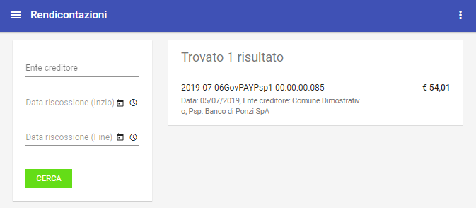
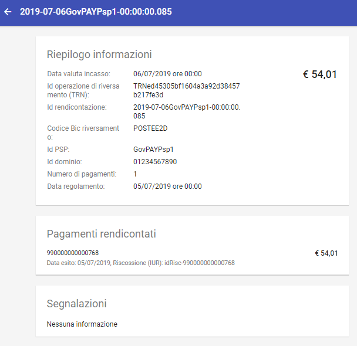
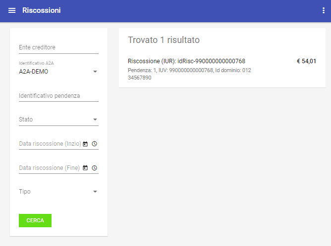
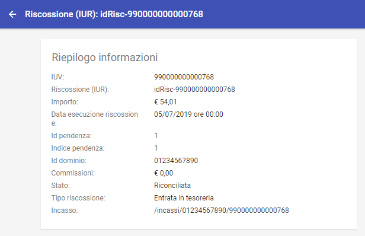
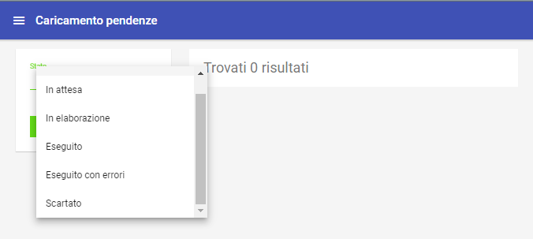

.. _utente_avanzate:

Funzioni Avanzate
=================

Rendicontazioni
---------------

La sezione “Funzioni Avanzate > Rendicontazioni” è dedicata alla consultazione dei flussi di rendicontazione acquisiti da pagoPA. La
pagina iniziale mostra l’elenco dei flussi di rendicontazione presenti nel repository.

   Area Generale Rendicontazioni

Per ciascuna rendicontazione in elenco, oltre ai riferimenti identificativi (identificativo, psp, ente creditore, ...), sono segnalati, con indicazione dello stato, i casi di errore.

È possibile filtrare gli elementi visualizzati utilizzando il form presente sul lato sinistro.

È possibile scaricare un file CSV con i dati delle rendicontazioni, visualizzate con il criterio di ricerca impostato, utilizzando la voce "Scarica Resoconto" presente nel menu a destra sulla testata della pagina.

La selezione di un elemento dell’elenco ne visualizza il dettaglio, come mostrato:

   Dettaglio Rendicontazione

Dettaglio Rendicontazione
~~~~~~~~~~~~~~~~~~~~~~~~~

La pagina di dettaglio della rendicontazione si compone delle seguenti sezioni:

-  *Riepilogo Informazioni*: riporta i dati identificativi della rendicontazione (identificativo flusso, psp, ente creditore, importo,
   ...)
-  *Pagamenti Rendicontati*: Le singole voci di rendicontazione che riguardano ciascun pagamento rendicontato (voce, importo, stato, ...)
-  *Segnalazioni*: L'elenco delle eventuali segnalazioni che sono state sollevate dal sistema durante la gestione del flusso di
   rendicontazione.

Riscossioni
-----------

La sezione *Funzioni Avanzate > Riscossioni* è dedicata alla consultazione delle somme che sono state correttamente riscosse tramite
i versamenti operati dai debitori.

Anche in questo caso risulta possibile filtrare gli elementi presenti nella pagina tramite il form presente sul lato sinistro. Di rilevante importanza è la possibilità di filtrare in base allo stato della riscossione:

-  *Riscossa* - è lo stato iniziale relativo agli importi riversati ma non ancora riconciliati.
-  *Riconciliata* - è lo stato finale che indica che tutti gli importi di una determina pendenza sono stati già riconciliati con le somme riversate.

È inoltre possibile selezionare le riscossioni in base al tipo. Esistono due tipi di riscossione:

-  *Entrata in Tesoreria*: Sono cifre riscosse dai PSP che verranno riversate sul conto della banca tesoriera dell'ente creditore. Si
   tratta di somme soggette a riconciliazione.
-  *Marca da Bollo Telematica*: Sono cifre riscosse dai PSP per il rilascio di una marca da bollo. Tali importi non saranno accreditati
   all'ente e quindi non sono soggetti a riconciliazione.

   Area Generale Riscossioni

È possibile scaricare un file CSV con i dati delle riscossioni, visualizzate con il criterio di ricerca impostato, utilizzando la voce
"Scarica Resoconto" presente nel menu a destra sulla testata della pagina.

Selezionando il singolo elemento dall’elenco si accede alla pagina di dettaglioche riporta ulteriori informazioni non modificabili:

   Dettaglio Riscossione

Caricamento Pendenze
--------------------

La sezione *Funzioni Avanzate > Caricamento Pendenze* è dedicata all'immissione massiva delle pendenze nel sistema. Tali
tracciati vengono caricati dagli utenti del cruscotto utilizzando il pulsante di aggiunta. Il form di caricamento permette di selezionare il file da caricare che deve essere in formato JSON e rispettare la sintassi descritta nel manuale di integrazione. All’interno di un tracciato si definiscono le operazioni da eseguire sulle pendenze, che possono essere:

-  Inserimento di una nuova pendenza
-  Annullamento di pendenza esistente

È possibile filtrare gli elementi, in base al proprio stato di elaborazione, utilizzando il form presente sul lato sinistro.

L'elenco a destra riporta gli elementi, visualizzandone i principali dati identificativi (identificativo del
tracciato, data di caricamento e stato dell’elaborazione).

È possibile scaricare un file CSV con i dati di riepilogo dei tracciati, visualizzati con il criterio di ricerca impostato, utilizzando la voce "Scarica Resoconto" presente, a destra, nel menu sulla testata della pagina.

   Caricamento massivo pendenze

Dettaglio Tracciato
~~~~~~~~~~~~~~~~~~~

La selezione di un elemento dell’elenco ne visualizza il dettaglio, che
comprende le seguenti informazioni:

-  *Riepilogo Informazioni*: dati generali del tracciato
   (identificativo del tracciato, data di caricamento e stato
   dell’elaborazione, operatore che ha effettuato il caricamento,
   contatori delle operazioni totali, operazioni eseguite, operazioni
   fallite, ... )
-  *Operazioni*: L’elenco delle operazioni eseguite a partire dal
   tracciato (tipo operazione, esito esecuzione, applicazione,
   identificativo pendenza, ... ).

È possibile scaricare un file compresso in formato *zip* contentente il tracciato originale, il
tracciato di esito generato dall’elaborazione e gli avvisi di pagamento per le pendenze caricate.
