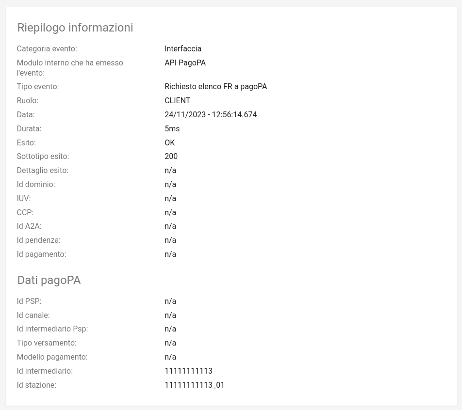

.. _utente_giornale:

Giornale degli Eventi
=====================

La sezione *Giornale degli Eventi* mostra le comunicazioni (tecniche e di dettaglio), ed il relativo esito, avvenute con la piattaforma pagoPA secondo quanto previsto dalle specifiche AgID. 

Area iniziale
-------------

.. figure:: ../../_images/GE01AreaGenerale.png
   :align: center
   :name: AreaInizialeDelGiornaleDegliEventi

   Area iniziale del Giornale degli Eventi

L’elenco degli eventi visualizzati si può filtrare, utilizzando il form presente sulla sinistra.

Gli elementi dell'elenco riassumono i dati principali dell'evento e, in caso di evento di errore, risulta evidenziato tale stato.

Dopo aver effettuato una ricerca è possibile ottenere un CSV di esportazione relativo all'elenco degli eventi che soddisfano i criteri di ricerca forniti. L'esportazione dell'elenco si effettua selezionando il collegamento "Esporta" che compare sul menu a discesa azionato con l'icona in alto a destra nella pagina. Il file prodotto con l'esportazione è un tracciato CSV in cui ciascun record contiene i dati dell'evento.

Il csv contiene le seguenti informazioni:

*  Identificatore univoco evento
*  Componente
*  Categoria Evento
*  Ruolo
*  Tipo Evento
*  Esito
*  Data Evento
*  Durata Evento
*  Sottotipo Esito
*  Dettaglio Esito
*  idDominio
*  iuv
*  ccp
*  idA2A
*  idPendenza
*  idPagamento
*  dati PagoPA

Selezionando uno degli elementi dell'elenco si accede al dettaglio dell'evento, una pagina che visualizza tutte le proprietà dell'evento.

Dettaglio Evento
----------------

   Dettaglio di un Evento

Il dettaglio di un evento assiema i seguenti gruppi di informazioni relativi all'evento considerato:

* Le informazioni *interne*, ovvero tutti i puntatori tecnologici e di processo connessi all'evento
* Gli eventuali dati relativi a PagoPa connessi all'evento (presenti solo per alcune tipologie di eventi)
