.. _utente_impostazioni:

Impostazioni
============

La sezione *Impostazioni* consente di configurare la piattaforma GovPay. 

Area iniziale
-------------

.. figure:: ../../_images/IMP01AreaGenerale.png
   :align: center
   :name: AreaInizialeImpostazioni

   Area iniziale Impostazioni

Il sistema consente di configurare le seguenti componenti:

*  Giornale degli Eventi
*  Comunicazioni Mail
*  Comunicazioni AppIO
*  Parser Tracciati CSV
*  Protezioni API Pubbliche

Giornale degli Eventi
---------------------

Il sistema consente di selezionare per quali API attivare la registrazione degli eventi, offrendo la possibilità di registrare le operazioni di lettura e scrittura.

Inoltre, è possibile selezionare se memorizzare anche i messaggi scambiati durante tali operazioni.

Infine, per ogni categoria si può scegliere se memorizzare l'evento sempre, mai o solo in caso di operazione conclusa con errore.

.. figure:: ../../_images/IMP02GDE.png
   :align: center
   :name: ImpostazioniGDE

   Impostazioni Giornale degli Eventi

Comunicazioni Mail
------------------

In questa sezione si configurano le comunicazioni che GovPay manda via mail, nel primo tab si configurano i parametri per la connessione al server di posta.

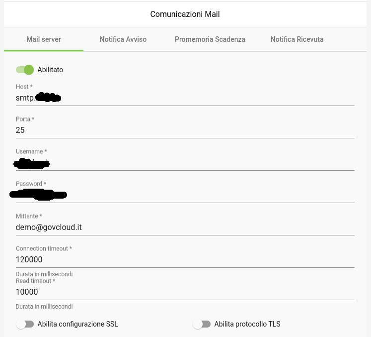

   Impostazioni Comunicazioni Mail

Più in basso nella schermata si trova la sezione per la configurazione dell'autenticazione SSL.

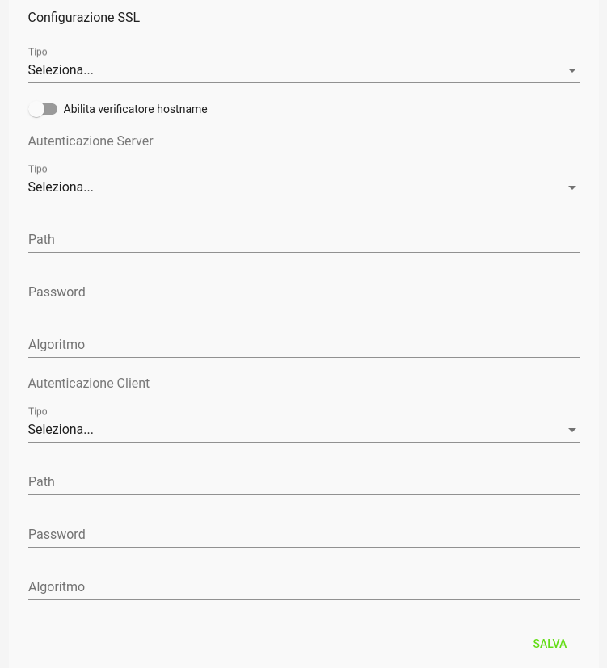

   Impostazioni Comunicazioni Mail Connessione SSL

Nei tab successivi si configurano le singole comunicazioni, definendo i template freemarker da utilizzare per la personalizzazione dei messaggi da inviare.

- Notifica Avviso

Per la notifica di un avviso si possono indicare i template per oggetto e messaggio della mail e se inserire il pdf dell'avviso di pagamento.

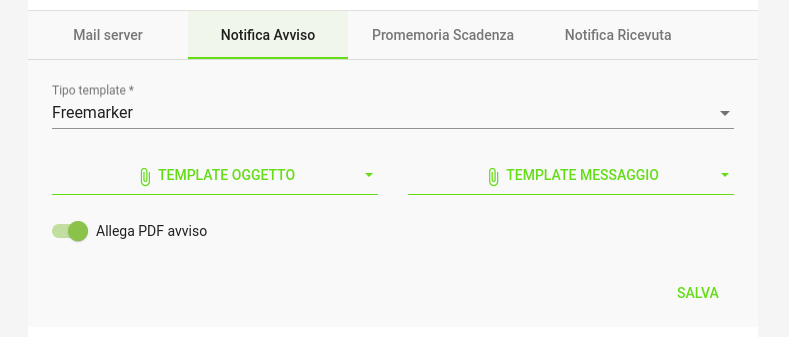

   Notifica Avviso

- Promemoria Scadenza

Per il promemoria scadenza si possono indicare i template per oggetto e messaggio della mail e i giorni di preavviso rispetto alla data di scadenza della pendenza.

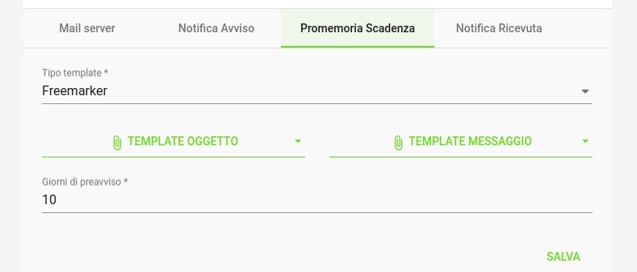

   Promemoria Scadenza

- Notifica Ricevuta

Per la notifica di una ricevuta si possono indicare i template per oggetto e messaggio della mail, se inserire il pdf della ricevuta di pagamento e se notificare solo transazioni andate a buon fine.

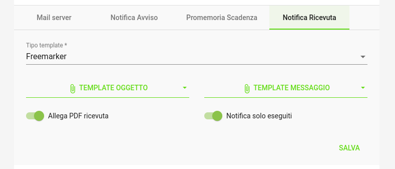

   Notifica Ricevuta

Comunicazioni AppIO
-------------------

In questa sezione si configurano le comunicazioni attraverso AppIO, nel primo tab si configurano i parametri per la connessione verso il BackendIO.

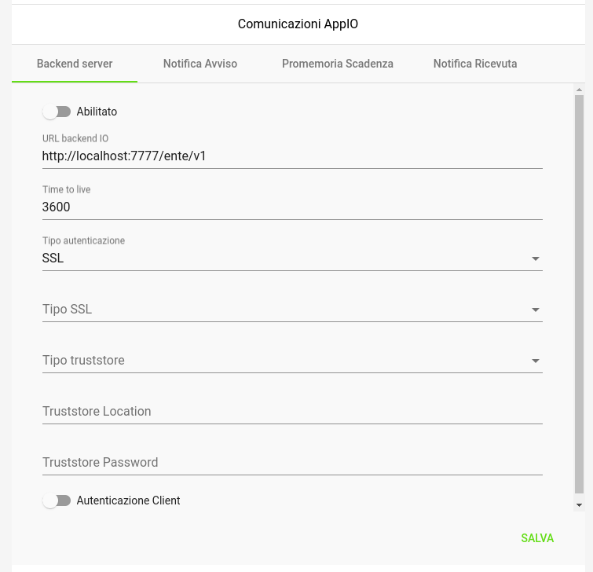

   Impostazioni Comunicazioni AppIO

Nei tab successivi si configurano le singole comunicazioni, definendo i template freemarker da utilizzare per la personalizzazione dei messaggi da inviare.

- Notifica Avviso

Per la notifica di un avviso si possono indicare i template per oggetto e messaggio della mail.

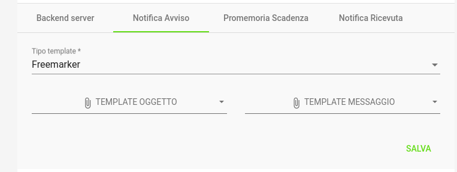

   Notifica Avviso

- Promemoria Scadenza

Per il promemoria scadenza si possono indicare i template per oggetto e messaggio della mail e i giorni di preavviso rispetto alla data di scadenza della pendenza.

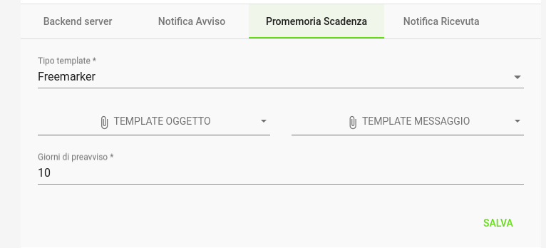

   Promemoria Scadenza

- Notifica Ricevuta

Per la notifica di una ricevuta si possono indicare i template per oggetto e messaggio della mail e se notificare solo transazioni andate a buon fine.

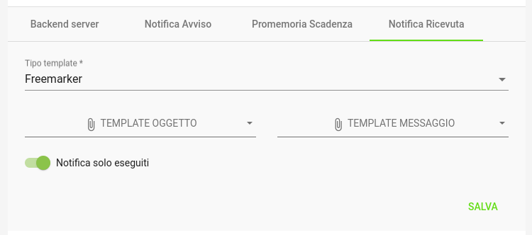

   Notifica Ricevuta

Parser Tracciati CSV
--------------------

In questa sezione si configura i template per la trasformazione dei tracciati di caricamento pendenze in formato CSV.

Si possono indicare:
- Template Caricamento: definisce la trasformazione dal singola riga del tracciato CSV in una pendenza in formato JSON delle API native.
- Template Esito: definisce la trasformazione del risultato del caricamento in una riga in formato CSV da inserire nel tracciato di esito.
- Linea Intestazione: definisce l'header da inserire nel tracciato di esito

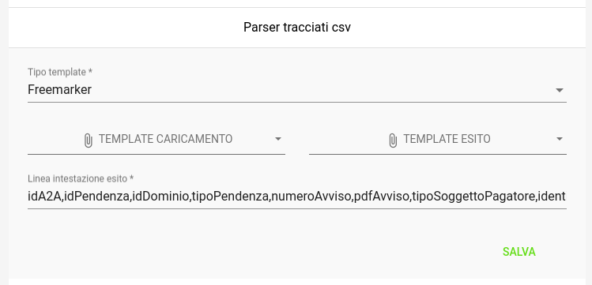

   Impostazioni Parser CSV

Protezioni API Pubbliche
------------------------

In questa sezione si configura la protezione tramite Captcha delle risorse public messe a disposizione da GovPay ai portali di pagamento.

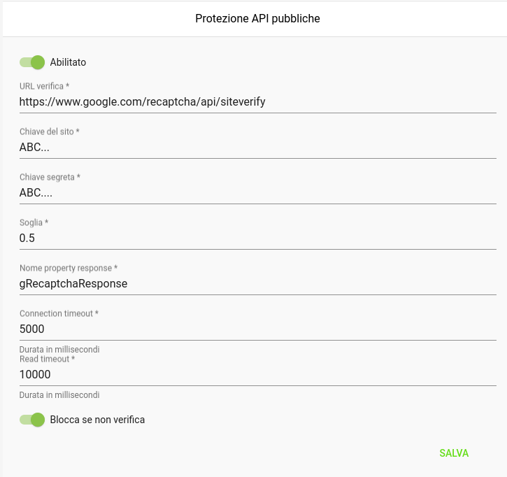

   Impostazioni API Pubbliche

