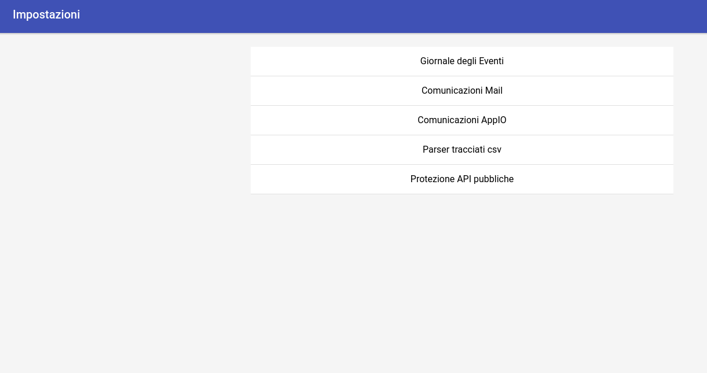
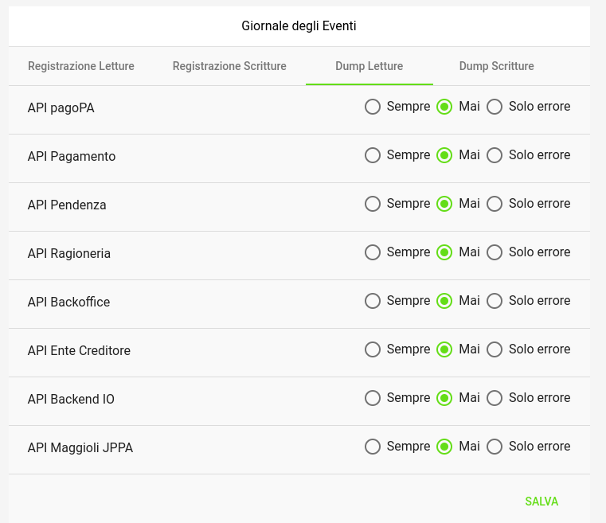

.. _utente_impostazioni:

Impostazioni
============

La sezione *Impostazioni* consente di configurare la piattaforma GovPay. 

Area iniziale
-------------

   Area iniziale Impostazioni

Il sistema consente di configurare le seguenti componenti:

*  Giornale degli Eventi
*  Comunicazioni Mail
*  Comunicazioni AppIO
*  Parser Tracciati CSV
*  Protezioni API Pubbliche

Giornale degli Eventi
---------------------

   Impostazioni Giornale degli Eventi

Comunicazioni Mail
------------------

Comunicazioni AppIO
-------------------

Parser Tracciati CSV
--------------------

Protezioni API Pubbliche
------------------------
