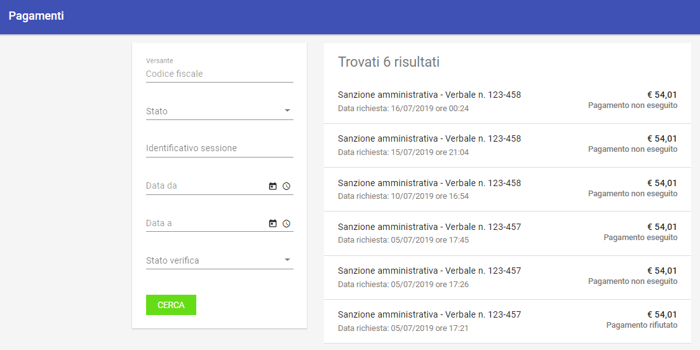
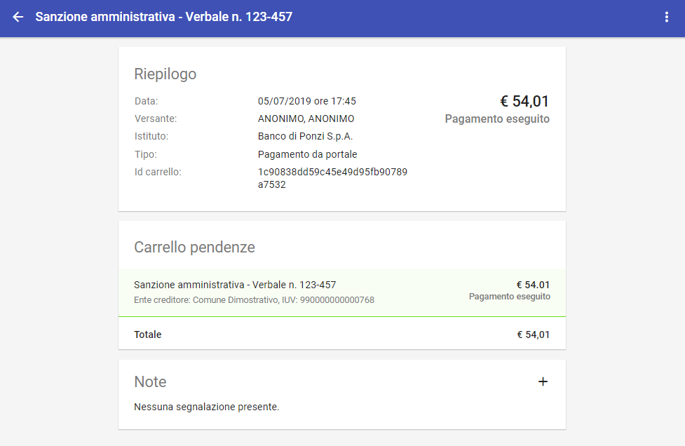
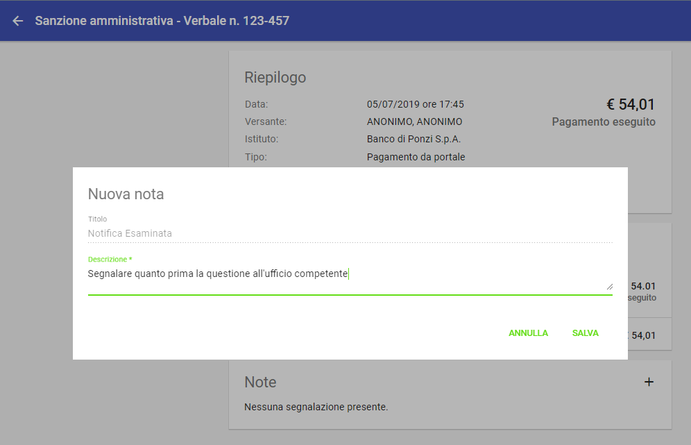
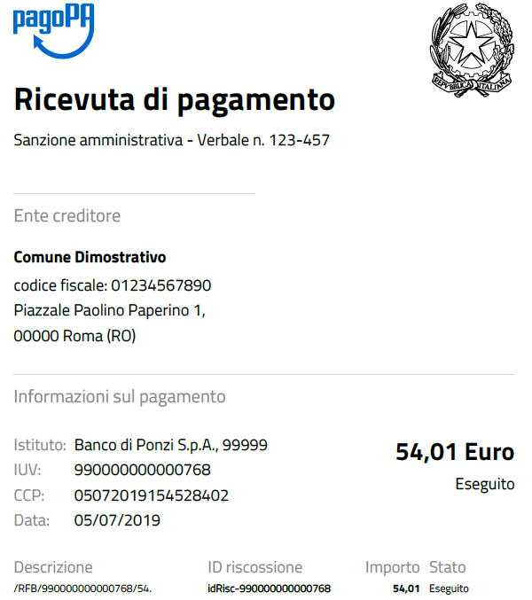

.. _utente_pagamenti:

Pagamenti
=========

La sezione "Pagamenti" è dedicata alla consultazione delle operazioni di pagamento che sono state richieste a Govpay in seguito all'interazione tra l'utente pagatore e il portale dei servizi di pagamento dell'ente creditore.

Gli stati del Pagamento
-----------------------

Si noti come, all'interno del sistema, il diagramma di stato dei pagamenti sia il seguente:

.. figure:: ../../_images/P01StatiPagamento.png
   :align: center
   :name: DiagrammaDegliStatiDelPagamento

   Diagramma degli stati del Pagamento

In particolare:

* Lo stato *rifiutato* si verifica quando un pagamento è stato richiesto a GovPay ma non è stato autorizzato su PagoPa
* Lo stato *decorso* si verifica quando AgID

Area iniziale
-------------

   Area iniziale dei Pagamenti

L'area iniziale è composta dai seguenti elementi:

*  Sulla sinistra è presente il form per impostare i criteri di filtro sui pagamenti che si vuole consultare.
*  Sulla destra è presente l'elenco dei pagamenti che corrispondono ai criteri di filtro impostati. Di ciascun elemento della lista è visualizzato il titolo che corrisponde a quello di una delle pendenze comprese nel pagamento e la dicitura "e altre X pendenze" nel caso in cui il pagamento sia composto da un carrello di pendenze di numero superiore a 1. Oltre al titolo, identificano un elemento della lista anche l'importo complessivo, lo stato e la data.

Dopo aver effettuato una ricerca è possibile ottenere un CSV di esportazione relativo all'elenco dei pagamenti che soddisfano i criteri
di ricerca forniti. L'esportazione dell'elenco si effettua selezionando il collegamento *Scarica Resoconto* che compare sul menu a discesa in alto a destra, come mostrato in figura:

.. figure:: ../../_images/P03ScaricaResoconto.png
   :align: center
   :name: ScaricaResocontoPagamenti

   Scarica Resoconto dei Pagamenti

I campi del csv (compresso in formato zip) sono i seguenti:

* Identificativo univoco del pagamento
* Data richiesta pagamento
* Importo
* Stato
* Identificativo del soggetto versante
* Anagrafica del soggetto versante
* Conto di addebito

Selezionando uno degli elementi presenti in elenco si procede alla visualizzazione del dettaglio del pagamento, abilitando l'eventuale modifica: si noti come sia presente una sezione dedicata agli eventi di dettaglio del pagamento stesso.

Dati Pagamento
--------------

La pagina dei dati di dettaglio del pagamento comprende:

*  Sezione di riepilogo dei dati che caratterizzano l'operazione di pagamento in questione (banca, importo, tipo di pagamento, ...)
*  Sezione che elenca le pendenze che compongono il carrello associato all'operazione di pagamento. Per ciascuna pendenza in elenco sono
   visualizzati i dati identificativi comprensivi di singolo importo e stato di avanzamento.
*  Sezione Note

   Dettaglio del Pagamento

Per aggiungere una nota, premere il pulsante *+*, il sistema presenta quindi la seguente maschera:

   Immissione nota

Con la voce di menu in alto a destra (*Scarica Resoconto*), è possibile scaricare i documenti salienti associati al pagammento:

.. figure:: ../../_images/P06ScaricaResocontoSingoloPagamento.png
   :align: center
   :name: ScaricaResocontoSingoloPagamento

   Scarica Resoconto

Viene scaricato in questo modo un archivio in formato zip,

.. figure:: ../../_images/P07ContenutoResocontoSingoloPagamento.png
   :align: center
   :name: ContenutoResocontoSingoloPagamento

   Contenuto archivio zip di resoconto del Pagamento

.. csv-table:: Contenuto Archivio zip del singolo pagamento
  :header: "File", "Formato", "Significato"
  :widths: 40,40,20

  "RPT", "xml", "Richiesta associata al pagamento"
  "RT", "xml", "Ricevuta telematica associata al pagamento"
  "RT", "pdf", "Ricevuta telematica in formato pdf"

Una ricevuta di pagamento in formato pdf avrebbe il seguente aspetto (si noti la presenza del logo del dominio in alto a destra)

   Ricevuta di Pagamento in formato pdf (esempio)

Eventi
------
Il sistema presenta, associato al dettaglio del pagamento, anche tutti gli eventi intercorsi relativi al pagamento stesso, come mostrato in figura:

.. figure:: ../../_images/P09EventiDelPagamento.png
   :align: center
   :name: EventiDiPagamento

   Eventi associati a un pagamento

Gli eventi non sono modificabili né ulteriormente espandibile (non è presente un dettaglio ulteriore).
