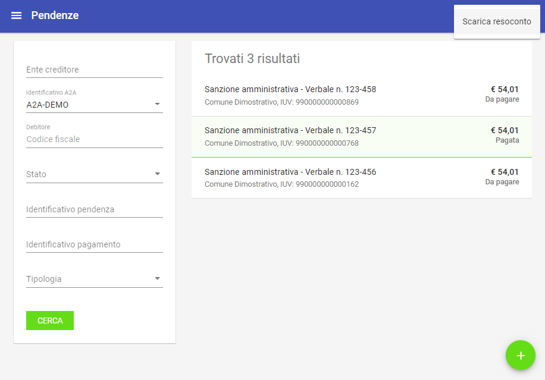
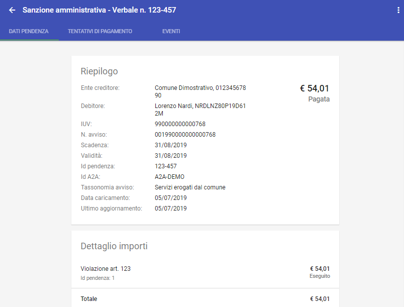

.. _utente_pendenze:

Pendenze
========

Questa sezione è dedicata alla consultazione delle pendenze di pagamento presenti nel repository dei pagamenti in attesa. Le pendenze sono abilitate al modello di pagamento 3 tramite Avviso di pagamento AgID.

Gli stati della Pendenza
------------------------
Si noti come, all'interno del sistema, il diagramma di stato delle pendenze sia il seguente:

.. figure:: ../../_images/PZ01StatiPendenza.png
   :align: center
   :name: DiagrammaDegliStatiDellaPendenza

   Diagramma degli stati della Pendenza

Si noti come si arrivi a e si parta da lo stato *annullata* solo a seguito di azioni dell'operatore. 

.. csv-table:: Stati della pendenza
  :header: "Stato", "Descrizione", "Note"
  :widths: 20,60,20

  "Da pagare", "Stato iniziale della pendenza", ""
  "Pagata", "Stato che indica il regolare pagamento della pendenza", ""
  "Riconciliata", "Stato che indica il completamento del processo di riconciliazione della pendenza con la somma incassata", ""
  "Annullata", "Stato assegnato alla pendenza dopo che ne è stato richiesto l'annullamento", ""

Area iniziale
-------------

.. figure:: ../../_images/PZ02PendenzeAreaIniziale.png
   :align: center
   :name: AreaInizialeDellePendenze

   Area iniziale delle Pendenze

L'area iniziale è composta dai seguenti elementi:

*  Sulla sinistra è presente il form per impostare i criteri di filtro sulle pendenze su cui si intende agire.
*  Sulla destra è presente l'elenco delle pendenze che corrispondono ai criteri di filtro impostati, con un insieme sommario di dati. Oltre al titolo, troviamo la codifica IUV, l'importo complessivo, lo stato e la data.

Dopo aver effettuato una ricerca è possibile ottenere un CSV di esportazione relativo all'elenco delle pendenze che soddisfano i criteri
di ricerca forniti. L'esportazione dell'elenco si effettua selezionando il collegamento *Scarica Resoconto* che compare sul menu a discesa in alto a destra, come mostrato in figura:

   Scarica csv delle pendenze trovate

I campi del csv (compresso in formato zip) sono i seguenti:

* Identificativo univoco della pendenza
* Identificativo del dominio
* Denominazione del dominio
* Numero di avviso
* Importo
* Data del caricamento della pendenza
* Data di validità della pendenza
* Tipo di avviso
* Stato della pendenza

Selezionando uno degli elementi presenti in elenco si procede alla visualizzazione del dettaglio della pendenza, abilitando l'eventuale modifica.

Dettaglio Pendenza
------------------

La pagina di dettaglio fornisce una vista delle singole informazioni che compongono la pendenza stessa.

   Dettaglio della pendenza

In testa, sulla destra, è presente un menu a discesa che consente, nel caso si possiedano le necessarie autorizzazioni, di effettuare le
seguenti operazioni:

-  Annulla/Ripristina Pendenza

   Se la pendenza si trova in uno stato diverso da "Eseguito" è possibile effettuare l'annullamento facendola transitare nello stato
   "Annullato". All’atto dell’annullamento viene richiesto di fornire un testo di motivazione dell’operazione che verrà visualizzato nella pagina di elenco e veicolato ai PSP nel caso ne venisse tentato il pagamento. Successivamente è possibile tornare indietro tramite
   l'operazione "Ripristina" che consente di far transitare la pendenza nello stato "Non Eseguito". Anche nel caso del ripristino è possibile opzionalmente inserire un testo di descrizione della motivazione.

-  Scarica resoconto

   Consente di scaricare un archivio in formato ZIP che contiene i
   documenti che compongono la pendenza, quali:

   -  Documento PDF con i dati della pendenza (IUV, scadenza, importo), il dettaglio delle voci di pagamento presenti e le eventuali
      segnalazioni.
   -  RPT e relative RT generate per la pendenza in formato XML.
   -  Le versioni PDF delle RT.
   -  Documento CSV contenente gli eventi scaturiti dagli scambi con pagoPA.
   -  Avviso di Pagamento in PDF se previsto dalla pendenza.

La presentazione dei dati di dettaglio della pendenza è articolata in tre differenti sezioni raggiungibili selezionando altrettanti schede:

-  Dati Pendenza
-  Tentativi di Pagamento
-  Eventi

Nel seguito si dettagliano i gruppi informativi appena elencati.

Dati Pendenza
~~~~~~~~~~~~~

.. figure:: ../../_images/PZ05PendenzaDatiPendenza.png
   :align: center
   :name: PendenzeDatiPendenza

   Dati pendenza

La pagina riporta nella sezione **Riepilogo** i dati principali che compongono la pendenza (ente creditore, debitore, IUV, scadenza,
importo, stato, ...). Il valore assunto dallo stato è un elemento importante che consente ad esempio, in fase di ricerca, di selezionare le sole pendenze che non risultino pagate.

La sezione **Dettaglio Importi** fornisce l'elenco delle singole voci di pagamento contenute nella pendenza (titolo, importo, stato).

La sezione **Note** riporta le eventuali segnalazioni associate alla pendenza che sono state rilevate dal sistema durante il suo ciclo di vita. Il sistema consente di inserire nuove note con la solita modalità (click sul tasto più)

Tentativi di Pagamento
~~~~~~~~~~~~~~~~~~~~~~

Questa sezione mostra i dati relativi alle transazioni di pagamento che sono state effettuate per pagare la pendenza (la banca, la data, l'importo, l'esito).
Il clic su ciascun elemento in elenco comporta un'espansione con la visualizzazione di ulteriori dati di dettaglio, se disponibili.

.. figure:: ../../_images/PZ06PendenzaTentativiPagamento.png
   :align: center
   :name: PendenzeTentativiDiPagamento

   Tentativi di pagamento di una data pendenza

Eventi
~~~~~~

Questa sezione mostra l'elenco degli eventi, presenti nel Giornale degli Eventi, previsto dalla specifica pagoPA, che sono scaturiti nel corso del ciclo di vita della pendenza che si sta consultando. Maggiori dettagli su questi elementi sono riportati nella sezione `6 <#anchor-11>`__, dove è descritta la funzionalità di consultazione generale del Giornale degli Eventi.
