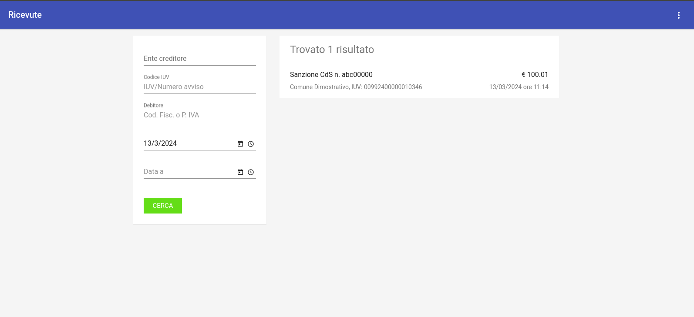
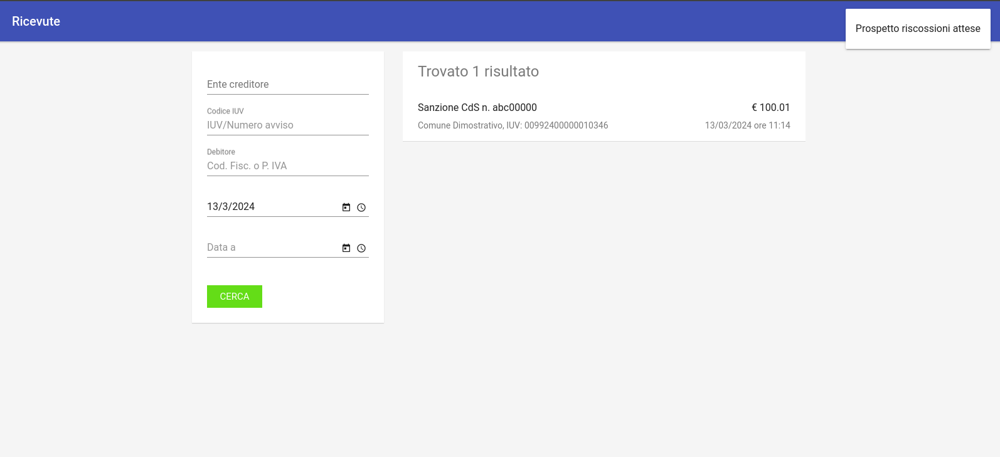

.. _govpay_ricevute:

Ricevute
========

La sezione *Ricevute* è dedicata alla consultazione delle ricevute di pagamento che sono state acquisite in Govpay.

   Area Generale Ricevute

L'area iniziale è composta dai seguenti elementi:

*  Sulla sinistra è presente il form per impostare i criteri di filtro sulle ricevute che si vuole consultare.
*  Sulla destra è presente l'elenco delle ricevute che corrispondono ai criteri di filtro impostati. Di ciascun elemento della lista è visualizzato il titolo che corrisponde alla causale della pendenza riferita dalla ricevuta. Oltre al titolo, identificano un elemento della lista anche l'importo complessivo, l'ente creditore, lo IUV e la data.

È possibile scaricare un file CSV con i dati delle riscossioni, utilizzando la voce
"Prospetto Riscossioni Attese" presente nel menu a destra sulla testata della pagina.

   Area Generale Ricevute: Prospetto Riscossioni Attese

Selezionando uno degli elementi presenti in elenco si procede alla visualizzazione del dettaglio della rievuta: si noti come sia presente una sezione dedicata agli eventi di dettaglio della ricevuta stesso.

Dati Ricevuta
-------------

La pagina dei dati di dettaglio della ricevuta comprende:

*  Sezione di riepilogo dei dati che caratterizzano la ricevuta in questione (dati relativi alla pendenza, importo, stato della ricevuta, ...)
*  Sezione che elenca il dettaglio degli importi pagati nella ricevuta. Per ciascuna voce in elenco sono visualizzati i dati identificativi comprensivi delle informazioni su contabilità e metadata personalizzati (quando presenti).
*  Sezione realtiva ai dati del PSP presso il quale è stato effettuato il pagamento

