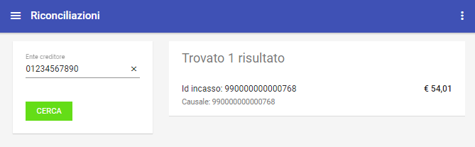

.. _utente_riconciliazioni:

Riconciliazioni
===============

Area Generale
-------------

La sezione “Riconciliazioni” è dedicata alla consultazione delle voci di riconciliazione delle riscossioni notificate
dalla banca tesoriera. Tali informazioni vengono registrate sulla piattaforma dagli applicativi che gestiscono il processo di
riconciliazione con la Banca Tesoriera.

È possibile filtrare gli elementi visualizzati nella pagina utilizzando il form presente sul lato sinistro in cui si seleziona l'ente creditore su cui si intende agire.

L'elenco sul lato destro riporta gli elementi visualizzandone i principali dati identificativi:

   Area iniziale Riconciliazioni

È possibile scaricare un file CSV con i dati delle riconciliazioni, visualizzate con il criterio di ricerca impostato, utilizzando la voce "Scarica Resoconto" presente nel menu sulla testata della pagina a destra. Il sistema permetterà il download di un file in formato zip che contiene un file riassuntivo in formato csv, con le informazioni tecniche relative a:
-  idDominio
-  idIncasso
-  causale
-  importo
-  sct

Dettaglio Riconciliazione
-------------------------

La selezione di un elemento dell’elenco ne visualizza il dettaglio, che comprende le seguenti informazioni:

-  *Riepilogo Informazioni* – dati generali della riscossione con i
   riferimenti del movimento bancario che lo ha determinato.
-  *Riscossioni* – elenco delle riscossioni riconciliate con le pendenze
   di origine.

.. figure:: ../../_images/R02DettaglioRiconciliazione.png
   :align: center
   :name: DettaglioRiconciliazione

   Dettaglio Riconciliazione

Nuova Riconciliazione
---------------------
Il sistema permette la creazione di una nuovo riconciliazione con le abituali metafore grafiche (tasto + in basso a destra):

.. figure:: ../../_images/R03NuovaRiconciliazione.png
   :align: center
   :name: NuovaRinciliazione

   Nuova Riconciliazione

Il sistema permette la selezione di un Ente Creditore e, iniziata la scrittura dei primi caratteri del identificativo IUV ne permette la selezione a partire da quanto effettivamente presente in termini di pagamenti e pendenze. Una volta selezionato il corretto identificativo IUV occorre immettere il codice SCT e salvare.

