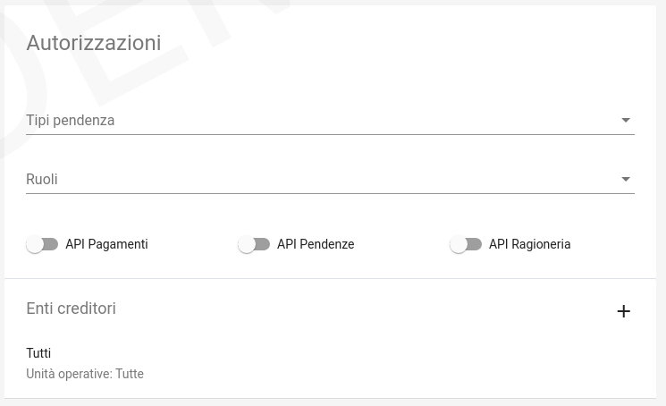

.. _govpay_configurazione_applicazioni:

Applicazioni
------------

Le Applicazioni in GovPay rappresentano i portali di pagamento e i sistemi applicativi gestionali dei debiti che si interfacciano tramite le Web API di integrazione.
Accedendo alla sezione *Configurazioni > Applicazioni*, viene visualizzato l'elenco delle applicazioni già censite. Sul lato sinistro
della pagina è presente un form che consente di filtrare i dati visualizzati nella pagina, come di seguito mostrato:

.. figure:: ../../_images/36Applicazioni.png
   :align: center
   :name: Applicazioni

   Vista generale delle applicazioni censite e criterio di filtro

Nuova Applicazione
~~~~~~~~~~~~~~~~~~

Per aggiungere una nuova applicazione, premere il pulsante posizionato, come sempre, in basso a destra. Analizzeremo questa funzionalità che è del tutto analoga, dal punto di vista delle informazioni richieste, a quella della modifica di un'applicazione già censita nel sistema.

.. figure:: ../../_images/37NuovaApplicazioneVistaDiInsieme.png
   :align: center
   :name: NuovaApplicazione

   Vista generale dei campi di una nuova applicazione

Analizziamo le sottosezioni in cui è strutturata l'applicazione, ovvero:
* Informazioni di riepilogo
* Codifica avvisi
* API integrazione
* Autorizzazioni API
* Autorizzazioni Backoffice

Informazioni di riepilogo
^^^^^^^^^^^^^^^^^^^^^^^^^
In questa sottosezione sono contenute le informazioni che definiscono un'applicazione in tutti i suoi aspetti di interazione con il sistema dei pagamenti.

.. figure:: ../../_images/38ApplicazioneRiepilogoDelleInformazioni.png
   :align: center
   :name: ApplicazioneInformazioniDiRiepilogo

   Informazioni di riepilogo di un'applicazione

.. csv-table:: Dettagli della sezione *Informazioni di riepilogo* di una nuova Applicazione
   :header: "Campo", "Significato", "Note"
   :widths: 40,40,20

   "Id A2A", "identificativo dell'applicazione", "Obbligatorio"
   "Principal", "Identificativo del principal autenticato nelle chiamate alle Web API di integrazione", ""
   "Abilitato", "se disabilitato, tutte le nuove richieste all'applicazione saranno negate", ""

Codifica avvisi
^^^^^^^^^^^^^^^
In questa sottosezione sono contenute le informazioni che definiscono un'applicazione in tutti i suoi aspetti di interazione con il sistema dei pagamenti.

.. figure:: ../../_images/39ApplicazioneCodificaAvvisi.png
   :align: center
   :name: ApplicazioneCodificaAvvisi

   Sezione Codifica Avvisi di un'applicazione

.. csv-table:: Dettagli della sezione *Codifica avvisi* di una nuova Applicazione
   :header: "Campo", "Significato", "Note"
   :widths: 40,40,20

   "Codifica IUV", "Numero identificativo dell'applicazione nel prefisso IUV, se configurato", ""
   "RegEx IUV", "Espressione regolare che consente di effettuare la validazione dei codici IUV inviati dall'applicazione", "es. 99[0-9]*"
   "Generazione IUV interna", "Se il flag è attivo l'applicazione genera autonomamente i codici IUV relativi alle proprie pendenze, altrimenti detti codici saranno generati da GovPay", ""

API Integrazione
^^^^^^^^^^^^^^^^

In questa sottosezione sono contenute le informazioni che definiscono un'applicazione in tutti i suoi aspetti di interazione con il sistema dei pagamenti.

.. figure:: ../../_images/40ApplicazioneAPIIntegrazione.png
   :align: center
   :name: ApplicazioneAPIIntegrazione

   Sezione API Integrazione di un'applicazione

.. csv-table:: Dettagli della sezione *API Integrazione* di una nuova Applicazione
   :header: "Campo", "Significato", "Note"
   :widths: 40,40,20

   "API Integrazione", "Endpoint del servizio del verticale che viene integrato da GovPay", ""
   "Versione API", "Versione delle interfacce di integrazione utilizzate dall'applicazione", ""
   "Tipo Autenticazione", "selezione a scelta tra: Nessuna, Http-Basic e SSL", "In base al valore selezionato sarà necessario inserire i conseguenti dati di configurazione della specifica modalità di autenticazione"

Autorizzazioni
^^^^^^^^^^^^^^

In questa sezione il sistema permette di autorizzare:

*  Specifici (o tutti) `Enti Creditori`_ all'utilizzo dell'applicazione
*  Specifici (o tutti) `Tipi Pendenze`_ ad essere elaborate attraverso l'applicazione
*  Specifici `Ruoli`_ all'utilizzo dell'applicazione

Inoltre in questa sottosezione è possibile definire se l'applicazione è in grado oppure no di interfacciarsi con le tre API (Pagamenti, Pendenze e Ragioneria) messe a disposizione da GovPay.

	Sezione Autorizzazioni di un'applicazione

Dettaglio Applicazione
~~~~~~~~~~~~~~~~~~~~~~

Selezionando una delle applicazioni presenti nella pagina di elenco si accede alla pagina di dettaglio, che permette di vedere i dati di sintesi dell'applicazione:

.. figure:: ../../_images/43ApplicazioneVistaDiSintesiPreModifica.png
   :align: center
   :name: ApplicazioneVistaSintesi

   Vista di sintesi di un'applicazione

Con l'uso delle solite metafore (matita su cerchio verde) è possibile accedere alle modifiche puntuali della definizione dell'applicazione. In tale processo le informazioni rimangono esattamente quelle appena viste per la definizione di una nuova applicazione.
