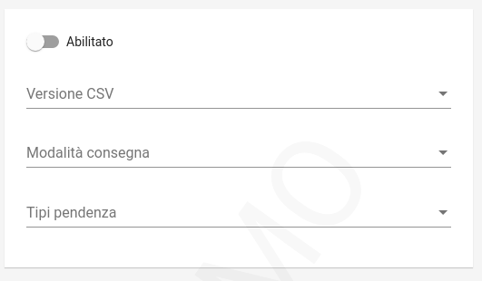

.. _govpay_configurazione_connettori_govpay:

Connettore per l'esportazione dei pagamenti in sandard GovPay
-------------------------------------------------------------

Questo connettore consente di esportare i dati dei pagamenti gestiti da GovPay per l'esportazione verso applicativi terzi: 

   Configurazione del Connettore GovPay

.. csv-table:: *Parametri di configurazione*
   :header: "Campo", "Descrizione"
   :widths: 40,60

   "Versione", "Versione del tracciato utilizzata per l'esportazione"
   "Modalità di consegna", "Canale di trasmissione del CSV verso l'ente"
   "Tipi pendenza", "Elenco dei tipi pendenza oggetto di esportazione"
  
Il tracciato esportato viene nominato con il seguente pattern: GovPay_Export_{idTracciato}.zip

Il batch di esportazione viene eseguito quotidianamente alle 3 di mattina.  

Versione 1.0
~~~~~~~~~~~~

L'archivio contiene le seguenti informazioni:

* File json con i metadati dell'estrazione, come il periodo di osservazione, tipipendenza estratti, versione, etc.. (metadata.json)
* File CSV con la sintesi dei pagamenti ricevuti (govpay_rendicontazione.csv)
* File CSV con la sintesi dei flussi rendicontazione (govpay_flussi_rendicontazione.csv)
* File XML originale pagoPA delle ricevute telematiche: (./RT/{idDominio}_{iuv}_{ccp}.xml)
* File XML originale pagoPA dei flussi di rendicontazione: (./FlussiRendicontazione/{idFlusso}_{dataOraFlusso}.xml)

Tracciato CSV dei pagamenti ricevuti
^^^^^^^^^^^^^^^^^^^^^^^^^^^^^^^^^^^^

Per ciascuna riscossione viene aggiunto un record nel tracciato con le seguenti informazioni

* idA2A: da pendenza
* idPendenza: da pendenza
* idDocumento: da pendenza
* codiceRata: da pendenza
* dataScadenza: da pendenza
* idVocePendenza: da pendenza
* idTipoPendenza: da pendenza
* descrizione: da pendenza.causale
* descrizioneVoce: da vocePendenza.descrizione
* anno: da pendenza
* identificativoDebitore: da RT
* anagraficaDebitore: da RT
* identificativoDominio: da RT
* identificativoUnivocoVersamento: da RT
* codiceContestoPagamento:da RT
* indiceDati: da RT
* identificativoUnivocoRiscossione: da RT
* modelloPagamento: da RT
* singoloImportoPagato: da RT
* dataEsitoSingoloPagamento: da RT
* causaleVersamento: da RT
* datiSpecificiRiscossione: da RT
* datiAllegati: da Pendenza
* datiAllegatiVoce: da vocePendenza
* denominazioneAttestante: da RT
* identificativoAttestante: da RT
* contabilita: da vocePendenza

Tracciato CSV delle rendicontazioni
^^^^^^^^^^^^^^^^^^^^^^^^^^^^^^^^^^^

Per ciascuna rendicontazione contenuta nei flussi ricevuti da pagoPA viene aggiunto un record nel tracciato con le seguenti informazioni:

* identificativoFlusso: da FR.identificativoFlusso
* dataOraFlusso: da FR.dataOraFlusso
* identificativoDominio: da FR.codDominio
* identificativoUnivocoRegolamento: da FR.identificativoUnivocoRegolamento
* dataRegolamento: da FR.dataRegolamento
* codiceBicBancaDiRiversamento: da FR.codiceBicBancaDiRiversamento
* numeroTotalePagamenti: da FR.numeroTotalePagamenti
* importoTotalePagamenti: da FR.importoTotalePagamenti
* identificativoUnivocoVersamento: da FR.ctDatiSingoliPagamenti[i].identificativoUnivocoVersamento
* identificativoUnivocoRiscossione: da FR.ctDatiSingoliPagamenti[i].identificativoUnivocoRiscossione
* indiceDatiSingoloPagamento: da FR.ctDatiSingoliPagamenti[i].indiceDatiSingoloPagamento
* singoloImportoPagato: da FR.ctDatiSingoliPagamenti[i].singoloImportoPagato
* codiceEsitoSingoloPagamento: da FR.ctDatiSingoliPagamenti[i].codiceEsitoSingoloPagamento
* dataEsitoSingoloPagamento: da FR.ctDatiSingoliPagamenti[i].dataEsitoSingoloPagamento
* denominazioneMittente: da FR.istitutoMittente.denominazioneMittente
* identificativoMittente: da FR.istitutoMittente.identificativoUnivocoMittente.codiceIdentificativoUnivoco
* denominazioneRicevente: da FR.istitutoRicevente.denominazioneRicevente
* identificativoRicevente: da FR.istitutoRicevente.identificativoUnivocoRicevente.codiceIdentificativoUnivoco

