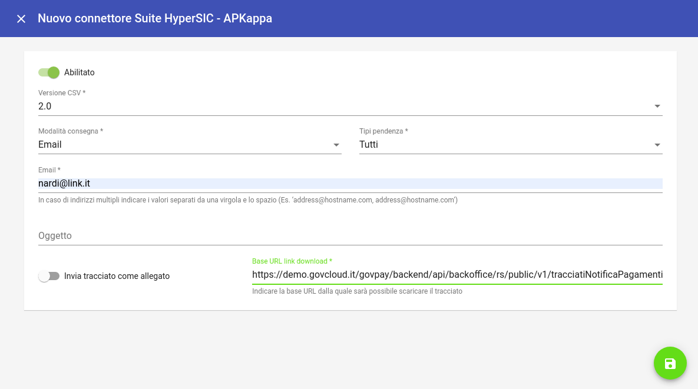

.. govpay_configurazione_connettori_hypersic:

Connettore per l'esportazione dei pagamenti verso HyperSIC di APKappa
---------------------------------------------------------------------

Questo connettore consente di esportare i dati dei pagamenti gestiti da GovPay in formato compatibile con
l'applicativo di riconciliazione HyperSIC di APKappa. 

   Configurazione del Connettore HyperSIC

.. csv-table:: *Parametri di configurazione*
   :header: "Campo", "Descrizione"
   :widths: 40,60

   "Versione", "Versione del tracciato utilizzata per l'esportazione"
   "Modalità di consegna", "Canale di trasmissione del CSV verso l'ente"
   "Tipi pendenza", "Elenco dei tipi pendenza oggetto di esportazione"
   "TBD", "TBD"
  
Il batch di esportazione viene eseguito quotidianamente alle 3 di mattina.

Il naming segue le specifiche del servizio HyperSIC che prevede i seguenti parametri separati da “_”:
- “RENDICONTAZIONE”, stringa fissa per identificativo tipologia di flusso;
- “AV20”, stringa fissa per identificativo versione del flusso;
- “Codice Fiscale Ente Creditore”, nel formato numerico di 11 caratteri;
- “Data Creazione Flusso”, nel formato AAAAMMGG;
- “Progressivo Flusso”, per la data di creazione flusso nel formato NNN.

Le riscossioni non rendicontate per piu' di 5 gg vengono incluse in un csv separato avente la medesima sintassi, ma con i campi relativi al flusso di rendicontazione vuoti e con progressivo flusso = 999.  

Versione 2.3
~~~~~~~~~~~~

Il tracciato è conforme alle specifiche :download:`Tracciato Standard Acquisizioni Rendicontazioni pagoPA v2.3<APK pagoPA Tracciato Import Rendicontazione V2.3.docx>` valorizzando i campi con le seguenti convenzioni:
 
.. csv-table:: *Valori di esportazione*
   :header: "Campo", "Descrizione"
   :widths: 40,60

   "CodiceServizio","vocePendenza.contabilita.proprietaCustom.codiceServizio
   o versamento.tipoPendenza.codTipoPendenza"
   "DescrizioneServizio","vocePendenza.contabilita.proprietaCustom.descrizioneServizio
   o versamento.tipoPendenza.descrizione"
   "CodiceDebitore","<vuoto>"
   "CFPIVADebitore","pendenza.soggettoDebitore.identificativo"
   "NominativoDebitore","pendenza.soggettoDebitore.anagrafica"
   "CodiceDebito","documento.identificativo oppure pendenza.idPendenza" 
   "DataEmissione","pendenza.dataCaricamento" 
   "CausaleDebito","pendenza.causale" 
   "ImportoDebito","pendenza.importo" 
   "CodiceRata","documento.numeroRata"
   "CodiceAvviso","pendenza.numeroAvviso" 
   "CodiceIUV","flussoRendicontazione.rendicontazione.iuv" 
   "DataScadenza","pendenza.dataScadenza" 
   "DataPagamento","flussoRendicontazione.rendicontazione.data"
   "ImportoPagato","flussoRendicontazione.rendicontazione.importo"
   "IstitutoMittente","flussoRendicontazione.ragione_sociale_psp"
   "ModalitaPagamento","<vuoto>"
   "IBANIncasso","<vuoto>"
   "CodiceFlussoRiversamento","flussoRendicontazione.identificativoFlusso"
   "DataRiversamento","flussoRendicontazione.dataRegolamento"
   "Annotazioni",""
   "LivelloContabile1","Se vocependenza.contabilita.quota[0] = null, tutto a null.
   Se quota[0].accertamento = null allora LivelloContabile = CAP 
   altrimenti LivelloContabile = ACC"
   "CodificaContabile1","Se LivelloContabile = CAP 
   allora CodificaContabile = {quota[0].annoEsercizio}/{quota[0].capitolo}
   altrimenti CodificaContabile = {quota[0].annoEsercizio}/{contabilita.accertamento}"
   "QuotaContabile1","quota[0].importo"
   "Altre quote contabili","Come nel caso della prima, fino alle 10 consentite"
