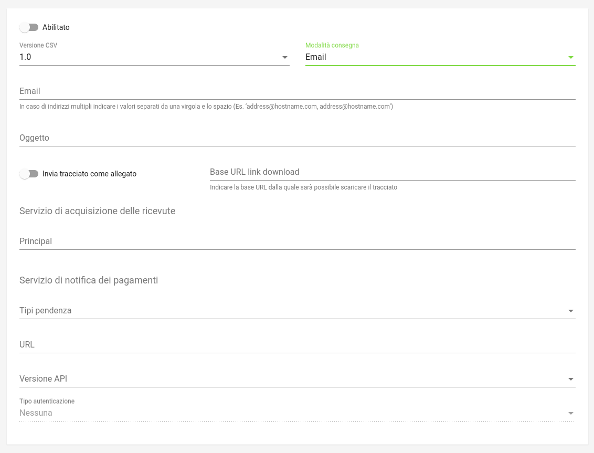

.. _govpay_configurazione_connettori_jppa:

Connettore per l'esportazione dei pagamenti verso Maggioli (JPPA)
-----------------------------------------------------------------

Il connettore consente di interfacciarsi verso la piattaforma PagoPA Maggioli ed esportare i pagamenti gestiti da GovPay in un formato compatibile con il protocollo JPPA.

Il protocollo prevede due fasi:

- Nella prima fase GovPay invia una notifica verso Maggioli attraverso l'operazione *InvioEsitoPagamento* per ogni transazioni di pagamento completata con successo e contestualmente raccoglie il risultato di ogni spedizione all'interno di un tracciato in formato csv.
- In una fase successiva Maggioli scarica le ricevute di pagamento corrispondenti alle notifiche ricevute attraverso l'operazione *RecuperaRT* esposta da GovPay.

La spedizione delle notifiche verso la piattaforma Maggioli viene eseguita quotidianamente alle 3 di mattina, solo al termine delle spedizioni viene inviato tramite email il tracciato csv contenente gli esiti degli invii delle notifiche di pagamento.

   Configurazione del Connettore Maggioli (JPPA)

.. csv-table:: *Parametri di configurazione generale*
   :header: "Campo", "Descrizione"
   :widths: 40,60

   "Versione CSV", "Versione del tracciato di esito"
   "Modalità di consegna", "Canale di trasmissione del CSV verso l'ente"
   "Email", "Specifica la lista degli indirizzi destinatari separati da virgola"
   "Oggetto", "Oggetto della email"
   "Invia come allegato", "Indica se il tracciato deve essere inserito in allegato o riferito con un link."
   "Base URL link download", "Indica la base URL del link di download.   Deve essere una URL valida per la risorsa */tracciatiNotificaPagamenti* delle API di Backoffice.   Ecco un esempio di Base URL: https://host-gp/govpay/backend/api/backoffice/rs/basic/v1/tracciatiNotificaPagamenti"

 .. raw:: html

     

.. csv-table:: *Parametri di configurazione servizio acquisizione ricevute*
   :header: "Campo", "Descrizione"
   :widths: 40,60

   "Principal", "Principal autenticato della chiamata da Maggioli"

.. csv-table:: *Parametri di configurazione servizio notifica pagamenti*
   :header: "Campo", "Descrizione"
   :widths: 40,60

   "Tipi pendenza", "Elenco dei tipi pendenza oggetto di esportazione"
   "URL", "URL dei servizi esposti da Maggioli"
   "Versione API", "Versione dei servizi da utilizzare"
   "Tipo Autenticazione", "Tipo di autenticazione da utilizzare (Nessuna/HTTPBasic/SSL)"

Tracciato esiti spedizioni versione 1.0
~~~~~~~~~~~~

Per ciascuna notifica di pagamento inviata viene aggiunto un record con l'esito dell'operazione:

.. csv-table:: *Valori di esportazione*
   :header: "Campo", "Descrizione"
   :widths: 40,60

   "idDominio","Identificativo Ente Creditore"
   "iuv","Identificativo Univoco Pagamento"
   "cpp","Codice Contesto Pagamento/ReceiptID"
   "esito","OK|ERROR"
   "descrizioneEsito", "Descrizione errore spedizione"
