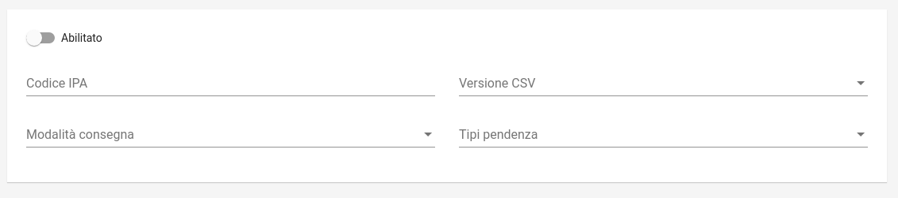

.. govpay_configurazione_connettori_mypivot:

Connettore per l'esportazione dei pagamenti verso MyPIVOT
------------------------------------------------------------

Questo connettore consente di esportare i dati dei pagamenti gestiti da GovPay in formato compatibile con
l'applicativo di riconciliazione MyPIVOT. Il batch di esportazione viene eseguito quotidianamente alle 3 di mattina. 

   Configurazione del Connettore MyPIVOT

.. csv-table:: *Parametri di configurazione*
   :header: "Campo", "Descrizione"
   :widths: 40,60

   "Versione", "Versione del tracciato utilizzata per l'esportazione"
   "Codice IPA", "Identificativo sull'Indice della Pubblica Amministrazione usato nella compilazione del CSV"
   "Modalità di consegna", "Canale di trasmissione del CSV verso l'ente"
   "Tipi pendenza", "Elenco dei tipi pendenza oggetto di esportazione"
  
Il tracciato CSV esportato viene nominato con il seguente pattern: "GOVPAY_" + idDominio + "_" + idunivoco + ".csv"  

Versione 1.0
~~~~~~~~~~~~

Il tracciato è conforme alla nota tecnica `MyPivot Integrazione Ente https://www.regione.puglia.it/documents/410606/413675/MyPivot+-+Nota+tecnica+Integrazione+Ente+V.5.6.2.pdf/60cc0453-c0ec-3076-77bf-5794f2171116?t=1591803805170`_
valorizzando i campi con le seguenti convenzioni:
 
.. csv-table:: *Valori di esportazione*
   :header: "Campo", "Descrizione"
   :widths: 40,60

   "IUD", "idA2A@idPendenza"
   "codIuv", "rt.datiPagamento.soggettoPagatore.identificativoUnivocoPagatore.tipoIdentificativoUnivoco"
   "tipoIdentificativoUnivoco", "rt.datiPagamento.soggettoPagatore.identificativoUnivocoPagatore.tipoIdentificativoUnivoco"
   "codiceIdentificativoUnivoco", "rt.datiPagamento.soggettoPagatore.identificativoUnivocoPagatore.codiceIdentificativoUnivoco"
   "anagraficaPagatore", "rt.datiPagamento.soggettoPagatore.anagraficaPagatore"
   "indirizzoPagatore", "rt.datiPagamento.soggettoPagatore.indirizzoPagatore"
   "civicoPagatore", "rt.datiPagamento.soggettoPagatore.civicoPagatore"
   "capPagatore", "rt.datiPagamento.soggettoPagatore.capPagatore"
   "localitaPagatore", "rt.datiPagamento.soggettoPagatore.localitaPagatore"
   "provinciaPagatore", "rt.datiPagamento.soggettoPagatore.provinciaPagatore"
   "nazionePagatore", "rt.datiPagamento.soggettoPagatore.nazionePagatore"
   "e-mailPagatore", "rt.datiPagamento.soggettoPagatore.e-mailPagatore"
   "dataEsecuzionePagamento", "rt.datiPagamento.datiSingoloPagamento[0].dataEsitoSingoloPagamento"
   "importoDovutoPagato", "rt.datiPagamento.importoTotalePagato"
   "commissioneCaricoPa", "vuoto"
   "tipoDovuto", "pendenza.vocePendenza[0].contabilita.proprietaCustom.tipoDovuto o versamento.tassonomiaEnte o versamento.codTipoPendenza"
   "tipoVersamento", "vuoto"
   "causaleVersamento", "rt.datiPagamento.datiSingoloPagamento[0].causaleVersamento"
   "datiSpecificiRiscossione", "rt.datiPagamento.datiSingoloPagamento[0].datiSpecificiRiscossione"
   "bilancio", "xml costruito con le informazioni indicate in pendenza.vocePendenza[0].contabilita.quote"
