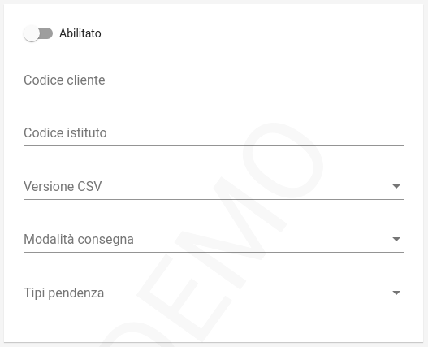

.. _govpay_configurazione_connettori_secim:

Connettore per l'esportazione dei pagamenti verso SECIM
------------------------------------------------------------

Questo connettore consente di esportare i dati dei pagamenti gestiti da GovPay in formato compatibile con
l'applicativo di riconciliazione sei servizi cimiteriali SECIM. 

   Configurazione del Connettore SECIM

.. csv-table:: *Parametri di configurazione*
   :header: "Campo", "Descrizione"
   :widths: 40,60

   "Versione", "Versione del tracciato utilizzata per l'esportazione"
   "Codice cliente", "Identificativo sull'Indice della Pubblica Amministrazione usato nella compilazione del CSV"
   "Modalità di consegna", "Canale di trasmissione del CSV verso l'ente"
   "Tipi pendenza", "Elenco dei tipi pendenza oggetto di esportazione"
  
Il tracciato esportato viene nominato con il seguente pattern: "GOVPAY_" + idDominio + "_" + idunivoco + ".csv"

Il batch di esportazione viene eseguito quotidianamente alle 3 di mattina.  

Versione 1.0
~~~~~~~~~~~~

Il tracciato risulta una personalizzazione del :download:`Tracciato di Riconciliazione di Poste Italiane <SPECIFICHE_RENDICONTAZIONE_SECIM.pdf>` valorizzando i campi con le seguenti convenzioni:
 
.. csv-table:: *Valori di esportazione*
   :header: "Campo", "Descrizione"
   :widths: 40,60

   "CODICE ISTITUTO [1..5]", "Da configurazione del connettore oppure rt.istitutoAttestante.identificativoUnivocoAttestante.codiceIdentificativoUnivoco se ABI oppure `00000`"
   "CODICE CLIENTE [6..12]", "Da configurazione del connettore"
   "FILLER [13..22]", "Spazi bianchi"
   "TIPO FLUSSO [23..30]", "pendenza.vocePendenza.contabilita.proprietaCustom.tipoFlusso oppure NDP001C0"
   "DATA CREAZIONE FLUSSO [31..38]", "Data esecuzione del batch"
   "FILLER [39..77]", "Spazi bianchi"
   "PROGRESSIVO RECORD [78..90]", "Numero di linea"
   "OPERAZIONE [91..93]", "Valore fisso 'RIS'"
   "FILLER [94..163]", "Spazi bianchi"
   "IUV [205..239]", "rt.datiPagamento.identificativoUnivocoVersamento"
   "RATA [240..274]", "'S' o 'T' più numero della rata"
   "FILLER [275..344]", "Spazi bianchi"
   "RIFERIMENTO CREDITORE [345..379]","'SECIM' o pendenza.vocePendenza.contabilita.proprietaCustom.tipoRiferimentoCreditore concatenato a pendenza.vocePendenza.contabilita.proprietaCustom.riferimentoCreditore o pendenza.voce.idVoce"
   "FILLER [380..457]", "Spazi bianchi"
   "IMPORTO VERSAMENTO [458..472]","pendenza.importoTotale"
   "FILLER [473..517]","Spazi bianchi"
   "CAUSALE VERSAMENTO [518..657]","rt.datiPagamento.datiSingoloPagamentoRT.causaleVersamento"
   "FILLER [658..713]","Spazi bianchi"
   "TIPO DEBITORE [714..716]","rt.soggettoPagatore.identificativoUnivocoPagatore.tipoIdentificativoUnivoco ('F' o 'G')"
   "TIPO CODICE DEBITORE [717..718]","se rt.soggettoPagatore.identificativoUnivocoPagatore.tipoIdentificativoUnivoco == 'F' allora "CF" altrimenti "PI""
   "CODICE DEBITORE [719..753]","rt.soggettoPagatore.identificativoUnivocoPagatore.codiceIdentificativoUnivoco"
   "ANAGRAFICA DEBITORE [754..803]","rt.soggettoPagatore.anagraficaPagatore"
   "FILLER [804..838]","Spazi bianchi"
   "INDIRIZZO DEBITORE [839..888]","rt.soggettoPagatore.indirizzoPagatore"
   "NUMERO CIVICO DEBITORE [889..893]","rt.soggettoPagatore.civicoPagatore"
   "CAP DEBITORE [894..898]","rt.soggettoPagatore.capPagatore"
   "LOCALITA DEBITORE [899..948]","rt.soggettoPagatore.localitaPagatore"
   "PROVINCIA DEBITORE [949..950]","rt.soggettoPagatore.provinciaPagatore"
   "STATO DEBITORE [951..985]","rt.soggettoPagatore.nazionePagatore"
   "FILLER [986..1055]","Spazi bianchi"
   "DATA PAGAMENTO [1056..1063]","rt.ctDatiSingoloPagamentoRT.dataEsitoSingoloPagamento"
   "DATA INCASSO [1064..1071]","rt.ctDatiSingoloPagamentoRT.dataEsitoSingoloPagamento"
   "ESERCIZIO DI RIFERIMENTO [1072..1075]","Valore fisso '0000'"
   "NUMERO PROVVISORIO [1076..1082]","Valore fisso '0000000'"
   "CODICE RETE INCASSO [1083..1085]","Valore fisso 'NDP'"
   "CODICE CANALE INCASSO [1086..1088]","Spazi bianchi"
   "CODICE STRUMENTO INCASSO [1089..1091]","Valore fisso 'NDP'"
   "NUMERO BOLLETTA [1092.1104]","Spazi bianchi"
   "IMPORTO PAGATO [1105..1119]","rt.datiPagamento.importoTotalePagato"
   "FILLER [1120..1172]","Spazi bianchi"
   "IMPORTO COMMISSIONE PA [1173..1187]","Valore fisso '000000000000000'"
   "IMPORTO COMMISSIONE DEBITORE [1188..1202]","rt.datiPagamento.datiSingoloPagamento[i].commissioniApplicatePSP se presenti altrimenti 0"
   "FILLER [1203..1589]","Spazi bianchi"
   "CCP [1590..1601]","Spazi bianchi"
   "FILLER [1602..2000]","Spazi bianchi"				
