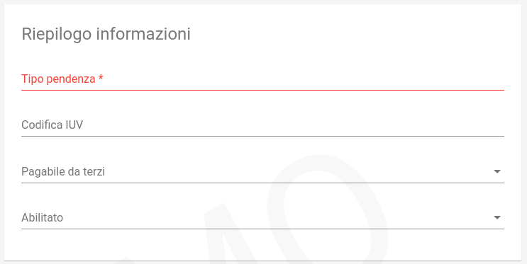

.. _govpay_configurazione_enti:

Enti Creditori
--------------

L'adesione di un Ente Creditore alla piattaforma deve essere preliminarmente essere eseguita
sui sistemi pagoPA tramite il Portale delle Adesioni:

 #. Il Referente dei Pagamenti (RP) aggiunge una nuova connessione intermediata all'Ente Creditore individuando il Partner/Intermediario
 #. Il Referente Tecnico del Partner/Intermediario associa l'Ente Creditore alla stazione, individuando il codice di segregazione.
  
Eseguita questa procedura, si può perfezionare la configurazione in GovPay per abilitare l'intermediazione.

Accedendo alla sezione *Configurazioni > Enti Creditori*, viene visualizzato l'elenco degli enti già censiti. Sul lato sinistro è presente il form per filtrare i domini visualizzati in elenco, con i possibili parametri di ricerca, ovvero:

.. figure:: ../../_images/17FilttroSuDomini.png
   :align: center

   Parametri di filtro per la ricerca di un Ente Creditore

Nuovo Ente Creditore
~~~~~~~~~~~~~~~~~~~~

Utilizzando il pulsante di creazione, presente in basso a destra nella pagina di elenco, è possibile procedere con la creazione di un nuovo Ente Creditore, compilando il seguente form di creazione:

.. figure:: ../../_images/18ParametriDominio.png
   :align: center
   :name: CampiDelDominio

   Campi del form di inserimento Nuovo Ente Creditore

.. csv-table:: Dati Anagrafici
   :header: "Campo", "Descrizione"
   :widths: 30,60

   "Id Dominio", "Identificativo dell'Ente Creditore in pagoPA, corrisponde al Codice Fiscale dell'ente"
   "Altre informazioni anagrafiche", "Dovrebbero corrispondere a quanto indicato nell'IndicePA"
   "Abilitato", "Indica se il dominio è usabile da GovPay per gestire nuovi pagamenti (abilitato) o se si vogliono impedire nuove richieste (disabilitato)", ""

.. csv-table:: Parametri adesione pagoPA
   :header: "Campo", "Descrizione"
   :widths: 30,60
   
   "Intermediario", "Intermediario o Partner di integrazione a pagoPA"
   "Stazione", "Stazione di intermediazione a pagoPA"
   "Codice interbancario", "Codice CBILL assegnato da pagoPA"
   "Aux Digit", "Come individuato in sede di associazione alla stazione sul Portale delle Adesioni"
   "Codice di segregazione", "Come individuato in sede di associazione alla stazione sul Portale delle Adesioni"
   
.. csv-table:: Altre informazioni
   :header: "Campo", "Descrizione"
   :widths: 30,60
   
   "Autorizzazione stampa BT", "Autorizzazione alla stampa in proprio assegnata da Poste Italiane"
   "Sintassi IUV", "Prefisso degli IUV generati da GovPay per questo dominio. Il prefisso, numerico, può contenere dei placeholder indicati successivamente"
   "Sfoglia...", "Araldo dell'Ente Creditore da apporre nelle stampe di avvisi o ricevute. Preferibilmente vettoriale monocromatico"   
      
I **placeholder contenuti nel prefisso IUV** vengono sostituiti a runtime con i valori forniti dagli applicativi richiedenti o con i valori di sistema configurati. La lunghezza del prefisso riduce lo spazio di IUV generabili, quindi è necessario che sia il più breve possibile.
I seguenti sono i placeholder di sistema, sovrascrivibili dall'applicazione chiamante:

* %(a): codifica dell'applicazione
* %(p): codifica del tipo pendenza
* %(y): anno di emissione dello IUV, due cifre
* %(Y): anno di emissione dello IUV, quattro cifre

Dettaglio Ente Creditore
~~~~~~~~~~~~~~~~~~~~~~~~

Selezionando uno degli enti creditori presenti nella pagina di elenco si accede alla pagina di dettaglio, che si compone a partire dalle seguenti aree:

.. csv-table:: Aree del dettaglio Ente Creditore
   :header: "Area", "Descrizione"
   :widths: 40,60

   "*Riepilogo Informazioni*", "Dati che caratterizzano l'ente creditore, appena visti nella sezione `Nuovo Ente Creditore`_"
   "*Unità Operative*", "Uffici di gestione dei pagamenti in cui è suddiviso il dominio dell’ente creditore."
   "*Iban*", "Conti di accredito utilizzati dall'Ente Creditore in pagoPA."
   "*Tipi Entrata*", "Anagrafica delle entrate, riferibili dalle voci pendenza delle posizioni."
   "*Tipi Pendenza*", "Anagrafica delle tipologie di pendenza."
   "*Connettori*", "Configurazione dei connettori di esportazione dati."

Tramite il pulsante di modifica presente nella pagina di dettaglio è possibile procedere con l'aggiornamento dei dati di base, visualizzati nell'area "Riepilogo Informazioni". Si tenga presente che il **valore del campo “Codice Dominio” non è modificabile**.

.. figure:: ../../_images/19DettaglioDominio1.png
   :align: center
   :name: CampiDelDettaglioDominio

   Campi del dettaglio dell'Ente Creditore

Unità Operative
^^^^^^^^^^^^^^^

La specifica pagoPA consente di indicare l'anagrafica dell'Unità operativa titolare del credito, qualora sia diversa da quella dell'Ente
Creditore. È quindi possibile censire le Unità operative del Dominio in GovPay al fine di utilizzarle in fase di pagamento.

.. figure:: ../../_images/21NuovaUnitaOperativa.png
   :align: center
   :name: CampiPerNuovaUnitaOperativa

   Campi per creare una Nuova Unità Operativa

.. csv-table:: Dettagli di una nuova Unità Operativa
   :header: "Campo", "Descrizione"
   :widths: 40,60

   "Id unità", "Codice identificativo, ad uso interno, dell'unità operativa"
   "Ragione Sociale", "Ragione sociale dell'Unità Operativa"
   "Sezione Anagrafica", "Riferimenti anagrafici dell'unità forniti dal Referente dei Pagamenti"
   "Abilitato", "Indica se l'unità operativa è abilitata o meno nel contesto del dominio su cui si opera"

Ovviamente dall'elenco delle unità operative associate a un Ente Creditore, è possibile modificarne le informazioni associate.

Iban
^^^^

Gli iban utilizzati per l'accredito degli importi versati devono essere censiti su GovPay:

.. figure:: ../../_images/22NuovoIBAN.png
   :align: center
   :name: CampiPerNuovoIBAN

   Maschera di creazione IBAN associato all'Ente Creditore

Il form di creazione di un Iban deve essere compilato con i dati seguenti:

.. csv-table:: Dettagli di un nuovo IBAN
   :header: "Campo", "Descrizione"
   :widths: 40,60

   "IBAN Accredito", "Codice IBAN del conto di accredito"
   "BIC Accredito", "BIC del conto di accredito"
   "Descrizione", "Descrizione del conto per una più agevole ricerca"
   "Intestatario del conto", "Visualizzato se postale, valorizza l'omonimo campo nel bollettino postale."
   "Autorizzazione stampa PT", "Visualizzato se postale, consente di sovrascrivere il valore nel dettaglio dell'Ente Creditore."
   "Postale", "Indica se l'iban è riferito ad un conto corrente postale"
   "Abilitato", "Indica se l'IBAN  è abilitato o meno"

Tornando all'elenco degli Iban, è possibile scegliere le operazioni di modifica degli elementi precedentemente creati.

Tipi entrata
^^^^^^^^^^^^

Nella definizione di una pendenza è possibile specificare fino a 5 voi di importo, ciascuna con i dati di contablità e 
conto di accredito. Queste informazioni possono essere fornite esplicitamente nella pendenza dall'applicativo chiamante
oppure riferire un codice Entrata che individua un Tipo Entrata in questa anagrafica dove si possono configurare questi dati.

.. note:: **Si noti come la gestione delle Entrate sia stata sostituita da quella delle Pendenze, assai più flessibile e con in più la possibilità di generazione automatica delle interfacce per la riscossione: ciò semplifica grandemente l'implementazione effettiva di queste modalità di pagamento verso l'Utente finale, fornendogli al contempo un'interfaccia omogenea e consistente. Si decide di lasciare questa tipologia di oggetti per meri scopi di ereditarietà. Le nuove configurazioni dovrebbero pertanto utilizzare la Gestione delle Pendenze.**

.. figure:: ../../_images/23NuovaEntrata.png
   :align: center
   :name: CampiPerNuovaEntrata

   Maschera di creazione nuova entrata associata all'Ente Creditore

Il form di creazione di un'entrata va compilato con le seguenti informazioni:

.. csv-table:: Dettagli di una nuova entrata
   :header: "Campo", "Descrizione"
   :widths: 40,60

   "Tipo entrata", "Selezione tra le tipologie già censite. Se non risulta presente la voce desiderata, selezionare *Nuova Entrata*
      -  Id Entrata: identificativo dell'entrata.
      -  Descrizione: testo di descrizione dell'entrata per facilitarne
         il riconoscimento agli operatori. Obbligatorio, a discrezione
         dell'operatore.
      -  Tipo Contabilità: tipologia di codifica contabile assegnata
         all'entrata (SIOPE/SPECIALE/...). Obbligatorio, fornito dalla
         segreteria.
      -  Codice Contabilità: codice contabilità assegnato all'entrata
         secondo la codifica indicata precedentemente. Obbligatorio,
         fornito dalla segreteria.
      -  *Codifica IUV*: codifica dell'entrata nel contesto degli IUV
         generati da GovPay, se configurato in tal senso."
   "IBAN Accredito", "IBAN di accredito del tributo a scelta tra quelli censiti per il dominio"
   "IBAN Appoggio", "utilizzato nelle situazioni in cui il PSP non è in condizioni di accreditare somme sul conto di accredito (si considerino le limitazioni in essere nel circuito postale)"
   "Tipo contabilità", "Se valorizzato sovrascive l'mpostazione prevista nel default per l'entrata cui si fa riferimento"
   "Codice contabilità", "Se valorizzato sovrascive l'mpostazione prevista nel default per l'entrata cui si fa riferimento"
   "Abilitato", "Indica se l'Entrata è abilitata o meno nel contesto del dominio su cui si opera"

.. note:: I campi *Tipo Contabilità e Codice Contabilità* rappresentano i valori di default per il tipo entrata e saranno attualizzabili nel contesto di ciascun Ente Creditore.

Dalla lista delle Entrate rimane sempre possibile modificare la singola Entrata. Fa eccezione l'entrata preconfigurata “Marca da Bollo Telematica” per la quale si ha la sola possibilità di modificare i parametri di contabilizzazione.

Tipi pendenze
^^^^^^^^^^^^^

Questa sezione permette la scelta e la personalizzazione delle tipologie di pendenza ammissibili per l'Ente Creditore tra
quelle registrate nell'anagrafica dei `Tipi Pendenze`_. Il sistema dà la possibilità, una volta aggiunta una nuova pendenza, 
di personalizzarla per l'Ente Creditore rispetto alla configurazione di base eventualmente definita nel registro `Tipi Pendenze`_.

Associando un Tipo Pendenza ad un Ente Creditore è possibile indicare le seguenti informazioni generali:

   
.. csv-table:: Informazioni generali
   :header: "Campo", "Descrizione"
   :widths: 40,60   
   
   "Tipo pendenza", "Tipologia di pendenza da associare tra quelle registrate nell'omonima anagrafica"
   "Codifica IUV", "Codice numerico associato alla tipologia pendenze, usato nella generazione degli IUV, se previsto"
   "Pagabile da terzi", "Indica se la tipologia di pendenza è pagabile anche da soggetti diversi dall'intestatario. Al momento l'informazione non viene utilizzata in nessun controllo."
   "Abilitato", "Abilita o disabilita l'associazione"

Le funzioni a valore aggiunto che è possibile configurare sono le seguenti:

.. csv-table:: Servizi aggiuntivi configurabili per tipologie di pendenza
   :header: "Servizio", "Descrizione"
   :widths: 40,60
   
   "Inserimento pendenza da Operatore",":ref:`govpay_configurazione_enti_formoperatore`"
   "Pagamento spontanto",":ref:`govpay_configurazione_enti_spontaneo`"
   "Comunicazioni via Mail",":ref:`govpay_configurazione_enti_email`"
   "Comunicazioni via AppIO",":ref:`govpay_configurazione_enti_appio`"
   "Altre funzioni",":ref:`govpay_configurazione_enti_altrefunzioni`"
  
   

.. toctree::
   :maxdepth: 2
   :hidden:

   ./pendenza_dovuto
   ./pendenza_spontaneo
   ./pendenza_email
   ./pendenza_appio
   ./pendenza_altre      
