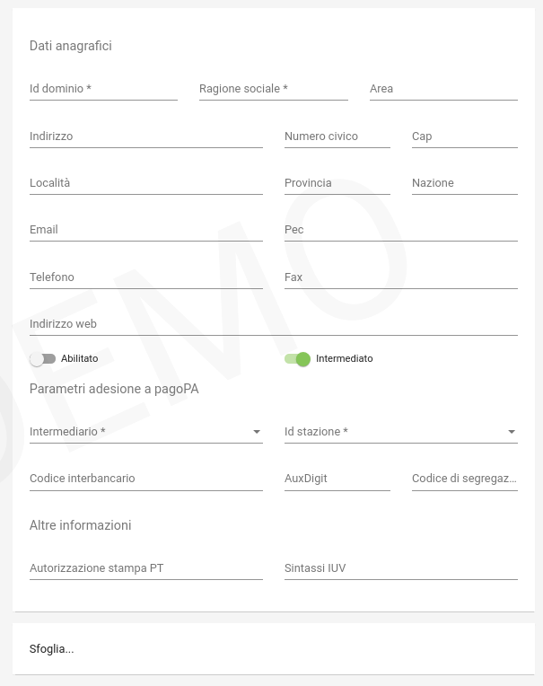
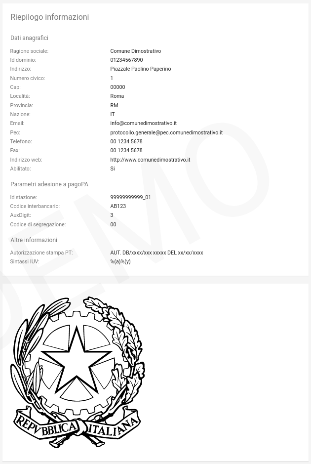

.. _govpay_configurazione_enti:

Enti Creditori
--------------

Ogni Ente Creditore su pagoPA va registrato nell'anagrafica di GovPay.

Accedendo alla sezione *Configurazioni > Enti Creditori*, viene visualizzato l'elenco degli enti già censiti. Sul lato sinistro è presente il form per filtrare i domini visualizzati in elenco, con i possibili parametri di ricerca, ovvero:

.. figure:: ../../_images/17FilttroSuDomini.png
   :align: center

   Parametri di filtro per la ricerca di un Ente Creditore

Ciascun Ente Creditore presente in elenco è identificato tramite denominazione e codice identificativo.

Nuovo Ente Creditore
~~~~~~~~~~~~~~~~~~~~

Utilizzando il pulsante di creazione, presente in basso a destra nella pagina di elenco, è possibile procedere con la creazione di un nuovo Ente Creditore, compilando il seguente form di creazione:

   Campi del form di inserimento Nuovo Ente Creditore

.. csv-table:: Dettagli di un Nuovo Ente Creditore
   :header: "Campo", "Significato", "Note"
   :widths: 40,40,20

   "Id Dominio", "Identificativo del dominio, fornito da AgID, corrisponde alla Partita Iva dell'ente", "Obbligatorio"
   "Ragione Sociale", "Ragione sociale del dominio", "Obbligatorio"
   "Area", "Identificativo interno dell'Area", ""
   "GLN (Global Location Number)", "Identificativo del dominio nella codifica standard GS1. Obbligatorio, fornito da AgIDD", ""
   "Intermediario", "Intermediario selezionato", "Obbligatorio"
   "Stazione", "Stazione tecnologica scelta in fase di adesione a pagoPA, deve ovviamente essere stata già censita sul sistema", "Obbligatorio"
   "Riferimenti anagrafici del Dominio", "Riferimenti anagrafici del dominio forniti dal Referente dei Pagamenti: Indirizzo (Indirizzo completo di toponimo), Numero Civico, CAP, Località, Provincia, Nazione (condice di due lettere, IT per Itaia), eMail, PEC, Sito web, Telefono, Fax", ""
   "CBILL", "Codice CBILL per i domini che supportano questa modalità di pagamento, attribuito da PagoPA", ""
   "Prefisso IUV", "Prefisso da inserire negli IUV generati da GovPay per questo dominio. Il prefisso, numerico, può contenere dei placeholder racchiusi tra graffe", ""
   "Aux", "Valore numerico che definisce la struttura del codice IUV in funzione del numero di punti di generazione dello stesso (cfr. *Specifiche Attuative dei codici identificativi di versamento, riversamento e rendicontazione*)", ""
   "Codice di segregazione", "Se configurato come dominio pluri-intermediato, imposta il codice numerico di segregazione.", "Fornito da AgID"
   "Abilitato", "Indica se il dominio è usabile da GovPay per gestire nuovi pagamenti (abilitato) o se si vogliono impedire nuove richieste (disabilitato)", ""
   "Autorizzazione stampa PT", "Numero di autorizzazione PT per la stampa in proprio del bollettino postale", ""
   "Sfoglia.. (Logo)", "Elemento per il caricamento del logo dell’ente creditore corrispondente al dominio", ""

I **placeholder contenuti nel prefisso IUV** vengono sostituiti a runtime con i valori forniti dagli applicativi richiedenti o con i valori di sistema configurati. La lunghezza del prefisso riduce lo spazio di IUV generabili, quindi è necessario che sia il più breve possibile.
I seguenti sono i placeholder di sistema, sovrascrivibili dall'applicazione chiamante:

* a: codice IUV assegnato all'applicazione che gestisce il debito
* t: codice IUV assegnato al tributo
* y: anno di emissione dello IUV, due cifre
* Y: anno di emissione dello IUV, quattro cifre

Dettaglio Ente Creditore
~~~~~~~~~~~~~~~~~~~~~~~~

Selezionando uno degli enti creditori presenti nella pagina di elenco si accede alla pagina di dettaglio, che si compone a partire dalle seguenti aree:

.. csv-table:: Aree del dettaglio Ente Creditore
   :header: "Area", "Descrizione"
   :widths: 40,40

   "*Riepilogo Informazioni*", "Dati che caratterizzano l'ente creditore, appena visti nella sezione `Nuovo Ente Creditore`_"
   "*Unità Operative*", "Uffici di gestione dei pagamenti in cui è suddiviso il dominio dell’ente creditore."
   "*Iban*", "Codici IBAN dei conti correnti su cui l’ente creditore riceve gli accrediti in banca tesoriera. Tali IBAN sono quelli già comunicati ad AgID in fase di accreditamento."
   "*Entrate*", "Sono le entrate attive nel dominio dell’ente creditore e quindi sulle quali è predisposto per ricevere dei pagamenti."
   "*Pendenze*", "Sono le entrate attive nel dominio dell’ente creditore e quindi sulle quali è predisposto per ricevere dei pagamenti."

Tramite il pulsante di modifica presente nella pagina di dettaglio è possibile procedere con l'aggiornamento dei dati di base, visualizzati nell'area "Riepilogo Informazioni". Si tenga presente che il **valore del campo “Codice Dominio” non è modificabile**.

   Campi del dettaglio dell'Ente Creditore

Le aree seguenti contengono i relativi pulsanti di creazione e modifica dei rispettivi elementi, con le solite, naturali, uniformi convenzioni grafiche.

.. figure:: ../../_images/20DettaglioDominio2.png
   :align: center
   :name: CampiDegliOggettiDiEnteCreditore

   Campi degli oggetti correlati all'Ente Creditore

Unità Operative
^^^^^^^^^^^^^^^

La specifica pagoPA consente di indicare l'anagrafica dell'Unità operativa titolare del credito, qualora sia diversa da quella dell'Ente
Creditore. È quindi possibile censire le Unità operative del Dominio in GovPay al fine di utilizzarle in fase di pagamento.

.. figure:: ../../_images/21NuovaUnitaOperativa.png
   :align: center
   :name: CampiPerNuovaUnitaOperativa

   Campi per creare una Nuova Unità Operativa

.. csv-table:: Dettagli di una nuova Unità Operativa
   :header: "Campo", "Significato", "Note"
   :widths: 40,40,20

   "Id unità", "Codice identificativo, ad uso interno, dell'unità operativa", "Obbligatorio"
   "Ragione Sociale", "Ragione sociale dell'Unità Operativa", "Obbligatorio"
   "Sezione Anagrafica", "Riferimenti anagrafici dell'unità forniti dal Referente dei Pagamenti", ""
   "Abilitato", "Indica se l'unità operativa è abilitata o meno nel contesto del dominio su cui si opera", ""

Ovviamente dall'elenco delle unità operative associate a un Ente Creditore, è possibile modificarne le informazioni associate.

Iban
^^^^

Gli iban utilizzati per l'accredito degli importi versati vanno censiti su GovPay. Esiste quindi una maschera di definizione degli IBAN associati all'Ente Creditore.

.. figure:: ../../_images/22NuovoIBAN.png
   :align: center
   :name: CampiPerNuovoIBAN

   Maschera di creazione IBAN associato all'Ente Creditore

Il form di creazione di un Iban deve essere compilato con i dati
seguenti:

.. csv-table:: Dettagli di un nuovo IBAN
   :header: "Campo", "Significato", "Note"
   :widths: 40,40,20

   "IBAN Accredito", "Codice IBAN del conto di accredito", "Obbligatorio, fornito dal referente dei Pagamenti"
   "BIC Accredito", "BIC del conto di accredito", "Obbligatorio"
   "Postale", "Indica se l'iban di accredito è riferito ad un conto corrente postale", ""
   "My Bank", "Indica se l'iban di accredito è è abilitato alle transazioni MyBank", ""
   "Abilitato", "Indica se l'IBAN  è abilitato o meno nel contesto del dominio su cui si opera", ""

Tornando all'elenco degli Iban, è possibile scegliere le operazioni di modifica degli elementi precedentemente creati. Il campo
Iban Accredito non è, ovviamente, modificabile.

Entrate
^^^^^^^

Ogni importo che costituisce un versamento deve essere associato ad una entrata censita sul sistema. L'entrata associata al versamento ne determina l'iban di accredito dell'importo e le coordinate di rendicontazione.

.. note:: **Si noti come la gestione delle Entrate sia stata sostituita da quella delle Pendenze, assai più flessibile e con in più la possibilità di generazione automatica delle interfacce per la riscossione: ciò semplifica grandemente l'implementazione effettiva di queste modalità di pagamento verso l'Utente finale, fornendogli al contempo un'interfaccia omogenea e consistente. Si decide di lasciare questa tipologia di oggetti per meri scopi di ereditarietà. Le nuove configurazioni dovrebbero pertanto utilizzare la Gestione delle Pendenze.**

.. figure:: ../../_images/23NuovaEntrata.png
   :align: center
   :name: CampiPerNuovaEntrata

   Maschera di creazione nuova entrata associata all'Ente Creditore

Il form di creazione di un'entrata va compilato con le seguenti informazioni:

.. csv-table:: Dettagli di una nuova entrata
   :header: "Campo", "Significato", "Note"
   :widths: 40,40,20

   "Tipo entrata", "Selezione tra le tipologie già censite", "Se non risulta presente la voce desiderata, selezionare *Nuova Entrata*
      -  Id Entrata: identificativo dell'entrata.
      -  Descrizione: testo di descrizione dell'entrata per facilitarne
         il riconoscimento agli operatori. Obbligatorio, a discrezione
         dell'operatore.
      -  Tipo Contabilità: tipologia di codifica contabile assegnata
         all'entrata (SIOPE/SPECIALE/...). Obbligatorio, fornito dalla
         segreteria.
      -  Codice Contabilità: codice contabilità assegnato all'entrata
         secondo la codifica indicata precedentemente. Obbligatorio,
         fornito dalla segreteria.
      -  *Codifica IUV*: codifica dell'entrata nel contesto degli IUV
         generati da GovPay, se configurato in tal senso."
   "IBAN Accredito", "IBAN di accredito del tributo a scelta tra quelli censiti per il dominio", "Obbligatorio"
   "IBAN Appoggio", "utilizzato nelle situazioni in cui il PSP non è in condizioni di accreditare somme sul conto di accredito (si considerino le limitazioni in essere nel circuito postale)", ""
   "Tipo contabilità", "Se valorizzato sovrascive l'mpostazione prevista nel default per l'entrata cui si fa riferimento", ""
   "Codice contabilità", "Se valorizzato sovrascive l'mpostazione prevista nel default per l'entrata cui si fa riferimento", ""
   "Abilitato", "Indica se l'Entrata è abilitata o meno nel contesto del dominio su cui si opera", ""

.. note:: I campi *Tipo Contabilità e Codice Contabilità* rappresentano i valori di default per il tipo entrata e saranno attualizzabili nel contesto di ciascun Ente Creditore.

Dalla lista delle Entrate rimane sempre possibile modificare la singola Entrata, con il campo *Codice Entrata* non modificabile. Fa eccezione l'entrata preconfigurata “Marca da Bollo Telematica” per la quale si ha la sola possibilità di modificare i parametri di contabilizzazione.

Pendenze
^^^^^^^^

Questa sezione permette la scelta e la personalizzazione delle pendenze (ovvero oggetti che vanno riconciliati con i pagamenti) ammissibili per l'Ente Creditore in essere. Si noti come le pendenze possano essere associate all'Ente selezionandole da quelle censite (l'aggiunta di un nuovo tipo di pendenza viene gestita nella funzionalità associata alla voce `Tipi Pendenze`_ del menu sulla sinistra). Il sistema, ovviamente, permette di aggiungere solo le pendenze che, per l'Ente, non siano state già scelte.
Ad esempio, in un Ente Creditore abbiamo le seguenti tipologie di pendenza già selezionate:

.. figure:: ../../_images/25PendenzeSceltePerIlDominio.png
   :align: center
   :name: PendenzeRelativeAUnDominio

   Pendenze associate a un Ente Creditore

A questo punto, sull'Ente Creditore selezionato, si potrà aggiungere una sola pendenza (quella non ancora selezionata), come mostrato:

.. figure:: ../../_images/26PendenzaSelezionabile.png
   :align: center
   :name: PendenzaSelezionabilePerAggiunta

   Pendenza selezionabile per aggiunta all'Ente Creditore

Il sistema dà la possibilità, una volta aggiunta una nuova pendenza, di personalizzarla per l'Ente Creditore, consentendo anche la generazione di maschere automatiche per l'immissione dei dati.
Si tenga presente che si affronterà il dettaglio dei campi delle pendenze nella sezione apposita, cui si fa riferimento. Al momento si noti come una pendenza possa essere completamente personalizzata per un dominio a partire da una *standard* definita nella sezione *`Tipi Pendenze`_*.
I meccanismi di selezione sono del tutto analoghi a quanto già visto in altri contesti del sistema: selezioniamo la Pendenza *Sanzione Amministrativa*

.. figure:: ../../_images/27SelezioneDellaPendenzaPerModifica.png
   :align: center
   :name: SelezionePendenzaSanzioneAmministrativa

   Selezione della Pendenza *Sanzione Amministrativa*

Il sistema mostra la seguente maschera

.. figure:: ../../_images/30ModificaSanzioneAmministrativa.png
   :align: center
   :name: ModificaSanzioneAmministrativa

   Modifica *Sanzione Amministrativa*

Da qui possiamo personalizzare **senza modificare le informazioni standard del tipo Sanzione Amministrativa**.
