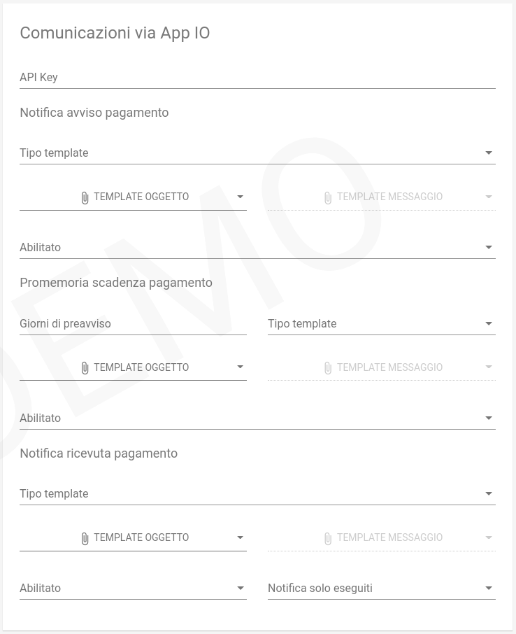

.. _govpay_configurazione_enti_appio:

Configurazione dell'avvisatura al cittadino via AppIO
-----------------------------------------------------

Nel caso in cui l'Ente abbia correttamente eseguito l'adesione al backoffice IO e configurato
tale servizio nelle impostazioni, è possibile
predisporre delle comunicazioni automatiche verso il cittadino tramite l'AppIO. 
Queste comunicazioni sono ovviamente attivate se il cittadino ha installato
l'AppIO su uno dei suoi dispositivi personali.

   Avvisatura via e-mail
   
Per attivare il servizio è necessario specificare l'``ApiKey`` fornita dal
backoffice IO per il servizio oggetto di pagamento.

Notifica avviso di pagamento
~~~~~~~~~~~~~~~~~~~~~~~~~~~~

La notifica di avviso di pagamento viene inviata quando viene creata una nuova pendenza oppure alla data indicata nel campo ``dataNotificaAvviso`` se la posizione sarà ancora pagabile.

.. csv-table:: *Notifica avviso*
   :header: "Campo", "Descrizione"
   :widths: 40,60

   "Tipo template", "Tipologia del template di trasformazione"
   "Template oggetto", "Template di traformazione per la produzione del testo usato come oggetto del messaggio"
   "Template messaggio", "Template di traformazione per la produzione del Markdown usato come corpo del messaggio"
   "Abilitato", "Indica se il servizio di notifica deve o meno essere operativo"

Promemoria scadenza pagamento
~~~~~~~~~~~~~~~~~~~~~~~~~~~~~

All'approssimarsi della data di scadenza indicata sull'avviso, il sistema può inviare una mail di promemoria. Il promemoria
viene inviato nella data indicata nel campo ``dataPromemoriaScadenza`` o qualche giorno prima della scadenza se la pendenza risulta
ancora pagabile.

.. csv-table:: *Promemoria scadebza*
   :header: "Campo", "Descrizione"
   :widths: 40,60

   "Giorni di preavviso", "Numero di giorni dalla scadenza in cui comunicare il promemoria"
   "Tipo template", "Tipologia del template di trasformazione"
   "Template oggetto", "Template di traformazione per la produzione del testo usato come oggetto della mail"
   "Template messaggio", "Template di traformazione per la produzione del Markdown usato come corpo della mail"
   "Abilitato", "Indica se il servizio di notifica deve o meno essere operativo"

Notifica ricevuta pagamento
~~~~~~~~~~~~~~~~~~~~~~~~~~~

A fronte di un tentativo di pagamento il sistema può inviare al debitore ed al pagatore, qualora diversi, un messaggio
di notifica dell'esito con allegata la stampad della ricevuta:

.. csv-table:: *Notifica ricevuta*
   :header: "Campo", "Descrizione"
   :widths: 40,60

   "Tipo template", "Tipologia del template di trasformazione"
   "Template oggetto", "Template di traformazione per la produzione del testo usato come oggetto della mail"
   "Template messaggio", "Template di traformazione per la produzione del Markdown usato come corpo della mail"
   "Abilitato", "Indica se il servizio di notifica deve o meno essere operativo"
   "Notifica solo eseguiti", "Indica se inviare la notifica solo nel caso di transazioni avvenute con successo"