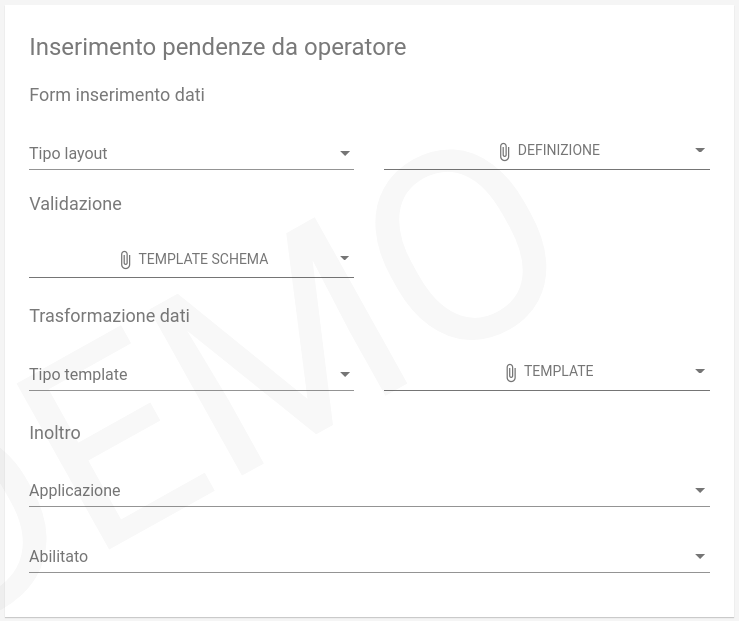

.. _govpay_configurazione_enti_formoperatore:

Configurazione del tipo pendenza per il caricamento manuale da operatore.
-------------------------------------------------------------------------

E' possibile predisporre delle form personalizzate nella Console di GovPay per consentire l'inserimento
delle pendenze richiedendo all'operatore un set minimale di informazioni e codificando la logica di 
creazione della pendenza.

   Inserimento pendenze da operatore

Form inserimento Dati
~~~~~~~~~~~~~~~~~~~~~

In questa sezione viene definito il layout della form di acquisizione dei dati necessari all'istruttoria della posizione che 
saranno poi l'input alla successiva fase di validazione:

.. csv-table:: *Form inserimento Dati*
   :header: "Campo", "Descrizione"
   :widths: 40,60

   "Tipo layout", "Indica il motore di interpretazione della definizione della form"
   "Definizione", "File che definisce la form nel formalismo scelto in `Tipo Layout`"

I tipi di layout al momento disponibili sono i seguenti:
	
	-  *Angular json schema form*: `Progetto GitHub <https://github.com/dschnelldavis/angular2-json-schema-form>`_ - `Playground <https://angular2-json-schema-form.firebaseapp.com/>`_

Validazione
~~~~~~~~~~~

E' possibile configurare in questa sezione il JSON Schema con cui validare i dati inviati dalla form definita nella sezione precedente. 

Trasformazione dati
~~~~~~~~~~~~~~~~~~~

In questa sezione può essere configurato il processo che, dai dati inseriti nella form, produce una pendenza. Il dato di Input è il JSON prodotto
dalla form di inserimento dati, mentre l'output deve essere un JSON che rispetta lo schema di una `PendenzaPost <https://petstore.swagger.io/?url=https://raw.githubusercontent.com/link-it/govpay/3.6.x/wars/api-backoffice/src/main/webapp/v1/govpay-api-backoffice-v1.yaml#model-pendenzaPost>`_.
oppure un JSON compatibile con il successivo servizio di inoltro, se configurato. 

Inoltro
~~~~~~~

E' possibile inviare i dati ricevuti ed eventualmente trasformati ad una applicazione per il processo di istruttoria. Il JSON ritornato da tale
servizio deve rispettare lo schema di una `PendenzaPost <https://petstore.swagger.io/?url=https://raw.githubusercontent.com/link-it/govpay/3.6.x/wars/api-backoffice/src/main/webapp/v1/govpay-api-backoffice-v1.yaml#model-pendenzaPost>`_.

