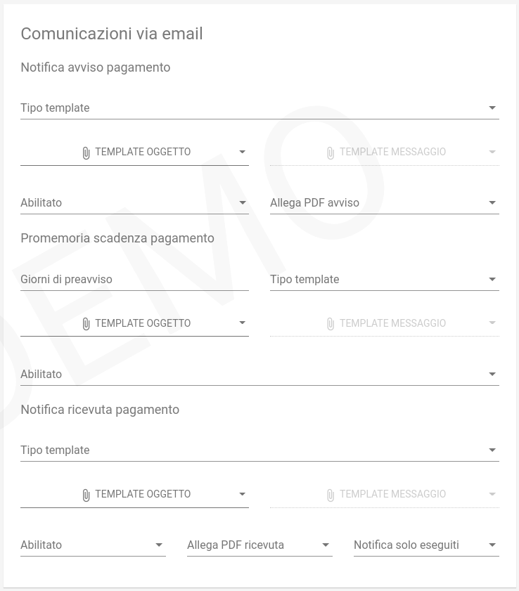

.. _govpay_configurazione_enti_email:

Configurazione dell'avvisatura al cittadino via Email
-----------------------------------------------------

Se dalle impostazioni e' stato correttamente configurato il server di posta, è possibile
predisporre delle comunicazioni automatiche verso il cittadino via e-mail. Queste comunicazioni
sono ovviamente attivate se tra i dati anagrafici del cittadino viene indicato un indirizzo e-mail valido.

   Avvisatura via e-mail

Notifica avviso di pagamento
~~~~~~~~~~~~~~~~~~~~~~~~~~~~

La notifica di avviso di pagamento viene inviata quando viene creata una nuova pendenza oppure alla data indicata nel campo ``dataNotificaAvviso`` se la posizione sarà ancora pagabile.

.. csv-table:: *Notifica avviso*
   :header: "Campo", "Descrizione"
   :widths: 40,60

   "Tipo template", "Tipologia del template di trasformazione"
   "Template oggetto", "Template di traformazione per la produzione del testo usato come oggetto della mail"
   "Template messaggio", "Template di traformazione per la produzione dell'html usato come corpo della mail"
   "Abilitato", "Indica se il servizio di notifica deve o meno essere operativo"
   "Allega pdf avviso", "Indica se allegare alla mail il pdf dell'avviso di pagamento"

Promemoria scadenza pagamento
~~~~~~~~~~~~~~~~~~~~~~~~~~~~~

All'approssimarsi della data di scadenza indicata sull'avviso, il sistema può inviare una mail di promemoria. Il promemoria
viene inviato nella data indicata nel campo ``dataPromemoriaScadenza`` o qualche giorno prima della scadenza se la pendenza risulta
ancora pagabile.

.. csv-table:: *Promemoria scadebza*
   :header: "Campo", "Descrizione"
   :widths: 40,60

   "Giorni di preavviso", "Numero di giorni dalla scadenza in cui comunicare il promemoria"
   "Tipo template", "Tipologia del template di trasformazione"
   "Template oggetto", "Template di traformazione per la produzione del testo usato come oggetto della mail"
   "Template messaggio", "Template di traformazione per la produzione dell'html usato come corpo della mail"
   "Abilitato", "Indica se il servizio di notifica deve o meno essere operativo"

Notifica ricevuta pagamento
~~~~~~~~~~~~~~~~~~~~~~~~~~~

A fronte di un tentativo di pagamento il sistema può inviare al debitore ed al pagatore, qualora diversi, un messaggio
di notifica dell'esito con allegata la stampad della ricevuta:

.. csv-table:: *Notifica ricevuta*
   :header: "Campo", "Descrizione"
   :widths: 40,60

   "Tipo template", "Tipologia del template di trasformazione"
   "Template oggetto", "Template di traformazione per la produzione del testo usato come oggetto della mail"
   "Template messaggio", "Template di traformazione per la produzione dell'html usato come corpo della mail"
   "Abilitato", "Indica se il servizio di notifica deve o meno essere operativo"
   "Allega pdf ricevuta", "Indica se allegare alla mail il pdf della ricevuta di pagamento"
   "Notifica solo eseguiti", "Indica se inviare la notifica solo nel caso di transazioni avvenute con successo"