.. _govpay_configurazione:

==============
Configurazione
==============

La configurazione di Govpay è quella attività, visibile solo agli amministratori del sistema, che consente il censimento e la manutenzione delle entità logiche (operatori, ruoli, domini, abilitazioni e quant'altro) coinvolte nel processo di pagamento.

Le attività di configurazione vengono svolte tramite un'apposita sezione del cruscotto grafico :ref:`govpay_console` e sono necessarie alla messa in funzione dell'applicativo.
La lista degli oggetti che è possibile configurare comprende i seguenti elementi:

-  *Intermediari*: rappresentano le entità “Intermediario” o “Partner Tecnologico” censiti presso il Nodo dei Pagamenti scelti in fase di adesione dagli Enti Creditore per l'accesso al sistema pagoPA.
-  *Enti Creditori*: corrispondono agli enti creditori aderenti al sistema pagoPA.
-  *Tipi Pendenza*: rappresentano le esigenze dell'ente creditore dalle quali scaturiscono le tipologie di pagamenti che possono essere gestiti dal sistema (ad esempiotassa rifiuti, licenza di caccia, bollo auto e via dicendo).
-  *Applicazioni*: rappresentano i portali di pagamento e i gestionali delle posizioni debitorie degli enti Creditori integrati con GovPay tramite gli appositi servizi.
-  *Operatori*: sono le utenze del cruscotto di gestione GovPay.
-  *Ruoli*: rappresentano l'insieme delle autorizzazioni consentite sulle entità dati, da assegnarsi agli utenti del
   cruscotto.

.. note:: Nell'analisi delle funzionalità di configurazione, le immagini esemplificative mostrate mancheranno della
   sezione di sinistra (*Lista funzionalità*) al fine di agevolare la focalizzazione sulla parte important della funzionalità, ovvero il suo dettaglio posto a destra.

.. _govpay_configurazione_intermediari:

Intermediari
------------

Gli intermediari o partner tecnologici sono entità censite da AgID sul circuito pagoPA al momento dell'adesione di un Ente Creditore. Per il corretto funzionamento di GovPay, gli intermediari di interesse devono essere censiti con le informazioni di corredo necessarie.

.. figure:: ../_images/09Intermediari.png
   :align: center

   Vista di dettaglio intermediari

Accedendo alla sezione corrispondente (*Configurazioni > Intermediari*), viene visualizzato l'elenco degli intermediari censiti
sul sistema. È possibile filtrare gli intermediari in relazione al loro stato, impostandolo nella casella di selezione posta a sinistra, come di seguito mostrato:

.. figure:: ../_images/10FiltroSuIntermediari.png
   :align: center

   Filtro su ricerca Intermediari

Nuovo Intermediario
~~~~~~~~~~~~~~~~~~~

Per inserire un nuovo intermediario è necessario premere l'apposito
pulsante, presente nella pagina di elenco in basso a destra, e compilare il form che viene
aperto:

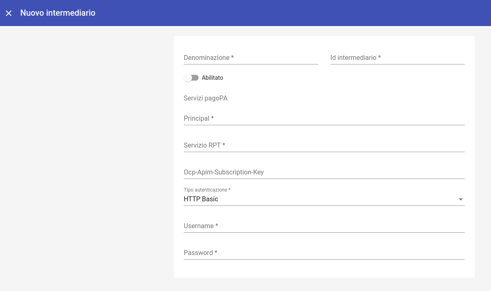

   Informazioni che definiscono un nuovo intermediario

Le informazioni contenute nel form sono le seguenti:

.. csv-table:: Dettagli di un nuovo intermediario
  :header: "Campo", "Significato", "Note"
  :widths: 40,40,20

  "Denominazione", "Nome associato all'Intermediario o al Partner Tecnologico", "Obbligatorio"
  "Id Intermediario", "Identificativo dell'intermediario o Partner Tecnologico, fornito da AgID, corrisponde alla Partita IVA del soggetto", "Obbligatorio"
  "Principal", "identificativo (subject certificato o principal) corrispondente alle credenziali con cui Govpay riceve le chiamate in entrata da pagoPA", ""
  "Abilitato/Non Abilitato", "Stato del nuovo intermediario: indica se l'intermediario è usabile da GovPay per gestire nuovi pagamenti o se impedire nuove richieste.", ""
  "Servizio RPT", "Riferimenti utilizzati da Govpay per comunicare con il Nodo SPC: Endpoint per le chiamate in uscita verso il Nodo SPC", ""
  "Tipo Autenticazione", "Lista a discesa per selezionare il tipo di autenticazione adottata per le comunicazioni con il Nodo SPC. Si può scegliere, al momento, tra *Nessuna e HTTP-Basic*. Nel caso si scelga quest'ultima modalità di autenticazione, dovranno essere inserite i relativi dati di configurazione (userid/password)", ""

Selezionando un intermediario dalla pagina che li elenca si accede alla pagina di dettaglio.

Dettaglio Intermediario
~~~~~~~~~~~~~~~~~~~~~~~

La pagina di dettaglio di un intermediario mostra i singoli campi che lo
compongono unitamente all'elenco delle stazioni ad esso associate.
Infatti, al censimento di un Intermediario o Partner Tecnologico, AgID
assegna anche una o più Stazioni Tecnologiche che devono essere
registrate su GovPay.

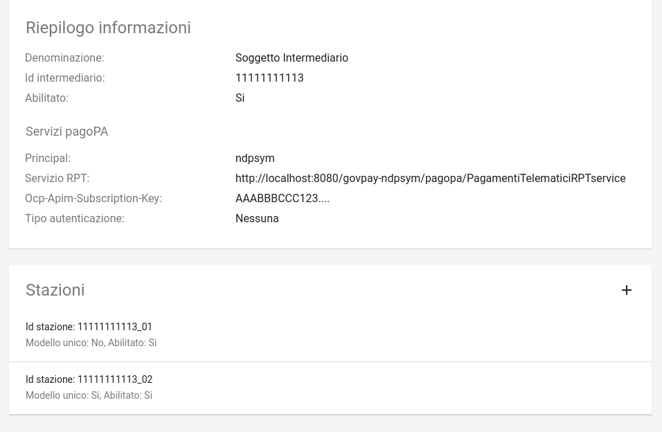

   Pulsante di modifica

Il pulsante di modifica presente nella pagina consente di aprire il form
per modificare le proprietà dell'intermediario.

Stazioni
~~~~~~~~

Nella pagina di dettaglio dell'intermediario (quindi una volta che lo si è creato) esiste una sezione dedicata alle
stazioni in cui è possibile aggiungerne di nuove:

.. figure:: ../_images/13AggiuntaStazionePlus.png
   :align: center

   Pulsante di aggiunta stazione (evidenziato in rosso)

Si ottiene così il seguente risultato:

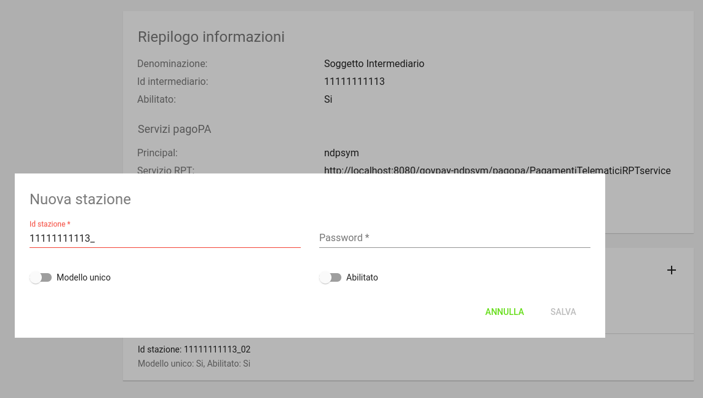

   Maschera di inserimento di una nuova stazione

Per definire una stazione connessa all'intermediario occorre immettere le seguenti informazioni:

.. csv-table:: Dettagli di una nuova stazione
  :header: "Campo", "Significato", "Note"
  :widths: 40,40,20

  "IdStazione", "Identificativo della stazione, fornito da AgID", "Obbligatorio"
  "Password", "Chiave segreta, fornita da AgID", "Obbligatorio"
  "Abilitato", "indica se la stazione è usabile da GovPay per gestire nuovi pagamenti (abilitato)
  o se si vogliono impedire nuove richieste (disabilitato)", ""

.. note:: Si noti come le stazioni siano connesse univocamente a ciascun intermediario, non è quindi possibile avere una stessa stazione connessa a due intermediari

È possibile visualizzare il dettaglio di una stazione selezionandola dall’elenco, avendo il dettaglio dei campi appena visti.

In corrispondenza di ciascuna stazione in elenco si evidenzia il pulsante per la modifica delle informazioni:

.. figure:: ../_images/15ModificaStazione1.png
   :align: center

   Modifica di una stazione esistente

I dati modificabili della stazione saranno la sola password e lo stato; l'identificativo non sarà modificabile:

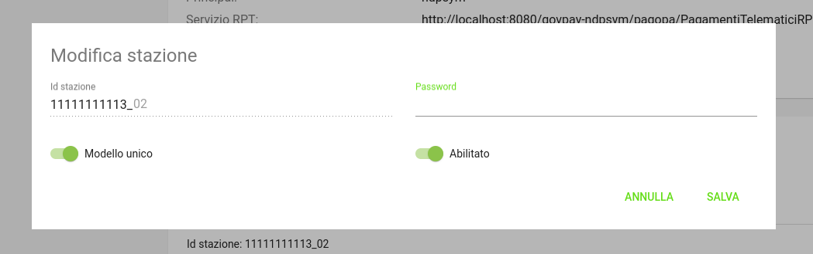

   Maschera di modifica di una stazione

Una volta terminata la modifica è necessaria la pressione della voce *Salva* per renderla effettiva.

.. _govpay_configurazione_enti:

Enti Creditori
--------------

Ogni Ente Creditore su pagoPA va registrato nell'anagrafica di GovPay.

Accedendo alla sezione *Configurazioni > Enti Creditori*, viene visualizzato l'elenco degli enti già censiti. Sul lato sinistro è presente il form per filtrare i domini visualizzati in elenco, con i possibili parametri di ricerca, ovvero:

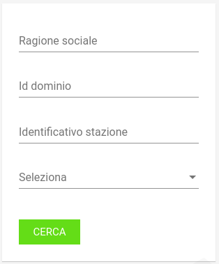

   Parametri di filtro per la ricerca di un Ente Creditore

Ciascun Ente Creditore presente in elenco è identificato tramite denominazione e codice identificativo.

Nuovo Ente Creditore
~~~~~~~~~~~~~~~~~~~~

Utilizzando il pulsante di creazione, presente in basso a destra nella pagina di elenco, è possibile procedere con la creazione di un nuovo Ente Creditore, compilando il seguente form di creazione:

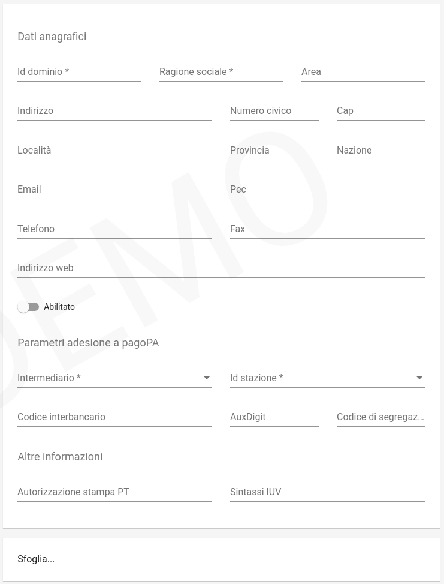

   Campi del form di inserimento Nuovo Ente Creditore

.. csv-table:: Dettagli di un Nuovo Ente Creditore
  :header: "Campo", "Significato", "Note"
  :widths: 40,40,20

  "Id Dominio", "Identificativo del dominio, fornito da AgID, corrisponde alla Partita Iva dell'ente", "Obbligatorio"
  "Ragione Sociale", "Ragione sociale del dominio", "Obbligatorio"
  "Area", "Identificativo interno dell'Area", ""
  "GLN (Global Location Number)", "Identificativo del dominio nella codifica standard GS1. Obbligatorio, fornito da AgIDD", ""
  "Intermediario", "Intermediario selezionato", "Obbligatorio"
  "Stazione", "Stazione tecnologica scelta in fase di adesione a pagoPA, deve ovviamente essere stata già censita sul sistema", "Obbligatorio"
  "Riferimenti anagrafici del Dominio", "Riferimenti anagrafici del dominio forniti dal Referente dei Pagamenti: Indirizzo (Indirizzo completo di toponimo), Numero Civico, CAP, Località, Provincia, Nazione (condice di due lettere, IT per Itaia), eMail, PEC, Sito web, Telefono, Fax", ""
  "CBILL", "Codice CBILL per i domini che supportano questa modalità di pagamento, attribuito da PagoPA", ""
  "Prefisso IUV", "Prefisso da inserire negli IUV generati da GovPay per questo dominio. Il prefisso, numerico, può contenere dei placeholder racchiusi tra graffe", ""
  "Aux", "Valore numerico che definisce la struttura del codice IUV in funzione del numero di punti di generazione dello stesso (cfr. *Specifiche Attuative dei codici identificativi di versamento, riversamento e rendicontazione*)", ""
  "Codice di segregazione", "Se configurato come dominio pluri-intermediato, imposta il codice numerico di segregazione.", "Fornito da AgID"
  "Abilitato", "Indica se il dominio è usabile da GovPay per gestire nuovi pagamenti (abilitato) o se si vogliono impedire nuove richieste (disabilitato)", ""
  "Autorizzazione stampa PT", "Numero di autorizzazione PT per la stampa in proprio del bollettino postale", ""
  "Sfoglia.. (Logo)", "Elemento per il caricamento del logo dell’ente creditore corrispondente al dominio", ""

I **placeholder contenuti nel prefisso IUV** vengono sostituiti a runtime con i valori forniti dagli applicativi richiedenti o con i valori di sistema configurati. La lunghezza del prefisso riduce lo spazio di IUV generabili, quindi è necessario che sia il più breve possibile.
I seguenti sono i placeholder di sistema, sovrascrivibili dall'applicazione chiamante:

* a: codice IUV assegnato all'applicazione che gestisce il debito
* t: codice IUV assegnato al tributo
* y: anno di emissione dello IUV, due cifre
* Y: anno di emissione dello IUV, quattro cifre

Dettaglio Ente Creditore
~~~~~~~~~~~~~~~~~~~~~~~~

Selezionando uno degli enti creditori presenti nella pagina di elenco si accede alla pagina di dettaglio, che si compone a partire dalle seguenti aree:

.. csv-table:: Aree del dettaglio Ente Creditore
  :header: "Area", "Descrizione"
  :widths: 40,40

  "*Riepilogo Informazioni*", "Dati che caratterizzano l'ente creditore, appena visti nella sezione `Nuovo Ente Creditore`_"
  "*Unità Operative*", "Uffici di gestione dei pagamenti in cui è suddiviso il dominio dell’ente creditore."
  "*Iban*", "Codici IBAN dei conti correnti su cui l’ente creditore riceve gli accrediti in banca tesoriera. Tali IBAN sono quelli già comunicati ad AgID in fase di accreditamento."
  "*Entrate*", "Sono le entrate attive nel dominio dell’ente creditore e quindi sulle quali è predisposto per ricevere dei pagamenti."
  "*Pendenze*", "Sono le entrate attive nel dominio dell’ente creditore e quindi sulle quali è predisposto per ricevere dei pagamenti."

Tramite il pulsante di modifica presente nella pagina di dettaglio è possibile procedere con l'aggiornamento dei dati di base, visualizzati nell'area "Riepilogo Informazioni". Si tenga presente che il **valore del campo “Codice Dominio” non è modificabile**.

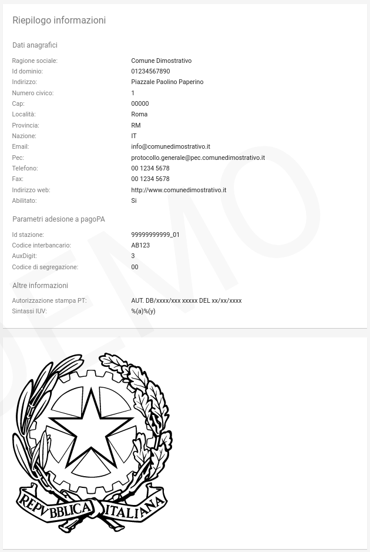

   Campi del dettaglio dell'Ente Creditore

Le aree seguenti contengono i relativi pulsanti di creazione e modifica dei rispettivi elementi, con le solite, naturali, uniformi convenzioni grafiche.

.. figure:: ../_images/20DettaglioDominio2.png
   :align: center
   :name: CampiDegliOggettiDiEnteCreditore

   Campi degli oggetti correlati all'Ente Creditore

Unità Operative
^^^^^^^^^^^^^^^

La specifica pagoPA consente di indicare l'anagrafica dell'Unità operativa titolare del credito, qualora sia diversa da quella dell'Ente
Creditore. È quindi possibile censire le Unità operative del Dominio in GovPay al fine di utilizzarle in fase di pagamento.

.. figure:: ../_images/21NuovaUnitaOperativa.png
   :align: center
   :name: CampiPerNuovaUnitaOperativa

   Campi per creare una Nuova Unità Operativa

.. csv-table:: Dettagli di una nuova Unità Operativa
  :header: "Campo", "Significato", "Note"
  :widths: 40,40,20

  "Id unità", "Codice identificativo, ad uso interno, dell'unità operativa", "Obbligatorio"
  "Ragione Sociale", "Ragione sociale dell'Unità Operativa", "Obbligatorio"
  "Sezione Anagrafica", "Riferimenti anagrafici dell'unità forniti dal Referente dei Pagamenti", ""
  "Abilitato", "Indica se l'unità operativa è abilitata o meno nel contesto del dominio su cui si opera", ""

Ovviamente dall'elenco delle unità operative associate a un Ente Creditore, è possibile modificarne le informazioni associate.

Iban
^^^^

Gli iban utilizzati per l'accredito degli importi versati vanno censiti su GovPay. Esiste quindi una maschera di definizione degli IBAN associati all'Ente Creditore.

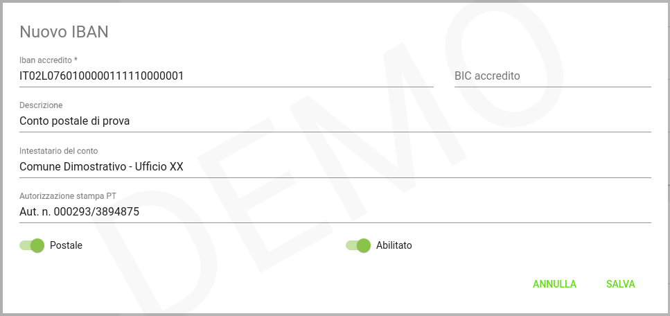

   Maschera di creazione IBAN associato all'Ente Creditore

Il form di creazione di un Iban deve essere compilato con i dati
seguenti:

.. csv-table:: Dettagli di un nuovo IBAN
  :header: "Campo", "Significato", "Note"
  :widths: 40,40,20

  "IBAN Accredito", "Codice IBAN del conto di accredito", "Obbligatorio, fornito dal referente dei Pagamenti"
  "BIC Accredito", "BIC del conto di accredito", "Obbligatorio"
  "Postale", "Indica se l'iban di accredito è riferito ad un conto corrente postale", ""
  "My Bank", "Indica se l'iban di accredito è è abilitato alle transazioni MyBank", ""
  "Abilitato", "Indica se l'IBAN  è abilitato o meno nel contesto del dominio su cui si opera", ""

Tornando all'elenco degli Iban, è possibile scegliere le operazioni di modifica degli elementi precedentemente creati. Il campo
Iban Accredito non è, ovviamente, modificabile.

Entrate
^^^^^^^

Ogni importo che costituisce un versamento deve essere associato ad una entrata censita sul sistema. L'entrata associata al versamento ne determina l'iban di accredito dell'importo e le coordinate di rendicontazione.

.. note:: **Si noti come la gestione delle Entrate sia stata sostituita da quella delle Pendenze, assai più flessibile e con in più la possibilità di generazione automatica delle interfacce per la riscossione: ciò semplifica grandemente l'implementazione effettiva di queste modalità di pagamento verso l'Utente finale, fornendogli al contempo un'interfaccia omogenea e consistente. Si decide di lasciare questa tipologia di oggetti per meri scopi di ereditarietà. Le nuove configurazioni dovrebbero pertanto utilizzare la Gestione delle Pendenze.**

.. figure:: ../_images/23NuovaEntrata.png
   :align: center
   :name: CampiPerNuovaEntrata

   Maschera di creazione nuova entrata associata all'Ente Creditore

Il form di creazione di un'entrata va compilato con le seguenti informazioni:

.. csv-table:: Dettagli di una nuova entrata
  :header: "Campo", "Significato", "Note"
  :widths: 40,40,20

  "Tipo entrata", "Selezione tra le tipologie già censite", "Se non risulta presente la voce desiderata, selezionare *Nuova Entrata*
      -  Id Entrata: identificativo dell'entrata. 
      -  Descrizione: testo di descrizione dell'entrata per facilitarne
         il riconoscimento agli operatori. Obbligatorio, a discrezione
         dell'operatore.
      -  Tipo Contabilità: tipologia di codifica contabile assegnata
         all'entrata (SIOPE/SPECIALE/...). Obbligatorio, fornito dalla
         segreteria.
      -  Codice Contabilità: codice contabilità assegnato all'entrata
         secondo la codifica indicata precedentemente. Obbligatorio,
         fornito dalla segreteria.
      -  *Codifica IUV*: codifica dell'entrata nel contesto degli IUV
         generati da GovPay, se configurato in tal senso."
  "IBAN Accredito", "IBAN di accredito del tributo a scelta tra quelli censiti per il dominio", "Obbligatorio"
  "IBAN Appoggio", "utilizzato nelle situazioni in cui il PSP non è in condizioni di accreditare somme sul conto di accredito (si considerino le limitazioni in essere nel circuito postale)", ""
  "Tipo contabilità", "Se valorizzato sovrascive l'mpostazione prevista nel default per l'entrata cui si fa riferimento", ""
  "Codice contabilità", "Se valorizzato sovrascive l'mpostazione prevista nel default per l'entrata cui si fa riferimento", ""
  "Abilitato", "Indica se l'Entrata è abilitata o meno nel contesto del dominio su cui si opera", ""

.. note:: I campi *Tipo Contabilità e Codice Contabilità* rappresentano i valori di default per il tipo entrata e saranno attualizzabili nel contesto di ciascun Ente Creditore.

Dalla lista delle Entrate rimane sempre possibile modificare la singola Entrata, con il campo *Codice Entrata* non modificabile. Fa eccezione l'entrata preconfigurata “Marca da Bollo Telematica” per la quale si ha la sola possibilità di modificare i parametri di contabilizzazione.

Pendenze
^^^^^^^^

Questa sezione permette la scelta e la personalizzazione delle pendenze (ovvero oggetti che vanno riconciliati con i pagamenti) ammissibili per l'Ente Creditore in essere. Si noti come le pendenze possano essere associate all'Ente selezionandole da quelle censite (l'aggiunta di un nuovo tipo di pendenza viene gestita nella funzionalità associata alla voce `Tipi Pendenze`_ del menu sulla sinistra). Il sistema, ovviamente, permette di aggiungere solo le pendenze che, per l'Ente, non siano state già scelte.
Ad esempio, in un Ente Creditore abbiamo le seguenti tipologie di pendenza già selezionate:

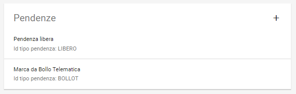

   Pendenze associate a un Ente Creditore

A questo punto, sull'Ente Creditore selezionato, si potrà aggiungere una sola pendenza (quella non ancora selezionata), come mostrato:

.. figure:: ../_images/26PendenzaSelezionabile.png
   :align: center
   :name: PendenzaSelezionabilePerAggiunta

   Pendenza selezionabile per aggiunta all'Ente Creditore

Il sistema dà la possibilità, una volta aggiunta una nuova pendenza, di personalizzarla per l'Ente Creditore, consentendo anche la generazione di maschere automatiche per l'immissione dei dati.
Si tenga presente che si affronterà il dettaglio dei campi delle pendenze nella sezione apposita, cui si fa riferimento. Al momento si noti come una pendenza possa essere completamente personalizzata per un dominio a partire da una *standard* definita nella sezione *`Tipi Pendenze`_*.
I meccanismi di selezione sono del tutto analoghi a quanto già visto in altri contesti del sistema: selezioniamo la Pendenza *Sanzione Amministrativa*

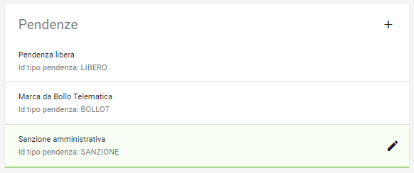

   Selezione della Pendenza *Sanzione Amministrativa*

Il sistema mostra la seguente maschera

.. figure:: ../_images/30ModificaSanzioneAmministrativa.png
   :align: center
   :name: ModificaSanzioneAmministrativa

   Modifica *Sanzione Amministrativa*

Da qui possiamo personalizzare **senza modificare le informazioni standard del tipo Sanzione Amministrativa**.

.. _govpay_configurazione_tipipendenze:

Tipi Pendenze
-------------

Ogni importo che costituisce un versamento deve essere associato ad una pendenza censita sul sistema. La configurazione di questo oggetto determina quindi le coordinate di pagamento e quelle di rendicontazione. Si noti come le pendenze siano associate a un dominio, determinando quindi il tipo di pagamenti che ad esso fanno riferimento.
La gestione dei tipi di pendenza permette la generazione di maschere automatiche per l'immissione dei dati, semplificando in modo notevole lo sviluppo di interfacce e ottimizzando i tempi generali di progetto.
Le modalità per la creazione di una nuova pendenza sono sempre le medesime (tasto più in basso a destra) e la maschera presentata è la seguente:

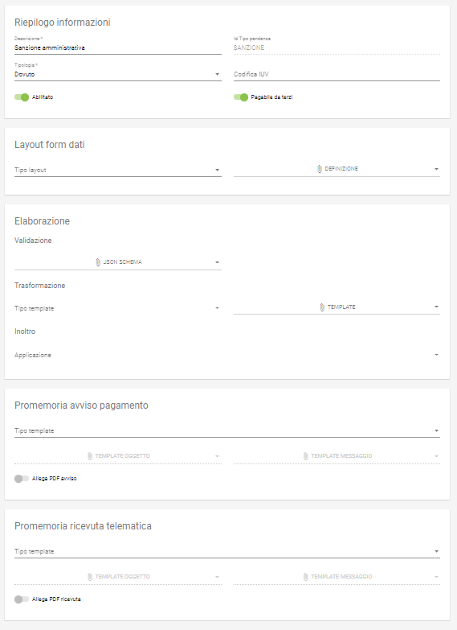

   Maschera di creazione di una Nuova Pendenza

Vediamo come modificare una pendenza esistente; ciò ci permetterà di illustrare il dettaglio dei campi presenti. Selezioniamo, ad esempio, la Pendenza *Sanzione Amministrativa*.

   Selezione della Pendenza *Sanzione Amministrativa*

Il sistema mostra la seguente maschera

.. figure:: ../_images/30ModificaSanzioneAmministrativa.png
   :align: center
   :name: ModificaTipoPendenzaSanzioneAmministrativa

   Modifica del tipo pendenza *Sanzione Amministrativa*

Possiamo identificare i seguenti raggruppamenti di informazioni:

* Riepilogo Informazioni
* Layout form dati
* Elaborazione
* Promemoria avviso pagamento
* Promemoria ricevuta telematica

A ciascuno di essi è dedicata una sezione di dettaglio, come segue.

Riepilogo Informazioni
~~~~~~~~~~~~~~~~~~~~~~
La sottosezione si presenta nel seguente modo:

   Sezione Riepilogo Informazioni

.. csv-table:: Campi modificabili della prima sezione
  :header: "Campo", "Significato", "Note"
  :widths: 40,40,20

  "Descrizione", "Descrizione sintetica del tipo di pendenza", ""
  "Id Tipo Pendenza", "Codice tecnico che indica in modo univoco la pendenza", "Non modificabile"
  "Tipologia", "Tipo di pendenza: dovuta o spontanea", ""
  "Codifica IUV", "Identificatore della struttura del codice IUV", ""
  "Abilitato", "Indica se la Sanzione Amministrativa sia abilitata o meno, quindi sia o meno associabile a domini esistenti", ""
  "Pagabile da terzi", "Indica se la sanzione possa o meno essere pagata non dal debitore", ""

Layout form dati
~~~~~~~~~~~~~~~~

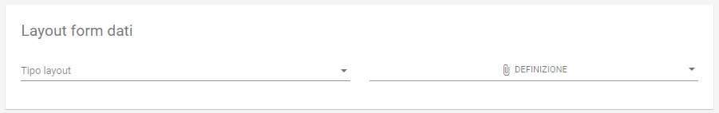

   Sezione form della *Sanzione Amministrativa*

.. csv-table:: Campi modificabili della sezione *Layout Form dati*
  :header: "Campo", "Significato", "Note"
  :widths: 40,40,20

  "Tipo layout", "Indica il motore di interpretazione della descrizione formale della maschera di immissione del pagamento da parte del debitore", " Al momento solo *Angular Json schema form*"
  "Definizione", "Mostra il menu di caricamento e visualizzazione della descrizione formale dell'interfaccia di pagamento", ""

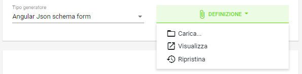

   Funzionalità selezionabili per la definizione form

Sono presenti le voci:

* *Carica*: carica un nuovo file di definizione del form
* *Visualizza*: visualizza la definizione del form
* *Ripristina*: ripristina la definizione originaria del form  

Vediamo un esempio di un file di definizione dell'interfaccia:

.. figure:: ../_images/28SchemaFormEntrata1.jpg
   :align: center
   :name: MenuDefinizioneForm1

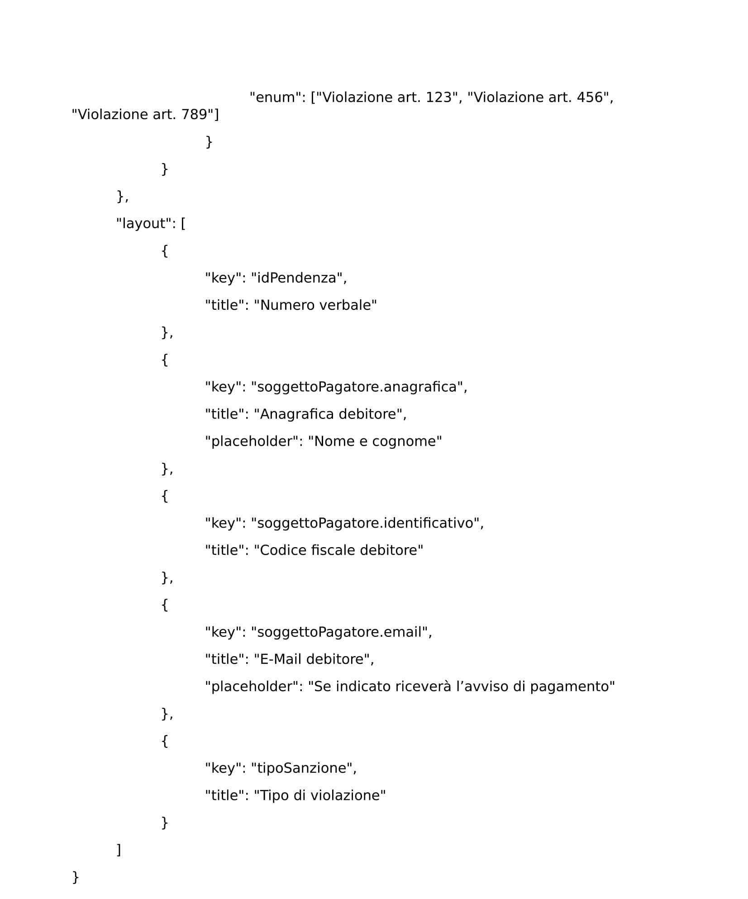

   Funzionalità selezionabili per la definizione form

Elaborazione
~~~~~~~~~~~~

La sezione *Elaborazione* consente a GovPay di descrivere in modo formale come elaborare quanto immesso nella sezione `Layout Form Dati`_ al fine di trasformare e inoltrare le informazioni del pagamento alle applicazioni (anche esterne) che ne abbisognino. Si pensi a uno scenario in cui, ad esempio, sia necessario informare un sistema di recupero crediti del fatto che una pendenza abbia superato la data di scadenza.

.. figure:: ../_images/33SezioneElaborazioneDellaModificaPendenze.png
   :align: center
   :name: SezioneElaborazioneDellaSanzioneAmministrativa

   Funzionalità della sezione *Elaborazione*

.. csv-table:: Dettagli della sezione *Elaborazione*
  :header: "Campo", "Significato", "Note"
  :widths: 40,40,20

  "Validazione", "Selezione delle funzionalità sulla definizione della validazione in formato Json Schema", "* Carica
  * Visualizza
  * Ripristina"
  "Trasformazione: tipo template", "Motore di trasformazione delle informazioni immesse nel Form Dati", "Freemarker"
  "Trasformazione: Template", "Template di defizione della trasformazione dati", "* Carica
  * Visualizza
  * Ripristina"
  "Inoltro", "Consente di selezionare l'applicazione cui verranno inoltrati i dati", "L'applicazione deve essere censita nella sezione *Applicazioni*"

Promemoria Avviso Pagamento
~~~~~~~~~~~~~~~~~~~~~~~~~~~

La sezione *Avviso di pagamento* permette l'inoltro automatico verso la mail del debitore dell'avviso di pagamento. La tipologia di definizione del *subject* e del corpo della mail è, al momento, basata su `Freemarker <https://freemarker.apache.org/>`_

.. figure:: ../_images/35EntrataPromemoriaAvvisoDiPagamento.png
   :align: center
   :name: PromemoriaAvvisoDiPagamento

   Informazioni della sezione *Promemoria Avviso Pagamento*

.. csv-table:: Dettagli della sezione *Promemoria Avviso Pagamento*
  :header: "Campo", "Significato", "Note"
  :widths: 40,40,20

  "Tipo template", "Motore di trasformazione delle informazioni immesse nel template *oggetto* e *messaggio* della mail di Avviso Pagamento", "Freemarker"
  "Template Oggetto", "Template di defizione dell'oggetto della mail di Avviso Pagamento", "* Carica
  * Visualizza
  * Ripristina"
   "Template Messaggio", "Template di defizione del messaggio della mail di Avviso Pagamento", "* Carica
  * Visualizza
  * Ripristina"
  "Allega pdf avviso", "Permette di allegare o meno il pdf dell'avviso di pagamento alla mail di promemoria", ""

Promemoria Ricevuta Telematica
~~~~~~~~~~~~~~~~~~~~~~~~~~~~~~

La sezione *Promemoria Ricevuta Telematica* è del tutto analoga a quella relativa all' *Avviso di pagamento*: essa permette l'inoltro automatico verso la mail del debitore della ricevuta telematica dell'avvenuto pagamento. Anche in questo caso la tipologia di definizione formale del *oggetto* e del corpo della mail è, al momento, basata su `Freemarker <https://freemarker.apache.org/>`_

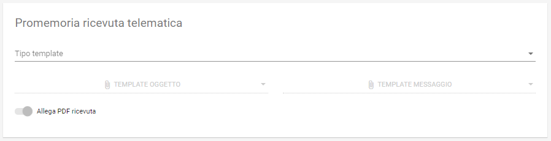

   Informazioni della sezione *Promemoria Ricevuta Telematica*

.. csv-table:: Dettagli della sezione *Promemoria Ricevuta Telematica*
  :header: "Campo", "Significato", "Note"
  :widths: 40,40,20

  "Tipo template", "Motore di trasformazione delle informazioni immesse nel template *oggetto* e *messaggio* della mail di Ricevuta Telematica", "Freemarker"
  "Template Oggetto", "Template di defizione dell'oggetto della mail di Ricevuta Telematica", "* Carica
  * Visualizza
  * Ripristina"
   "Template Messaggio", "Template di defizione del messaggio della mail di Ricevuta Telematica", "* Carica
  * Visualizza
  * Ripristina"
  "Allega pdf avviso", "Permette di allegare o meno il pdf della Ricevuta Telematica", ""

Esempio di scenario di utilizzo
~~~~~~~~~~~~~~~~~~~~~~~~~~~~~~~
Come esempio di scenario di utilizzo possiamo cercare di mappare, sui componenti presentati, un semplice processo reale: si supponga di gestire, infatti, il pagamento spontaneo di dieci buoni pasto elettronici con relativo inoltro della codifica elettronica univoca, previo pagamento andato a buon fine, al richiedente.

.. csv-table:: Gestione buoni pasto elettronici
  :header: "#", "Oggetto della pendenza", "Passo di processo"
  :widths: 20,40,40

  "1", "Layout form dati", "Definizione form in cui si chiede il numero di buoni pasto richiesti"
  "2", "Elaborazione.Validazione", "Gestione delle soglie (es. massimo 20 buoni pasti a richiesta)"
  "3", "Elaborazione.Trasformazione", "Creazione della pendenza correlata al numero di buoni mensa effettivamente richiesti (es. determinazione del costo finale, con le varie franchigie, aggravi amministrativi e via dicendo)"
  "4", "Elaborazione.Applicazione", "Interfacciamento con l'applicazione verticale che crea i codici relativi ai buoni mensa richiesti"

E' di tutta evidenza come **questo non sia che uno dei molteplici processi che sono formalmente definibili, quindi implementabili direttamente, con i meccanismi appena visti, da GovPay**.

.. _govpay_configurazione_applicazioni:

Applicazioni
------------

Le Applicazioni in GovPay rappresentano i portali di pagamento e i sistemi applicativi gestionali dei debiti che si interfacciano tramite le Web API di integrazione.
Accedendo alla sezione *Configurazioni > Applicazioni*, viene visualizzato l'elenco delle applicazioni già censite. Sul lato sinistro
della pagina è presente un form che consente di filtrare i dati visualizzati nella pagina, come di seguito mostrato:

.. figure:: ../_images/36Applicazioni.png
   :align: center
   :name: Applicazioni

   Vista generale delle applicazioni censite e criterio di filtro

Nuova Applicazione
~~~~~~~~~~~~~~~~~~

Per aggiungere una nuova applicazione, premere il pulsante posizionato, come sempre, in basso a destra. Analizzeremo questa funzionalità che è del tutto analoga, dal punto di vista delle informazioni richieste, a quella della modifica di un'applicazione già censita nel sistema.

.. figure:: ../_images/37NuovaApplicazioneVistaDiInsieme.png
   :align: center
   :name: NuovaApplicazione

   Vista generale dei campi di una nuova applicazione

Analizziamo le sottosezioni in cui è strutturata l'applicazione, ovvero:
* Informazioni di riepilogo
* Codifica avvisi
* API integrazione
* Autorizzazioni API
* Autorizzazioni Backoffice

Informazioni di riepilogo
^^^^^^^^^^^^^^^^^^^^^^^^^
In questa sottosezione sono contenute le informazioni che definiscono un'applicazione in tutti i suoi aspetti di interazione con il sistema dei pagamenti.

.. figure:: ../_images/38ApplicazioneRiepilogoDelleInformazioni.png
   :align: center
   :name: ApplicazioneInformazioniDiRiepilogo

   Informazioni di riepilogo di un'applicazione

.. csv-table:: Dettagli della sezione *Informazioni di riepilogo* di una nuova Applicazione
  :header: "Campo", "Significato", "Note"
  :widths: 40,40,20

  "Id A2A", "identificativo dell'applicazione", "Obbligatorio"
  "Principal", "Identificativo del principal autenticato nelle chiamate alle Web API di integrazione", ""
  "Abilitato", "se disabilitato, tutte le nuove richieste all'applicazione saranno negate", ""

Codifica avvisi
^^^^^^^^^^^^^^^
In questa sottosezione sono contenute le informazioni che definiscono un'applicazione in tutti i suoi aspetti di interazione con il sistema dei pagamenti.

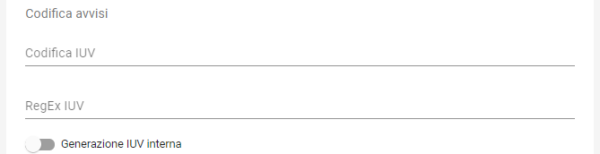

   Sezione Codifica Avvisi di un'applicazione

.. csv-table:: Dettagli della sezione *Codifica avvisi* di una nuova Applicazione
  :header: "Campo", "Significato", "Note"
  :widths: 40,40,20

  "Codifica IUV", "Numero identificativo dell'applicazione nel prefisso IUV, se configurato", ""
  "RegEx IUV", "Espressione regolare che consente di effettuare la validazione dei codici IUV inviati dall'applicazione", "es. 99[0-9]*"
  "Generazione IUV interna", "Se il flag è attivo l'applicazione genera autonomamente i codici IUV relativi alle proprie pendenze, altrimenti detti codici saranno generati da GovPay", ""

API Integrazione
^^^^^^^^^^^^^^^^

In questa sottosezione sono contenute le informazioni che definiscono un'applicazione in tutti i suoi aspetti di interazione con il sistema dei pagamenti.

.. figure:: ../_images/40ApplicazioneAPIIntegrazione.png
   :align: center
   :name: ApplicazioneAPIIntegrazione

   Sezione API Integrazione di un'applicazione

.. csv-table:: Dettagli della sezione *API Integrazione* di una nuova Applicazione
  :header: "Campo", "Significato", "Note"
  :widths: 40,40,20

  "API Integrazione", "Endpoint del servizio del verticale che viene integrato da GovPay", ""
  "Versione API", "Versione delle interfacce di integrazione utilizzate dall'applicazione", ""
  "Tipo Autenticazione", "selezione a scelta tra: Nessuna, Http-Basic e SSL", "In base al valore selezionato sarà necessario inserire i conseguenti dati di configurazione della specifica modalità di autenticazione"

Autorizzazioni
^^^^^^^^^^^^^^

In questa sezione il sistema permette di autorizzare:

*  Specifici (o tutti) `Enti Creditori`_ all'utilizzo dell'applicazione
*  Specifici (o tutti) `Tipi Pendenze`_ ad essere elaborate attraverso l'applicazione
*  Specifici `Ruoli`_ all'utilizzo dell'applicazione

Inoltre in questa sottosezione è possibile definire se l'applicazione è in grado oppure no di interfacciarsi con le tre API (Pagamenti, Pendenze e Ragioneria) messe a disposizione da GovPay.

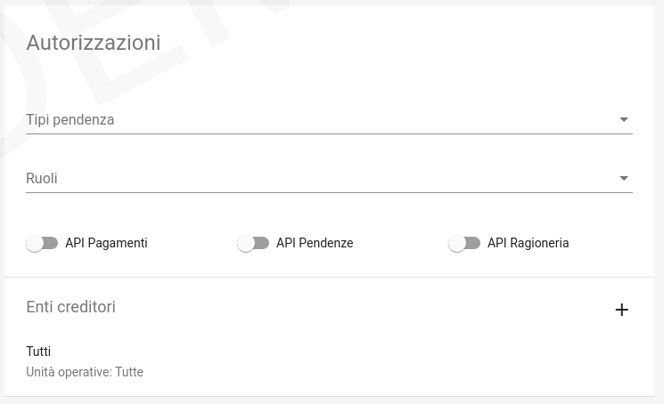

   Sezione Autorizzazioni di un'applicazione

Dettaglio Applicazione
~~~~~~~~~~~~~~~~~~~~~~

Selezionando una delle applicazioni presenti nella pagina di elenco si accede alla pagina di dettaglio, che permette di vedere i dati di sintesi dell'applicazione:

.. figure:: ../_images/43ApplicazioneVistaDiSintesiPreModifica.png
   :align: center
   :name: ApplicazioneVistaSintesi

   Vista di sintesi di un'applicazione

Con l'uso delle solite metafore (matita su cerchio verde) è possibile accedere alle modifiche puntuali della definizione dell'applicazione. In tale processo le informazioni rimangono esattamente quelle appena viste per la definizione di una nuova applicazione.

.. _govpay_configurazione_operatori:

Operatori
---------

Gli operatori rappresentano gli utenti autorizzati all'accesso al cruscotto di gestione di GovPay. Accedendo alla sezione *Configurazioni > Operatori*, il sistema visualizza l'elenco degli operatori già censiti. Sul lato sinistro della pagina è presente un form che consente di filtrare gli operatori in relazione al proprio stato.
Gli elementi nell'elenco identificano gli operatori presenti visualizzando i campi *principal* e *nome*.

Nuovo Operatore
~~~~~~~~~~~~~~~

Tramite il pulsante presente nella pagina di elenco è possibile aprire il form di creazione di un operatore:

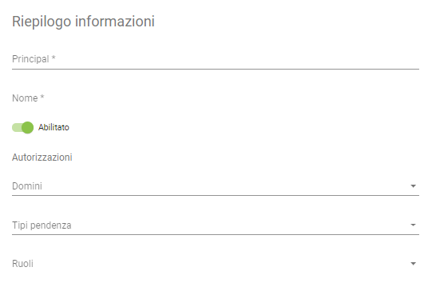

   Definizione di un nuovo Operatore

.. csv-table:: Informazioni di dettaglio di un nuovo Operatore
  :header: "Campo", "Significato", "Note"
  :widths: 40,40,20

  "Principal", "Identificativo dell'operatore dato da PagoPa", "Obbligatorio"
  "Nome", "Nome e cognome dell'operatore", "Obbligatorio"
  "Abilitato", "Indica se l'operatore ha o meno l'accesso al Cruscotto di gestione", ""
  "Domini", "Indica i domini su cui può svolgere compiti l'Operatore", "E' presente l'opzione *Tutti* che permette a una sola utenza di operare trasversalmente a più domini"
  "Tipi pendenza", "Selezione delle pendenze su cui l'operatore può operare", "Presente l'opzione *Tutti*"
  "Ruoli", "Ruoli cui l'utente è abilitato: ogni ruolo ha un perimetro autorizzativo che l'operatore eredita", ""

Dettaglio Operatore
~~~~~~~~~~~~~~~~~~~

Dalla pagina elenco degli operatori, selezionando uno degli elementi, si giunge alla relativa pagina con le informazioni di sintesi.

   Vista di sintesi di un Operatore

Da quest'ultima è possibile, con l'uso delle solite metafore (matita su cerchio verde in basso a destra), accedere alle modifiche puntuali della definizione di un operatore. In tale processo le informazioni rimangono esattamente quelle appena viste per la definizione di una nuova applicazione, con una sola informazione non modificabile, ovvero *principal*.

.. _govpay_configurazione_ruoli:

Ruoli
-----

I ruoli rappresentano una delle modalità con cui assegnare le autorizzazioni a operatori e applicazioni. I ruoli vengono acquisiti da
GovPay tramite il profilo utente ottenuto dal sistema che gestisce il processo di autenticazione. Dopo aver effettuato l'accesso a GovPay, l'operatore o applicazione ottiene le autorizzazioni che gli sono state concesse puntualmente (vedi sezioni `7.3.2.3 <#anchor-30>`__ e `7.4.2.3 <#anchor-36>`__) in aggiunta a quelle associate ai ruoli posseduti.

La sezione *Configurazioni > Ruoli* mostra l’elenco dei ruoli già presenti nel sistema.

.. figure:: ../_images/46RuoliVistaIniziale.png
   :align: center
   :name: RuoliVistaIniziale

   Vista iniziale dei ruoli censiti

Nuovo Ruolo
~~~~~~~~~~~

Utilizzando l'apposito pulsante presente nella pagina di elenco, è possibile creare un nuovo ruolo:

.. figure:: ../_images/47NewRuolo.png
   :align: center
   :name: NuovoRuolo

   Definizione di un Nuovo Ruolo

.. csv-table:: Informazioni di dettaglio di un nuovo Ruolo
  :header: "Campo", "Significato", "Note"
  :widths: 40,40,20

  "Identificativo", "Identificativo assegnato al ruolo", "Obbligatorio"
  "Lista risorse", "Lista delle risorse su cui il ruolo ha accesso in *Lettura* o *Scrittura*", ""

Dettaglio Ruolo
~~~~~~~~~~~~~~~

In modo del tutto analogo a quanto visto con le altre entità, selezionando un elemento dall'elenco dei ruoli si accede al suo dettaglio. Quest'ultimo è modificabile semplicemente premendo la matita in basso a destra.
