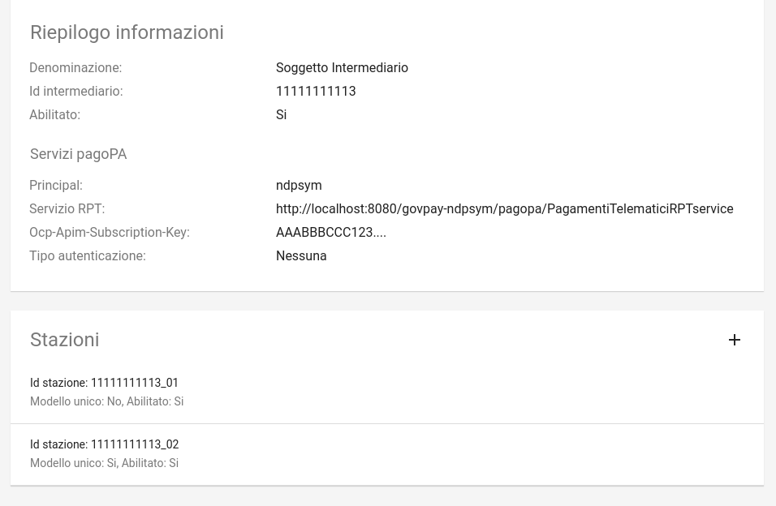
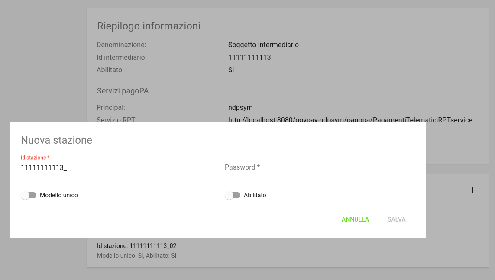
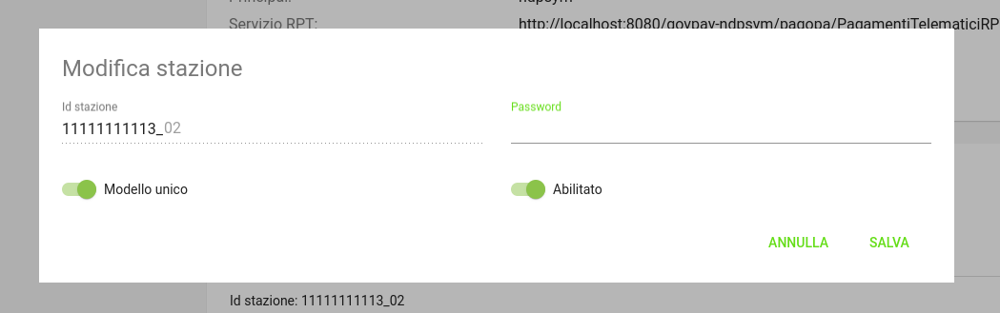

.. _govpay_configurazione_intermediari:

Intermediari
===============

Gli intermediari o partner tecnologici sono entità censite da AgID sul circuito pagoPA al momento dell'adesione di un Ente Creditore. Per il corretto funzionamento di GovPay, gli intermediari di interesse devono essere censiti con le informazioni di corredo necessarie.

.. figure:: ../../_images/09Intermediari.png
   :align: center

   Vista di dettaglio intermediari

Accedendo alla sezione corrispondente (*Configurazioni > Intermediari*), viene visualizzato l'elenco degli intermediari censiti
sul sistema. È possibile filtrare gli intermediari in relazione al loro stato, impostandolo nella casella di selezione posta a sinistra, come di seguito mostrato:

.. figure:: ../../_images/10FiltroSuIntermediari.png
   :align: center

   Filtro su ricerca Intermediari

Nuovo Intermediario
~~~~~~~~~~~~~~~~~~~

Per inserire un nuovo intermediario è necessario premere l'apposito
pulsante, presente nella pagina di elenco in basso a destra, e compilare il form che viene
aperto:

.. figure:: ../../_images/11CampiNuovoIntermediario.png
   :align: center

   Informazioni che definiscono un nuovo intermediario

Le informazioni contenute nel form sono le seguenti:

.. csv-table:: Dettagli di un nuovo intermediario
   :header: "Campo", "Significato", "Note"
   :widths: 40,40,20

   "Denominazione", "Nome associato all'Intermediario o al Partner Tecnologico", "Obbligatorio"
   "Id Intermediario", "Identificativo dell'intermediario o Partner Tecnologico, fornito da AgID, corrisponde alla Partita IVA del soggetto", "Obbligatorio"
   "Principal", "identificativo (subject certificato o principal) corrispondente alle credenziali con cui Govpay riceve le chiamate in entrata da pagoPA", ""
   "Abilitato/Non Abilitato", "Stato del nuovo intermediario: indica se l'intermediario è usabile da GovPay per gestire nuovi pagamenti o se impedire nuove richieste.", ""
   "Servizio RPT", "Riferimenti utilizzati da Govpay per comunicare con il Nodo SPC: Endpoint per le chiamate in uscita verso il Nodo SPC", ""
   "Tipo Autenticazione", "Lista a discesa per selezionare il tipo di autenticazione adottata per le comunicazioni con il Nodo SPC. Si può scegliere, al momento, tra *Nessuna e HTTP-Basic*. Nel caso si scelga quest'ultima modalità di autenticazione, dovranno essere inserite i relativi dati di configurazione (userid/password)", ""

Selezionando un intermediario dalla pagina che li elenca si accede alla pagina di dettaglio.

Dettaglio Intermediario
~~~~~~~~~~~~~~~~~~~~~~~

La pagina di dettaglio di un intermediario mostra i singoli campi che lo
compongono unitamente all'elenco delle stazioni ad esso associate.
Infatti, al censimento di un Intermediario o Partner Tecnologico, AgID
assegna anche una o più Stazioni Tecnologiche che devono essere
registrate su GovPay.

   Pulsante di modifica

Il pulsante di modifica presente nella pagina consente di aprire il form
per modificare le proprietà dell'intermediario.

Stazioni
~~~~~~~~

Nella pagina di dettaglio dell'intermediario (quindi una volta che lo si è creato) esiste una sezione dedicata alle
stazioni in cui è possibile aggiungerne di nuove:

.. figure:: ../../_images/13AggiuntaStazionePlus.png
   :align: center

   Pulsante di aggiunta stazione (evidenziato in rosso)

Si ottiene così il seguente risultato:

   Maschera di inserimento di una nuova stazione

Per definire una stazione connessa all'intermediario occorre immettere le seguenti informazioni:

.. csv-table:: Dettagli di una nuova stazione
   :header: "Campo", "Significato", "Note"
   :widths: 40,40,20

   "IdStazione", "Identificativo della stazione, fornito da AgID", "Obbligatorio"
   "Password", "Chiave segreta, fornita da AgID", "Obbligatorio"
   "Abilitato", "indica se la stazione è usabile da GovPay per gestire nuovi pagamenti (abilitato)
   o se si vogliono impedire nuove richieste (disabilitato)", ""

.. note:: Si noti come le stazioni siano connesse univocamente a ciascun intermediario, non è quindi possibile avere una stessa stazione connessa a due intermediari

È possibile visualizzare il dettaglio di una stazione selezionandola dall’elenco, avendo il dettaglio dei campi appena visti.

In corrispondenza di ciascuna stazione in elenco si evidenzia il pulsante per la modifica delle informazioni:

.. figure:: ../../_images/15ModificaStazione1.png
   :align: center

   Modifica di una stazione esistente

I dati modificabili della stazione saranno la sola password e lo stato; l'identificativo non sarà modificabile:

   align: center

   Maschera di modifica di una stazione

Una volta terminata la modifica è necessaria la pressione della voce *Salva* per renderla effettiva.
