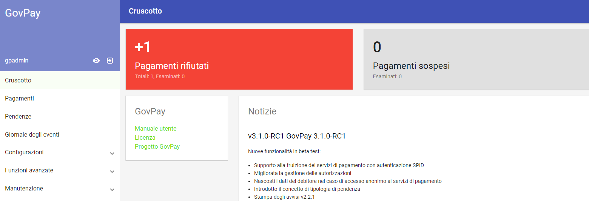
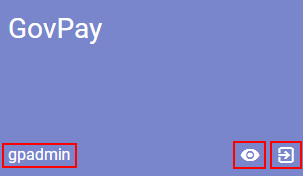
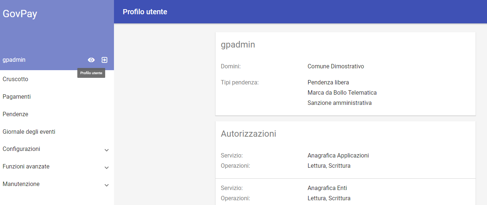

.. _govpay_console:

=========
Cruscotto
=========

Una volta completata con successo la procedura di installazione sarà possibile procedere con la configurazione accedendo al **Cruscotto di Gestione** al seguente indirizzo:

http://<hostname>:<port>/backend/gui/backoffice

Dove al posto dei placeholder <hostname> e <port> dovranno essere inseriti i riferimenti al proprio ambiente di installazione (nome host o indirizzo IP e relativa porta).

Sono disponibili le seguenti funzionalità informative, liberamente consultabili prima dell'autenticazione:

*  **Manuale Utente**, che permette di accedere alla versione più recente di questo manuale in formato liberamente
*  **Progetto GovPay**, che illustra le caratteristiche salienti del prodotto e le sue novità

Per l'accesso al cruscotto viene presentata la maschera per l'immissione delle credenziali. Si noti come ad ogni
utente sia associato un *ruolo* che rappresenta l'insieme delle funzionalità che sono destinate all'utente stesso. Questo meccanismo, che verrà maggiormente dettagliato in seguito, permette di *ritagliare* in modo assolutamente generico il giusto profilo funzionale per tutte le classi di utente abilitati all'uso della piattaforma.

.. figure:: _images/01PrimoAccesso.png
   :align: center

   Immissione delle credenziali [#]_

.. [#] Ovviamente le credenziali evidenziate in figura sono a puro scopo esemplificativo

I metodi di autenticazione al sistema sono:

*  Username / password
*  `SPID <https://www.spid.gov.it//>`_

Si noti che il sistema abilita l'accesso tramite SPID se l'Ente ha effettuato tutti i necessari passi per accreditarsi all'uso di SPID stesso (certificazioni, test e via dicendo).

Dopo aver effettuato l’accesso con le credenziali in proprio possesso, si accede a tutte le funzionalità descritte nelle corrispondenti sezioni di questo documento. La schermata dovrebbe presentarsi in questo modo [#]_

.. [#] Si tenga sempre presente che la propria schermata dipende dai ruoli cui si è associati

   Schermata iniziale

La colonna posta sinistra nell'interfaccia rappresenta il menu di navigazione, con le relative voci che variano in funzione dei ruoli associati all'utenza autenticata.

   Cruscotto iniziale [#]_

.. [#] Si noti come le funzionalità evidenziate corrispondono a un ruolo particolare: l'utente che si autentica, a seconda dei ruoli cui è associato, potrà vedere tutte o parte delle funzionalità in figura

L'area iniziale (primo box in alto a sinistra) mette a disposizione informazioni sul profilo e permette di effettuare il logut dalla piattaforma.

   Funzionalità di profilo

Si faccia riferimento alle evidenziazioni in rosso: da sinistra verso destra abbiamo:

* **Identificativo** dell'utente appena autenticatosi
* **Dettaglio** profilo Utente
* **Logout** per permettere l'uscita dal sistema

Si tenga presente che, come regola generale, **se si è indecisi sulla funzionalità associata a un pulsante, basta stazionarci sopra con il puntatore del mouse** per avere una descrizione sintetica della funzionalità cui esso è associato.
Cliccando su profilo utente abbiamo, sul riquadro di destra, il dettaglio dell'utente con le autorizzazioni sulle funzionalità che gli sono state concesse. Ad esempio avremmo:

   Dettaglio del profilo (esempio)

A seguire sono elencate le sezioni del menu di navigazione, che possono variare in base alle autorizzazioni possedute dall'utente che ha effettuato l'accesso. Le sezioni del menu sono:

* *Cruscotto*: sezione iniziale che evidenzia in modo immediato la situazione generale di pagamenti e pendenze.
* *Pagamenti*: sezione di consultazione delle operazioni di pagamento effettuate dai debitori.
* *Pendenze*: sezione di consultazione delle pendenze di pagamento in carico ai debitori.
* *Giornale degli eventi*: sezione di consultazione del Giornale Eventi previsto dalla specifica pagoPA.
* *Configurazioni:* raccoglie gli strumenti per la consultazione, censimento e modifica delle entità alla base della configurazione del prodotto (Psp, Domini, Tributi, Applicazioni, ecc.).
* *Funzioni Avanzate*: sezione dedicata alla consultazione di entità avanzate (rendicontazioni, riscossioni, ecc.).
* *Manutenzione*: Accesso a funzionalità di manutenzione straordinaria.

Ad esempio, per l'utente che si è autenticato nel nostro caso esemplificativo (gpadmin) avremo la seguente lista funzionalità:

.. figure:: _images/06ListaFunzionalita.png
   :align: center

   Lista funzionalità (esempio)

A ciascuna di queste funzionalità verrà dedicata una sezione di dettaglio esplicativo:

.. toctree::
   :maxdepth: 1

   configurazione/index
   conduzione/index