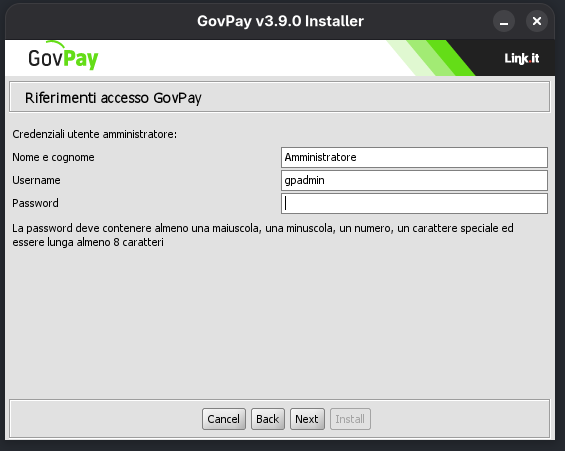
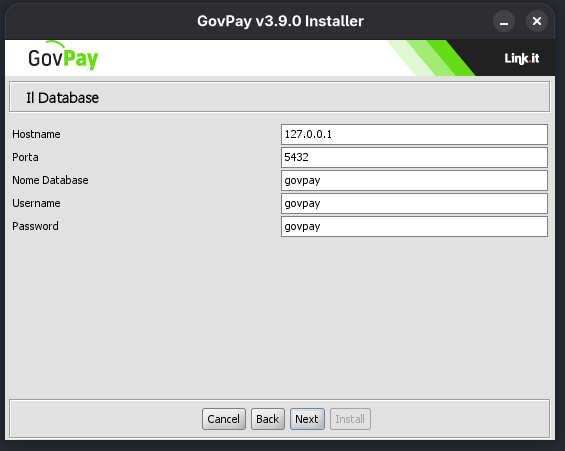
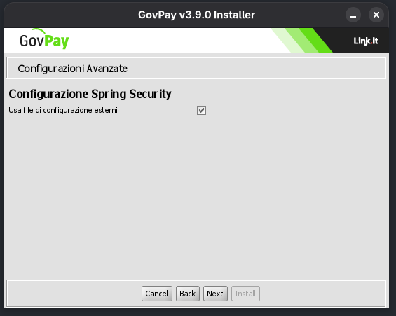
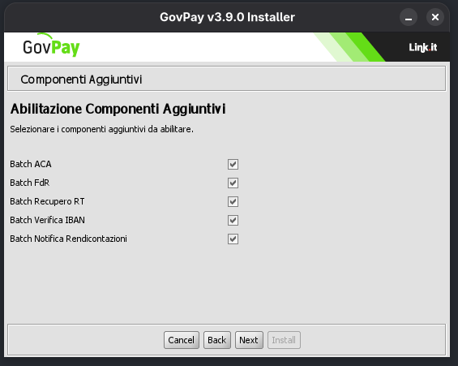
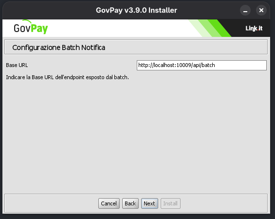
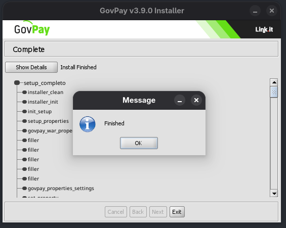

.. _inst_configurazione:

Configurazione dei moduli applicativi
=====================================

La fase di configurazione dei moduli applicativi consente di impostare i
dati di riferimento del proprio ambiente di installazione, tramite una
procedura basata sul modello wizard.

Download
--------

Scaricare l'ultima versione (binary release) di GovPay dal sito GitHub
https://github.com/link-it/GovPay.

Produzione dell'installer dai sorgenti
--------------------------------------

La compilazione dei sorgenti richiede:

- Maven 3.8 o successivo
- Java 21

L'installer può essere prodotto con la seguente procedura:

1. Clonare il repository git di GovPay: `git clone https://github.com/link-it/govpay.git`
2. Compilare con il comando `mvn -Denv=installer_template clean install`
3. Spostarsi nella cartella **src/main/resources/setup/** ed eseguire lo script **prepareSetup.sh**

Esecuzione dell'Installer
-------------------------

L'archivio di installazione può essere scompattato e il relativo
installer eseguito su un ambiente che non deve essere necessariamente
quello di destinazione. Infatti l'Installer non installa il prodotto ma
produce tutti gli elementi necessari che dovranno essere dispiegati
nell’ambiente di esercizio.

Per l'esecuzione dell'installer verificare ed eventualmente impostare la
variabile d’ambiente **JAVA_HOME** in modo che riferisca la directory
radice dell'installazione di Java. Eseguire quindi l'installer mandando
in esecuzione il file **install.sh** su Unix/Linux, oppure
**install.cmd** su Windows.

Avvio
~~~~~

L’Installer mostra all’avvio una pagina introduttiva.

Sono mostrate informazioni quali:

-  Nome e versione del prodotto
-  Informazioni sul copyright
-  Informazioni sulla licenza d'uso

Selezionando il pulsante Next si procede con la configurazione del
software.

   Pagina introduttiva all'avvio dell'Installer

Informazioni Preliminari
~~~~~~~~~~~~~~~~~~~~~~~~

La schermata "Informazioni Preliminari" consente di inserire i dati sul
contesto di installazione nell'ambiente di esercizio.

   Informazioni preliminari

Devono essere inserite le seguenti informazioni:

-  **DB Platform:** selezionare la piattaforma RDBMS utilizzata
-  **Work Folder:** inserire il path assoluto della *directory*, presente nell'ambiente di destinazione, che sarà utilizzata da GovPay per accedere a dati accessori legati alle funzionalità opzionali, ad esempio:
 -  **file di configurazione personalizzati**
 -  **file di configurazione Log4j personalizzati**
 -  **file di configurazione di Spring Security personalizzati**

-  **Log Folder**: inserire il path assoluto della directory, presente nell'ambiente di destinazione, che sarà utilizzata da GovPay per inserire i diversi file di tracciamento prodotti.

Riferimenti Accesso GovPay
~~~~~~~~~~~~~~~~~~~~~~~~~~

Questo passaggio prevede che vengano inserite le credenziali del cruscotto di gestione:

Credenziali dell'utente amministratore:

-  **Nome e Cognome:** nome e cognome da associare alle credenziali di amministrazione
-  **Username:** indicare l'identificativo dell'utenza di amministrazione per l'accesso alla console di gestione e monitoraggio.
-  **Password:** indicare la password seguendo i vincoli "deve contenere almeno una maiuscola, una minuscola, un numero, un carattere speciale ed essere lunga almeno 8 caratteri".

   Riferimenti Accesso GovPay

Il Database
~~~~~~~~~~~

Nella schermata "Il Database" si devono inserire i riferimenti per
l'accesso al database di esercizio di GovPay.

   Informazioni accesso al DB

-  **Hostname**: indirizzo per raggiungere il database
-  **Porta**: la porta da associare all’hostname per la connessione al
   database
-  **Nome Database**: il nome dell’istanza del database a supporto di
   GovPay.
-  **Username**: l’utente con diritti di lettura/scrittura sul database
   sopra indicato.
-  **Password**: la password dell’utente del database.

.. note::
    Non è necessario che il database e l'utente indicato esistano in questa fase. Potranno essere creati nella successiva fase di dispiegamento purché i dati relativi coincidano con i valori inseriti in questi campi del wizard.

Servizi Backoffice
~~~~~~~~~~~~~~~~~~

Nella schermata "Servizi Backoffice" si devono inserire i riferimenti alle BaseURL delle risorse utilizzate dal cruscotto.

   Configurazione Servizi Cruscotto

-  **Base path risorse statiche console**: BaseURL dove il cruscotto ricerca le risorse statiche
-  **Base path API Backoffice**: BaseURL delle API-Backoffice

File di configurazione Console Backoffice
~~~~~~~~~~~~~~~~~~

Nella schermata "File di configurazione Console Backoffice" si deve inserire il riferimento al file di configurazione utilizzato dal cruscotto.

   File di configurazione Console Backoffice

-  **Path del file di configurazione della console**: Il path del file di configurazione della console

Configurazioni Avanzate
~~~~~~~~~~~~~~~~~~~~~~~

La schermata "Configurazioni Avanzate" consente di configurare opzioni avanzate del prodotto.

   Configurazioni Avanzate

**Configurazione Spring Security**

-  **Usa file di configurazione esterni:** opzione che abilita i file di configurazione esterni di Spring per l'accesso alle funzionalità avanzate, come la configurazione delle modalità di autenticazione (:ref:`inst_dispiegamento_auth`).

Componenti Aggiuntivi
~~~~~~~~~~~~~~~~~~~~~

La schermata "Componenti Aggiuntivi" consente di selezionare i batch esterni da abilitare.

   Componenti Aggiuntivi

I batch esterni disponibili sono:

-  **Batch ACA:** invio delle posizioni debitorie all'Archivio Centralizzato degli Avvisi (ACA) di pagoPA
-  **Batch FdR:** acquisizione dei Flussi di Rendicontazione (FdR) da pagoPA
-  **Batch Recupero RT:** recupero delle Ricevute Telematiche (RT) mancanti dal Nodo pagoPA
-  **Batch Verifica IBAN:** verifica della configurazione degli IBAN degli Enti Creditori
-  **Batch Notifica Rendicontazioni:** notifica dei pagamenti completati salvo buon fine

Per ciascun batch selezionato verrà presentata una schermata di configurazione dove inserire la **Base URL** dell'endpoint esposto dal batch.

   Configurazione Batch ACA

   Configurazione Batch FdR

   Configurazione Batch Recupero RT

   Configurazione Batch Verifica IBAN

   Configurazione Batch Notifica Rendicontazioni

Installazione
~~~~~~~~~~~~~

Premendo il pulsante **Install** il processo di configurazione termina
con la produzione dei files necessari per l’installazione di GovPay che
verranno inseriti nella nuova directory **dist** creata al termine di
questo processo.

   Installazione terminata

I files presenti nella directory **dist** dovranno essere utilizzati
nella fase successiva di dispiegamento di GovPay.

Componenti Aggiuntivi
---------------------

GovPay può essere esteso con componenti aggiuntivi che forniscono funzionalità opzionali.
Questi componenti sono distribuiti separatamente e possono essere installati in base alle esigenze.

govpay-aca-batch
~~~~~~~~~~~~~~~~

Batch per l'invio delle posizioni debitorie all'Archivio Centralizzato degli Avvisi (ACA) di pagoPA.

- **Repository:** https://github.com/link-it/govpay-aca-batch
- **Release:** https://github.com/link-it/govpay-aca-batch/releases

Questo componente consente di:

- Sincronizzare le pendenze di GovPay con l'ACA
- Gestire l'invio massivo delle posizioni debitorie
- Monitorare lo stato delle comunicazioni con l'ACA

Il batch può essere schedulato per eseguire periodicamente l'invio delle posizioni debitorie
non ancora comunicate o aggiornate.

govpay-fdr-batch
~~~~~~~~~~~~~~~~

Batch per l'acquisizione dei Flussi di Rendicontazione (FdR) da pagoPA.

- **Repository:** https://github.com/link-it/govpay-fdr-batch
- **Release:** https://github.com/link-it/govpay-fdr-batch/releases

Questo componente consente di:

- Scaricare automaticamente i flussi di rendicontazione dalla piattaforma pagoPA
- Elaborare e importare i flussi nel database di GovPay
- Gestire la riconciliazione automatica dei pagamenti

Il batch può essere schedulato per eseguire periodicamente il download e l'elaborazione
dei nuovi flussi di rendicontazione disponibili.

govpay-rt-batch
~~~~~~~~~~~~~~~~

Batch per il recupero delle Ricevute Telematiche (RT) mancanti dal Nodo pagoPA.

- **Repository:** https://github.com/link-it/govpay-rt-batch
- **Release:** https://github.com/link-it/govpay-rt-batch/releases

Questo componente consente di:

- Individuare le rendicontazioni prive della corrispondente ricevuta di pagamento, più vecchie di una soglia temporale configurabile (default: 15 giorni)
- Recuperare automaticamente le RT mancanti invocando l'endpoint ``GET /organizations/{codDominio}/receipts/{iur}`` del Nodo pagoPA
- Persistere le ricevute recuperate nel database di GovPay e aggiornare lo stato delle rendicontazioni
- Registrare tutte le operazioni nel Giornale degli Eventi (GDE)

govpay-iban-batch
~~~~~~~~~~~~~~~~~

Batch per la verifica della configurazione degli IBAN degli Enti Creditori.

- **Repository:** https://github.com/link-it/govpay-iban-batch
- **Release:** https://github.com/link-it/govpay-iban-batch/releases

Questo componente consente di:

- Verificare periodicamente la corretta configurazione degli IBAN associati agli Enti Creditori
- Segnalare eventuali anomalie o disallineamenti nella configurazione

Il batch può essere schedulato per eseguire periodicamente la verifica degli IBAN configurati.

govpay-notifica-batch
~~~~~~~~~~~~~~~~~~~~~

Batch per la notifica dei pagamenti completati salvo buon fine.

- **Repository:** https://github.com/link-it/govpay-notifica-batch
- **Release:** https://github.com/link-it/govpay-notifica-batch/releases

Questo componente consente di:

- Inviare notifiche relative ai pagamenti completati con esito salvo buon fine
- Gestire il ciclo di vita delle notifiche verso i sistemi degli Enti Creditori

Il batch può essere schedulato per eseguire periodicamente l'invio delle notifiche
per i pagamenti completati.

govpay-gde-api
~~~~~~~~~~~~~~

API per il Giornale degli Eventi (GDE) esterno.

- **Repository:** https://github.com/link-it/govpay-gde-api
- **Release:** https://github.com/link-it/govpay-gde-api/releases

Questo componente espone API REST per:

- Ricevere e archiviare gli eventi generati da GovPay
- Consultare lo storico degli eventi
- Integrare il giornale eventi con sistemi esterni di monitoraggio

Il servizio GDE può essere configurato come endpoint esterno per la registrazione
degli eventi, consentendo una gestione centralizzata del logging applicativo.
