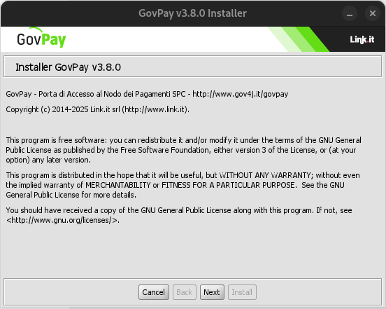
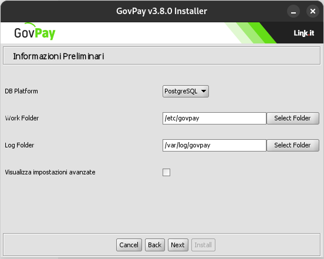
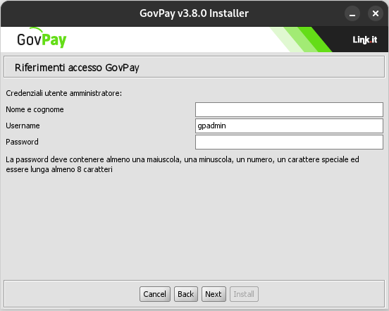
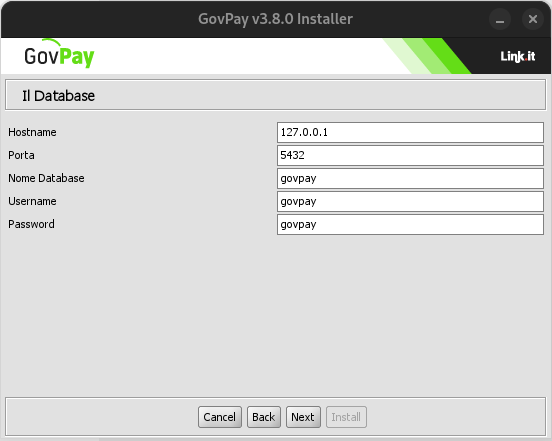
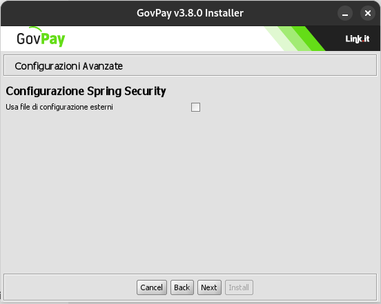
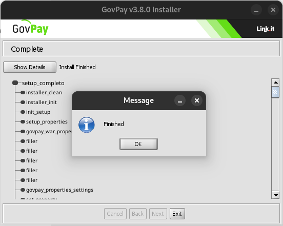

.. _inst_configurazione:

Configurazione dei moduli applicativi
=====================================

La fase di configurazione dei moduli applicativi consente di impostare i
dati di riferimento del proprio ambiente di installazione, tramite una
procedura basata sul modello wizard.

Download
--------

Scaricare l'ultima versione (binary release) di GovPay dal sito GitHub
https://github.com/link-it/GovPay.

Esecuzione dell'Installer
-------------------------

L'archivio di installazione può essere scompattato e il relativo
installer eseguito su un ambiente che non deve essere necessariamente
quello di destinazione. Infatti l'Installer non installa il prodotto ma
produce tutti gli elementi necessari che dovranno essere dispiegati
nell’ambiente di esercizio.

Per l'esecuzione dell'installer verificare ed eventualmente impostare la
variabile d’ambiente **JAVA_HOME** in modo che riferisca la directory
radice dell'installazione di Java. Eseguire quindi l'installer mandando
in esecuzione il file **install.sh** su Unix/Linux, oppure
**install.cmd** su Windows.

Avvio
~~~~~

L’Installer mostra all’avvio una pagina introduttiva.

Sono mostrate informazioni quali:

-  Nome e versione del prodotto
-  Informazioni sul copyright
-  Informazioni sulla licenza d'uso

Selezionando il pulsante Next si procede con la configurazione del
software.

   Pagina introduttiva all'avvio dell'Installer

Informazioni Preliminari
~~~~~~~~~~~~~~~~~~~~~~~~

La schermata "Informazioni Preliminari" consente di inserire i dati sul
contesto di installazione nell'ambiente di esercizio.

   Informazioni preliminari

Devono essere inserite le seguenti informazioni:

-  **Application Server:** la scelta dell'application server è vincolata su "WildFly 11.0"**
-  **DB Platform:** selezionare la piattaforma RDBMS utilizzata
-  **Work Folder:** inserire il path assoluto della *directory*, presente nell'ambiente di destinazione, che sarà utilizzata da GovPay per accedere a dati accessori legati alle funzionalità opzionali, ad esempio:
   -  **file di configurazione personalizzati**
   -  **loghi dei psp**

-  **Log Folder**: inserire il path assoluto della directory, presente nell'ambiente di destinazione, che sarà utilizzata da GovPay per inserire i diversi file di tracciamento prodotti.
-  **Visualizza Impostazioni Avanzate**: opzioni per abilitare funzionalità avanzate del prodotto, saranno visualizzate in un passaggio più avanti.

Riferimenti Accesso GovPay
~~~~~~~~~~~~~~~~~~~~~~~~~~

Questo passaggio prevede che vengano inseriti i dati per l'accesso all'istanza di GovPay e le credenziali del cruscotto di gestione:

-  **Protocollo di Trasporto:** indicare il protocollo di trasporto attivo (HTTP | HTTPS)
-  **Nome Host o IP:** inserire l'hostname tramite il quale saranno raggiungibili i servizi di GovPay (ad esempio la console di monitoraggio).
-  **Porta:** indicare la porta

Credenziali dell'utente amministratore:

-  **Nome e Cognome:** nome e cognome da associare alle credenziali di amministrazione
-  **Username:** indicare l'identificativo dell'utenza di amministrazione per l'accesso alla console di gestione e monitoraggio.
-  **Password:** indicare la password seguendo i vincoli "deve contenere almeno una maiuscola, una minuscola, un numero, un carattere speciale ed essere lunga almeno 8 caratteri".

   Riferimenti Accesso GovPay

Il Database
~~~~~~~~~~~

Nella schermata "Il Database" si devono inserire i riferimenti per
l'accesso al database di esercizio di GovPay.

   
   Informazioni accesso al DB
   

-  **Hostname**: indirizzo per raggiungere il database
-  **Porta**: la porta da associare all’hostname per la connessione al
   database
-  **Nome Database**: il nome dell’istanza del database a supporto di
   GovPay.
-  **Username**: l’utente con diritti di lettura/scrittura sul database
   sopra indicato.
-  **Password**: la password dell’utente del database.
   **Nome modulo driver postgres**: il nome del modulo con cui è stato deployato il driver JDBC in wildfly

.. note::
    Il nome del modulo driver viene richiesto sono in caso di istallazione su PostgreSQL
   
.. note::
    Non è necessario che il database e l'utente indicato esistano in questa fase. Potranno essere creati nella successiva fase di dispiegamento purché i dati relativi coincidano con i valori inseriti in questi campi del wizard.

Configurazioni Avanzate
~~~~~~~~~~~~~~~~~~~~~~~

La schermata "Confifurazioni Avanzate" è presente solo se nel passaggio "Informazioni Preliminari" è stata selezionata l'opzione "Visualizza Impostazioni Avanzate".

   
   Configurazioni Avanzate
   
Configurazione Spring Security

-  **Usa file di configurazione esterni:** opzione che abilita i file di configurazione esterni di Spring per l'accesso alle funzionalità avanzate, come la configurazione delle modalità di autenticazione (:ref:`inst_dispiegamento_auth`).

Installazione
~~~~~~~~~~~~~

Premendo il pulsante **Install** il processo di configurazione termina
con la produzione dei files necessari per l’installazione di GovPay che
verranno inseriti nella nuova directory **dist** creata al termine di
questo processo.

   
   Installazione terminata
   
   
I files presenti nella directory **dist** dovranno essere utilizzati
nella fase successiva di dispiegamento di GovPay.

