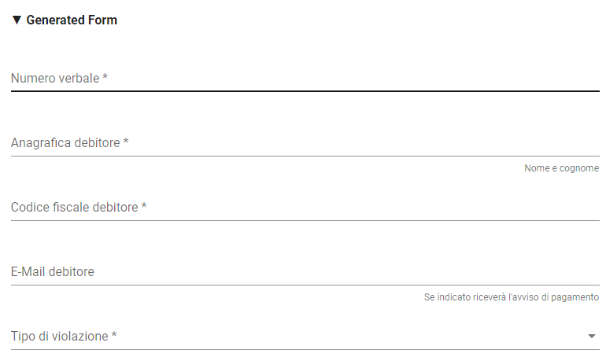
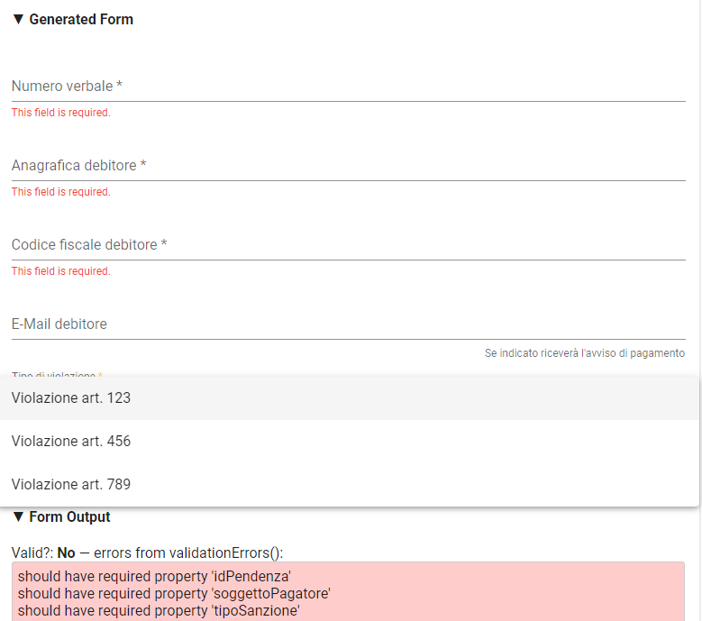

.. _integrazione_interfacce:

Gestione automatica delle interfacce
====================================

Una delle caratteristiche più interessanti di GovPay è quella di poter essere personalizzato tramite linguaggi formali atti a descrivere le interefacce verso il debitore: è possibile quindi definire le interfacce di pagamento (e anche quelle di inoltro, ad esempio, via mail della ricevuta telematica) attraverso file di testo con sintassi standard.
Nel seguito della sezione si affronterà un caso pratico di definizione di intefaccia di una pendenza caricata su un Ente Creditore.

I Linguaggi di definizione utilizzati
-----------------------------------
La definizione delle interfacce e dei processi di elaborazione e validazione si appoggia ai seguenti standard industriali assai consolidati:

* `Angular Json <https://angular.io/>`_
* `Freemarker <https://freemarker.apache.org/>`_

Nel primo caso (Angular) esiste una `risorsa web <https://hamidihamza.com/Angular6-json-schema-form/>`_ che consente di verificare online il form che si sta definendo.
Si noti come le sezioni seguenti non possano né vogliano sostituirsi a manualistica e tutorial per i *framework* prima citati: l'intento è solo quello di presentare alcuni casi d'uso frequenti nell'utilizzo e di semplice estensione.

Personalizzazione del tipo pendenza
-----------------------------------

La pendenza può essere personalizzata, ad esempio, in relazione alla sua instanza per l'Ente Creditore. Cerchiamo di modificare la sezione della Pendenza Sanzione Amministrativa in relazione a un Ente Creditore. Andando sull'Ente creditore:

.. figure:: ../_images/INT07_ModificaSanzioneAmministrativaDiComuneDimostrativo.png
   :align: center
   :name: ModificaLayoutPendenza

   Modifica del Tipo Pendenza all'interno di un Ente Ceditore

Selezionando questa modifica, il sistema propone

.. figure:: ../_images/INT06_CaratteristichePendenzaConInterfacceAutomatiche.png
   :align: center
   :name: Interfaccepersonalizzabilineltipopendenza

   Interfacce personalizzabili attraverso script nel Tipo Pendenza

Le interfacce personalizzabili sono

.. csv-table:: 
  :header: "Campo", "Significato", "Note"
  :widths: 40,40,20
  
  "Layout Form Dati", "Definizione dell'nterfaccia di caricamento dei dati dell'istanza della pendenza", "Angular Json"
  "Validazione", "Interfaccia di validazione dei dati dell'istanza della pendenza", "Angular Json"
  "Trasformazione", "Motore di traformazione dei dati dell'istanza della pendenza", "Freemarker"
  "Promemoria avviso di pagamento: oggetto", "Definizione dell'oggetto della mail del promemoria avviso di pagamento", "Freemarker"
  "Promemoria avviso di pagamento: messaggio", "Definizione del messaggio della mail del promemoria avviso di pagamento", "Freemarker"
  "Promemoria ricevuta telematica: oggetto", "Definizione dell'oggetto della mail del promemoria ricevuta telematica", "Freemarker"
  "Promemoria ricevuta telematica: messaggio", "Definizione del messaggio della mail del promemoria ricevuta telematica", "Freemarker"

Layout Forma Dati
~~~~~~~~~~~~~~~~~

Tramite lo script citato a seguire viene implementata un'interfaccia con i seguenti campi:

.. csv-table:: 
  :header: "Campo", "Note"
  :widths: 50,50
  
  "Numero verbale", "Campo libero per l'immissione del numero verbale"
  "Anagrafica Debitore", "Campo libero per l'immissione di nome e congnome del debitore, come evidenziato anche dall'etichetta"
  "Codice Fiscale Debitore", "Campo validato formalmente per l'immissione del codice fiscale del debitore"
  "eMail Debitore", "Campo validato formalmente (dev'essere un'email) per l'immissione della mail del debitore"
  "Tipo Violazione", "Campo a selezione in cui il debitore deve scegliere il tipo di violazione"

Il risultato finale è il seguente:

   
   Form Layout Completo
   

A titolo di esempio si consideri il campo di selezione, i cui valori sono stati inseriti nel json nella seguente sezione:

"tipoSanzione": {
		"type": "string",
		"enum": ["Violazione art. 123", "Violazione art. 456", "Violazione art. 789"]
		}

Il risultato è il seguente

.. figure:: ../_images/INT09_FormDiImmissionedatiConEvidenzaCombo.png
   :align: center
   :name: SceltaTipoViolazione

   Selezione del tipo di violazione

Lo script completo è (si noti le parti di definizione dei pattern di email e codice fiscale)

.. code-block:: guess
   
   {
	"schema": {
		   "type": "object",
		   "required": [
			"idPendenza",
			"soggettoPagatore",
			"tipoSanzione"
		    ],
		   "properties": {
			"idPendenza": {
				"type": "string",
				"pattern": "[A-Za-z0-9\\-_]{1,35}"
			},
			"soggettoPagatore": {
				"type": "object",
				"required": [
					"identificativo",
					"anagrafica"
				],
				"properties": {
					"identificativo": {
						"type": "string",
						"pattern": "[A-Z]{6}\\d{2}[A-Z]\\d{2}[A-Z]\\d{3}[A-Z]"
					},
					"anagrafica": {
						"type": "string"
					},
					"email": {
						"type": "string",
						"pattern": "[A-Za-z0-9_]+([\\-\\+\\.'][A-Za-z0-9_]+)*@[A-Za-z0-9_]+([\\-\\.][A-Za-z0-9_]+)*\\.[A-Za-z0-9_]+([\\-\\.][A-Za-z0-9_]+)*"
					}
				}
			},
			"tipoSanzione": {
				"type": "string",
				"enum": ["Violazione art. 123", "Violazione art. 456", "Violazione art. 789"]
			}
		}
	},
	"layout": [
		{
			"key": "idPendenza",
			"title": "Numero verbale"
		},
		{
			"key": "soggettoPagatore.anagrafica",
			"title": "Anagrafica debitore",
			"placeholder": "Nome e cognome"
		},
		{
			"key": "soggettoPagatore.identificativo",
			"title": "Codice fiscale debitore"
		},
		{
			"key": "soggettoPagatore.email",
			"title": "E-Mail debitore",
			"placeholder": "Se indicato riceverà l'avviso di pagamento"
		},
		{
			"key": "tipoSanzione",
			"title": "Tipo di violazione"
		}
	]
   }

            
            
Validazione
~~~~~~~~~~~

Lo script di validazione è ancora espresso nel formato json angular schema. Nel nostro esempio si presenta in questo modo:

.. code-block:: guess
   
   {
	"schema": {
		"type": "object",
		"required": [
			"idPendenza",
			"soggettoPagatore",
			"tipoSanzione"
		],
		"properties": {
			"idPendenza": {
				"type": "string",
				"pattern": "[A-Za-z0-9\\-_]{1,35}"
			},
			"soggettoPagatore": {
				"type": "object",
				"required": [
					"identificativo",
					"anagrafica"
				],
				"properties": {
					"identificativo": {
						"type": "string",
						"pattern": "[A-Z]{6}\\d{2}[A-Z]\\d{2}[A-Z]\\d{3}[A-Z]"
					},
					"anagrafica": {
						"type": "string"
					},
					"email": {
						"type": "string",
						"pattern": "[A-Za-z0-9_]+([\\-\\+\\.'][A-Za-z0-9_]+)*@[A-Za-z0-9_]+([\\-\\.][A-Za-z0-9_]+)*\\.[A-Za-z0-9_]+([\\-\\.][A-Za-z0-9_]+)*"
					}
				}
			},
			"tipoSanzione": {
				"type": "string",
				"enum": ["Violazione art. 123", "Violazione art. 456", "Violazione art. 789"]
			}
		}
	},
	"layout": [
		{
			"key": "idPendenza",
			"title": "Numero verbale"
		},
		{
			"key": "soggettoPagatore.anagrafica",
			"title": "Anagrafica debitore",
			"placeholder": "Nome e cognome"
		},
		{
			"key": "soggettoPagatore.identificativo",
			"title": "Codice fiscale debitore"
		},
		{
			"key": "soggettoPagatore.email",
			"title": "E-Mail debitore",
			"placeholder": "Se indicato riceverà l'avviso di pagamento"
		},
		{
			"key": "tipoSanzione",
			"title": "Tipo di violazione"
		}
	]
   }

            
Un'osservazione attenta dello script ne mostra la sostanziale equivalenza con quello di definizione del layout. In effetti lo script afferma che:
1. I campi necessari sono idPendenza, soggettoPagatore e tipoSanzione, che si mappano su quelli definiti nel punto precedente
2. idPendenza è una stringa alfanumerica lunga fino a 35 caratteri
3. l'email non è necessaria: per essa è comunque fornita un'espressione regolare che impedisce l'immissione di email non valide
4. Il tipo sanzione ammette solo tre valori (123, 456, 789)

In effetti, immettendo lo script nel simulatore prima segnalato si ottiene il seguente risultato

   
   Validazione
   
            
Si nota dai messaggi che il simulatore mostra come le componenti di validazione siano correttamente interpretate.

Ci si potrebbe chiedere il perchè di questa ripetizione (Layout Form Dati e Validazione): la ragione di questa necessità risiede nel comportamento non omogeneo dei browser. La prima validazione è infatti demandata al lato client della filiera applicativa, che non ha alcun contratto sull'esecuzione dei controlli. In altre parole, la piattaforma non ha alcuna sicurezza che i controlli immessi nel Layout Form saranno davvero effettuati lato client: l'unica strategia davvero cautelativa, in casi come questi, è pertanto quella di avere uno strato server di gestione degli errori che, prima di interpretare i dati e trasformarli, provveda alla validazione di quanto immesso anche se arrivato al server senza controlli clienti (comportamento del browser).
Per i motivi appena descritti, si consiglia sempre di implementare i controlli formali anche in questa sezione.

Trasformazione
~~~~~~~~~~~~~~

Questa sezione provvede all'instradamento, previa loro trasformazione, dei dati immessi nel form verso i servizi che li consumeranno (applicazione selezionata nella sezione *Inoltro*). Vediamone un esempio complessivo i cui blocchi commenteremo in modo dettagliato:
       
.. code-block:: guess    

   <#assign jsonUtilities = class["org.openspcoop2.utils.json.JSONUtils"].getInstance()>
   <#assign request = jsonUtilities.getAsNode(jsonPath.read("$"))>
   <#assign calendar = class["java.util.Calendar"]>
   <#assign now = new("java.util.Date")>
   <#assign calendarInstance = calendar.getInstance()>
   <#assign xxx = calendarInstance.setTime(now)!>
   <#assign yyy = calendarInstance.add(calendar.MONTH, 1)!>
   <#assign zzz = calendarInstance.set(calendar.DATE, calendarInstance.getActualMaximum(calendar.DAY_OF_MONTH))!>
   <#assign dataValidita = calendarInstance.getTime()?string("yyyy-MM-dd")>
   <#if request.get("tipoSanzione").asText() = "Violazione art. 123">
	<#assign importo = "54.01">
   <#elseif request.get("tipoSanzione").asText() = "Violazione art. 456">
	<#assign importo = "123.6">
   <#elseif request.get("tipoSanzione").asText() = "Violazione art. 678">
	<#assign importo = "307">
   <#setting locale="en_US">
   
   {
	"idA2A": "A2A-DEMO",
	"idPendenza": "${request.get("idPendenza").asText()}",
	"idDominio": "${pathParams["idDominio"]}",
	"idTipoPendenza": "${pathParams["idTipoPendenza"]}",
 	"causale": "Sanzione amministrativa - Verbale n. ${request.get("idPendenza").asText()}",
	"soggettoPagatore": {
		"tipo": "F",
		"identificativo": "${request.get("soggettoPagatore").get("identificativo").asText()}",
		"anagrafica": "${request.get("soggettoPagatore").get("anagrafica").asText()}",
		"email": "${request.get("soggettoPagatore").get("email").asText()}"
	},
   	"importo": "${importo}",
	"dataValidita": "${dataValidita}",
	"dataScadenza": "${dataValidita}",
	"tassonomiaAvviso": "Servizi erogati dal comune",
	"voci": [
		{
			"idVocePendenza": "1",
			"importo": "${importo}",
			"descrizione": "${request.get("tipoSanzione").asText()}",
			"ibanAccredito": "IT02L1234500000111110000001",
			"tipoContabilita": "ALTRO",
			"codiceContabilita": "${pathParams["idTipoPendenza"]}"
		}
	]
   }
       

Al fine di contestualizzare in modo opportuno il discorso fin qui fatto, è opportuno ricordare il sottostante di questo passo della filiera di elaborazione dei dati, come da interfaccia di configurazione:

.. figure:: ../_images/INT13_ContestoDiRiferimento.png
   :align: center
   :name: ContestoDiRiferimento
   
   Contesto di riferimento della trasformazione

Analizziamo ora le diverse parti dello script

.. code-block:: guess    

   <#assign jsonUtilities = class["org.openspcoop2.utils.json.JSONUtils"].getInstance()>
   <#assign request = jsonUtilities.getAsNode(jsonPath.read("$"))>
   <#assign calendar = class["java.util.Calendar"]>
   <#assign now = new("java.util.Date")>
   <#assign calendarInstance = calendar.getInstance()>
   <#assign xxx = calendarInstance.setTime(now)!>
   <#assign yyy = calendarInstance.add(calendar.MONTH, 1)!>
   <#assign zzz = calendarInstance.set(calendar.DATE, calendarInstance.getActualMaximum(calendar.DAY_OF_MONTH))!>
   <#assign dataValidita = calendarInstance.getTime()?string("yyyy-MM-dd")>
   <#if request.get("tipoSanzione").asText() = "Violazione art. 123">
	<#assign importo = "54.01">
   <#elseif request.get("tipoSanzione").asText() = "Violazione art. 456">
	<#assign importo = "123.6">
   <#elseif request.get("tipoSanzione").asText() = "Violazione art. 678">
	<#assign importo = "307">
   <#setting locale="en_US">

in questa sezione, oltre al trattamento abbozzato delle date di inizio e fine validità (si ricordi che si è in presenza di un esempio) si assegna l'importo in funzione del tipo di sanzione, con la relativa logica di controllo (<#if e seguenti)

Vediamo la sezione di trasformazione vera e propria, con la logica di alimentazione del servizio web di inoltro:

.. code-block:: guess    
     
   {
	"idA2A": "A2A-DEMO",
	"idPendenza": "${request.get("idPendenza").asText()}",
	"idDominio": "${pathParams["idDominio"]}",
	"idTipoPendenza": "${pathParams["idTipoPendenza"]}",
 	"causale": "Sanzione amministrativa - Verbale n. ${request.get("idPendenza").asText()}",
	"soggettoPagatore": {
		"tipo": "F",
		"identificativo": "${request.get("soggettoPagatore").get("identificativo").asText()}",
		"anagrafica": "${request.get("soggettoPagatore").get("anagrafica").asText()}",
		"email": "${request.get("soggettoPagatore").get("email").asText()}"
	},
   	"importo": "${importo}",
	"dataValidita": "${dataValidita}",
	"dataScadenza": "${dataValidita}",
	"tassonomiaAvviso": "Servizi erogati dal comune",
	"voci": [
		{
			"idVocePendenza": "1",
			"importo": "${importo}",
			"descrizione": "${request.get("tipoSanzione").asText()}",
			"ibanAccredito": "IT02L1234500000111110000001",
			"tipoContabilita": "ALTRO",
			"codiceContabilita": "${pathParams["idTipoPendenza"]}"
		}
	]
   }

Possiamo notare che:
*  idPendenza viene preso dal corrispondente campo definito nella sezione di layout. Occorre porre particolare attenzione a che il wording sia il medesimo di quello in definizione formale del form
*  idDominio, idTipoPendenza vengono valorizzati nello stesso modo
*  si definisce l'input, per il campo composto voci, come idVocePendenza, importo, descrizione (preso direttamente dalla request), ibanAccredito imposto come fisso, tipo e codice contabilità

In buona sostanza, esiste una parte preparatoria, con una vera logica di trasformazione e definizione di variabili intermedie, ed una parte di elencazione dei parametri del servizio di inoltro che viene implementata a partire dai semilavorati della prima parte. Il risultato è comunque di avere un sistema di input, trasformazione ed elaborazione configurato e pronto per la produzione tramite la scrittura di alcuni semplici script, ovvero senza le costose, classiche fasi di costruzione di un front-end dedicato propriamente detto. Questa metodologia assicura l'ottimizzazione di tempi e costi e la possibilità di effettuare modifiche praticamente in tempo reale. 

Promemoria avviso di pagamento
~~~~~~~~~~~~~~~~~~~~~~~~~~~~~~
  
La piattaforma intende semplificare anche la corispondenza mail con il soggetto debitore (ovviamente a patto che sia presente e presidiata la mail di quest'ultimo), automatizzando l'invio degli avvisi di pagamento. Possiamo, nella sezione apposita, immettere due script freemarker, uno dedicato all'oggetto della mail, il secondo pensato per generare automaticamente il corpo della stessa. 

.. code-block:: guess    

   Promemoria pagamento: ${versamento.getCausaleVersamento().getSimple()}

A partire dall'oggetto versamento, lo script estrae la causale, generando l'oggetto della mail dell'avviso di pagamento.

.. code-block:: guess    

   Gentile ${versamento.getAnagraficaDebitore().getRagioneSociale()}, 
   le notifichiamo che e' stata elevata una sanzione amministrativa a suo carico: verbale n. ${versamento.getCodVersamentoEnte()}.
   Puo' effettuare il pagamento on-line dal portale ${dominio.getRagioneSociale()} al seguente indirizzo:
   https://demo.govcloud.it/govpay-portal/?idDominio=01234567890&numeroAvviso=${versamento.getNumeroAvviso()}.
   Oppure stampare l'avviso che trova allegato alla presente email per effettuare il pagamento presso un qualsiasi
   prestatore di servizi di pagamento aderente al circuito pagoPA. 
   Distinti saluti.
  
Ancora una volta si noti l'estrema personalizzabilità del sistema, che rende possibile variare i messaggi a seconda del dominio e del tipo di sanzione in modo trasparente e praticamente in tempo reale. Il messaggio può dipendere, in toni e riferimento, anche dall'eventuale ritardo rispetto alle scadenze, con tempistiche differenziate: ciò comporta la scrittura di logica di processo in termini elementari.
  
  
Promemoria ricevuta telematica
~~~~~~~~~~~~~~~~~~~~~~~~~~~~~~

A valle del processo di pagamento della pendenza, la piattaforma, similmente a quanto fatto con l'avviso di pagamento, semplifica l'invio di una ricevuta telematica al soggetto pagatore. Possiamo, nella sezione apposita, immettere due script freemarker, uno dedicato all'oggetto della mail, il secondo pensato per generare automaticamente il corpo della stessa. 

.. code-block:: guess    

   <#if rpt.getEsitoPagamento().getCodifica() = 0>
     Notifica pagamento eseguito: ${rpt.getCodDominio()}/${rpt.getIuv()}/${rpt.getCcp()}
   <#elseif rpt.getEsitoPagamento().getCodifica() = 1>
     Notifica pagamento non eseguito: ${rpt.getCodDominio()}/${rpt.getIuv()}/${rpt.getCcp()}
   <#elseif rpt.getEsitoPagamento().getCodifica() = 2>
     Notifica pagamento eseguito parzialmente: ${rpt.getCodDominio()}/${rpt.getIuv()}/${rpt.getCcp()}
   <#elseif rpt.getEsitoPagamento().getCodifica() = 3>
     Notifica decorrenza termini pagamento: ${rpt.getCodDominio()}/${rpt.getIuv()}/${rpt.getCcp()}
   <#elseif rpt.getEsitoPagamento().getCodifica() = 4>
     Notifica decorrenza termini pagamento: ${rpt.getCodDominio()}/${rpt.getIuv()}/${rpt.getCcp()}

A partire dall'oggetto versamento, lo script estrae la causale, generando l'oggetto della mail dell'avviso di pagamento.

.. code-block:: guess    

   <#assign dataRichiesta = rpt.getDataMsgRichiesta()?string("yyyy-MM-dd HH:mm:ss")>
   Il pagamento di "${versamento.getCausaleVersamento().getSimple()}" effettuato il ${dataRichiesta} risulta concluso con esito
   ${rpt.getEsitoPagamento().name()}:
   Ente creditore: ${dominio.getRagioneSociale()} (${dominio.getCodDominio()})
   Istituto attestante: ${rpt.getDenominazioneAttestante()} (${rpt.getIdentificativoAttestante()})
   Identificativo univoco versamento (IUV): ${rpt.getIuv()}
   Codice contesto pagamento (CCP): ${rpt.getCcp()}
   Importo pagato: ${rpt.getImportoTotalePagato()}
   
   Distinti saluti.
  
Questo tipo di soluzione per la ricevuta telematica possiede tutte le caratteristiche positive dell'avviso di pagamento viste nella sezione precedente.
  
