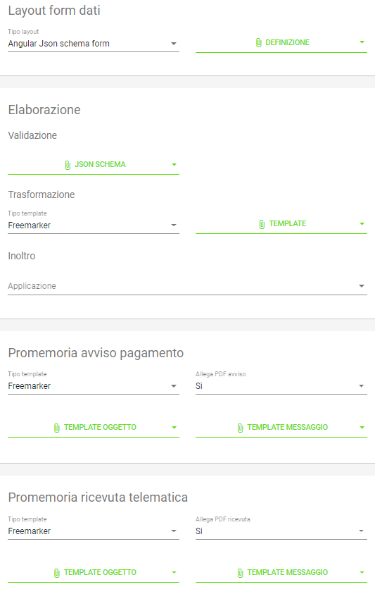

.. _integrazione_interfacce:

Gestione automatica delle interfacce
====================================

Una delle caratteristiche più interessanti di GovPay è quella di poter essere personalizzato tramite linguaggi formali atti a descrivere le interefacce verso il debitore: è possibile quindi definire le interfacce di pagamento (e anche quelle di inoltro, ad esempio, via mail della ricevuta telematica) attraverso file di testo con sintassi standard (Angular e Freemarker).
Nel seguito della sezione si affronterà un caso pratico di definizione di intefaccia di una pendenza caricata su un Ente Creditore.

Personalizzazione del tipo pendenza
-----------------------------------

   Interfacce personalizzabili attraverso script nel Tipo Pendenza

.. csv-table:: Interfaccre personalizzabili
  :header: "Sintesi", "Descrizione"
  :widths: 30,70
  
  "ssss", "kkkkk"
