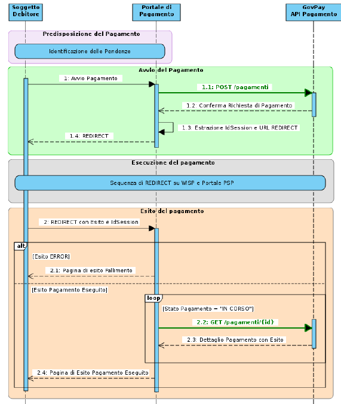

.. _integrazione_pagamentiente:

Pagamenti ad iniziativa ente
============================

Il Soggetto Debitore utilizza il Portale dei
Pagamenti dell’Ente Creditore per effettuare i pagamenti dovuti. Il
flusso di pagamento è illustrato nella figura seguente

.. figure:: ../_images/INT02_PagamentoAdIniziativaEnte.png
   :align: center
   :name: CampiDominioTipo1

   Pagamento ad iniziativa Ente

1. L'utente debitore utilizza gli strumenti offerti dal Portale dei
   Pagamenti dell’Ente per giungere alla formalizzazione di una
   richiesta di pagamento.
2. Dopo aver ricevuto la conferma dal cittadino, il portale avvia il
   processo di pagamento con GovPay.
3. Il processo di pagamento prosegue indirizzando la navigazione
   dell’utente sul WISP affinché possa selezionare il PSP e la modalità
   di pagamento preferita.
4. Dal WISP, la navigazione dell’utente prosegue sul Portale PSP, da lui
   scelto, dove viene perfezionato il pagamento con la modalità
   prescelta.
5. Al termine dell’esecuzione del pagamento sul Portale PSP, l'utente
   viene rediretto sul Portale dei Pagamenti dell'Ente che dà conferma
   dell'esito del pagamento e ne predispone la ricevuta.

Il flusso descritto si realizza integrando il Portale dei Pagamenti a
GovPay e implementando le interazioni individuate dal seguente sequence
diagram:

   Squence Diagram del pagamento

Predisposizione del pagamento
-----------------------------

L’utente utilizza le funzionalità del portale per identificare
le pendenze che intende pagare. La composizione dei pagamenti da effettuare avviene in modo differente in base alla seguente casistica:

1. Le pendenze sono disponibili nell'ambito del Portale di Pagamento
2. Le pendenze sono state preventivamente caricate nell'archivio dei pagamenti in attesa di GovPay
3. Le pendenze vengono recuperate a partire dall'avviso di pagamento pagoPA

Le pendenze individuate, tramite uno o più dei metodi sopra elencati,
andranno a costituire un carrello di pagamento oggetto delle fasi
successive. Vediamo di seguito le differenti modalità di interazione, previste con GovPay, in base alla diversa situazione tra quelle sopra elencate.

Pagamento di una pendenza disponibile al Portale di Pagamento
~~~~~~~~~~~~~~~~~~~~~~~~~~~~~~~~~~~~~~~~~~~~~~~~~~~~~~~~~~~~~

L’utente interagisce con il portale per la
predisposizione dei dati delle pendenze oggetto di pagamento. Tali dati
possono essere:

-  Presenti nei sistemi verticali dell’ente dai quali il portale si occupa di reperirli.

-  Forniti direttamente dall’utente tramite la compilazione di un form.

In ogni caso il portale necessita del dettaglio completo delle pendenze
per procedere alla successiva fase di pagamento e per farlo non è
previsto il coinvolgimento di GovPay.

Pagamento di una pendenza caricata nell'archivio dei pagamenti in attesa di GovPay
~~~~~~~~~~~~~~~~~~~~~~~~~~~~~~~~~~~~~~~~~~~~~~~~~~~~~~~~~~~~~~~~~~~~~~~~~~~~~~~~~~

L’utente accede al Portale e consulta la propria
posizione debitoria dall'archivio dei pagamenti in attesa di GovPay,
individuando alcune pendenze che desidera pagare. Dopo averle
selezionate ed aggiunte al carrello, avvia il pagamento.

La realizzazione di questo scenario prevede due interazioni con GovPay:

1. Il caricamento della pendenza nell'archivio dei pagamenti in attesa:
   i verticali, gestori delle posizioni debitorie, tramite l'operazione
   *PUT /pendenze/{idA2A}/{idPendenza}* dell'API Pendenze, alimentano
   l'archivio dei pagamenti in attesa con le pendenze generate a valle
   dei propri processi di istruttoria.
2. L'acquisizione della posizione debitoria di un soggetto debitore: il
   portale di pagamento acquisisce la posizione debitoria del soggetto
   autenticato, richiedendo, tramite l'operazione *GET /pendenze* della
   API Pagamento, la lista delle pendenze disponibili sul sistema
   filtrando per identificativo debitore. Le pendenze ottenute saranno
   visualizzate all'utente che procederà alla selezione e successivo
   pagamento.

Al termine della selezione, il portale necessita dei soli riferimenti
identificativi delle pendenze, ovvero la coppia di parametri idA2A e
idPendenza, per la successiva fase di avvio del pagamento.

Pagamento di una pendenza con avviso
~~~~~~~~~~~~~~~~~~~~~~~~~~~~~~~~~~~~

Ll’utente accede al Portale ed individua una
pendenza da pagare tramite gli estremi identificativi di un Avviso di
Pagamento pagoPA, ovvero:

-  *Identificativo dominio*: codice fiscale dell’Ente Creditore.
-  *Numero avviso*: identificativo dell'avviso per l'Ente Creditore che
   lo ha emesso.

Con queste informazioni, acquisite tramite scansione dei glifi grafici o
inserimento manuale dell'utente, il Portale di Pagamento può verificare
lo stato ed i dettagli della pendenza associata tramite l'operazione
*GET /avvisi/{idDominio}/{numeroAvviso}*.

Per informazioni inerenti le modalità di predisposizione e consegna
dell'Avviso di Pagamento pagoPA si rimanda al capitolo
`5 <#anchor-20>`__ “\ `Pagamenti ad iniziativa PSP <#anchor-20>`__\ “

Il portale necessita dei soli estremi dell'avviso per la successiva fase
di avvio del pagamento.

Avvio del Pagamento
-------------------

Al termine della fase di predisposizione del pagamento, il portale
dispone di un carrello di pendenze in forma completa, riferite per
identificativo pendenza oppure per estremi dell'avviso di pagamento, a
seconda della modalità di identificazione descritta in precedenza.

Ottenuta dall'utente la conferma a procedere, il Portale avvia il
pagamento eseguendo l'operazione *POST /pagamenti*, inserendo nel corpo
della richiesta la lista delle pendenze nei tre possibili formati
esplorati nella fase di predisposizione del pagamento. In assenza di
errori si ottengono in risposta, tra le altre, le seguenti informazioni
necessarie alle successive fasi:

-  La URL contenuta in *redirect* a cui indirizzare l'utente per
   proseguire nella successiva fase di esecuzione del pagamento;
-  L'identificativo *idSession* necessario a riconciliare la sessione di
   pagamento al ritorno dell'utente sul portale, nella fase conclusiva
   di esito;
-  La URL contenuta in *location* per richiedere aggiornamenti sullo
   stato del pagamento;

Selezione del PSP ed Esecuzione del versamento
----------------------------------------------

Il portale avvia la fase di esecuzione effettuando la redirezione
dell'utente alla URL ricevuta da GovPay. Il flusso di navigazione
guiderà l'utente sul WISP per la selezione del PSP e, successivamente,
sul Portale del PSP selezionato per il perfezionamento del versamento.

Al termine delle operazioni, l'utente viene reindirizzato al Portale di
Pagamento per consultare l'esito del pagamento.

Esito del Pagamento
-------------------

Al ritorno sul Portale di Pagamento, al termine delle operazioni,
l'utente include nella url di redirezione due parametri che
l'integratore deve estrarre dalla query string:

-  *idSession*: corrisponde all'omonimo parametro ottenuto da GovPay in
   fase di avvio, necessario a riconciliare la sessione di pagamento;
-  *esito*: informazione usabile dal portale per la selezione della
   pagina da presentare all'utente. È importante sottolineare che
   l'esito certo del pagamento è comunque dato dalla Ricevuta Telematica
   (RT). I valori di esito possono essere:

   -  *OK*: l’operazione di pagamento sul Portale del PSP si è conclusa
      con l’addebito dell’importo necessario.
   -  *ERROR*: l’operazione di pagamento sul Portale del PSP si è
      conclusa senza l’addebito dell’importo necessario.
   -  *DIFFERITO*: l’esito dell’operazione sarà disponibile solo alla
      ricezione della RT.

In caso di esito di ERROR, il Portale Ente può mostrare all'utente una
pagina di errore, in alternativa visualizza una pagina interlocutoria
mentre richiede l'esito del pagamento a GovPay.

Non appena disponibile l'esito del pagamento, GovPay invia una notifica
al gestionale tramite un apposito servizio messo a disposizione da
quest'ultimo. La notifica inviata contiene anche la ricevuta telematica.

Per la realizzazione della pagina di esito, il portale può utilizzare le
informazioni ottenute tramite il servizio di notifica dell'esempio
precedente (modalità push), oppure tramite l’invocazione dell’API di
pagamento (modalità pull), tramite l'operazione *GET
/pagamenti/{idPagamento}* utilizzando la url *location* acquisita nella
precedente fase di avvio. Nella risposta, tra le altre informazioni, si individua il parametro
*stato* che può assumere i seguenti valori:

-  *IN CORSO*: non sono ancora state acquisite tutte le ricevute di
   pagamento da pagoPA e l'esito della transazione non è quindi
   determinabile;
-  *ESEGUITO*: le ricevute telematiche sono state tutte acquisite e
   presentano lo stato di successo.
-  *NON ESEGUITO*: le ricevute telematiche sono state acquisite e tutte
   presentano lo stato di insuccesso.
-  *ESEGUITO PARZIALE*: le ricevute telematiche sono state tutte
   acquisite e presentano esiti discordanti.

La risposta inoltre presenta i riferimenti necessari ad acquisire le
ricevute telematiche nei formati messi a disposizione da GovPay.

Oltre al servizio di richiesta dello stato di pagamento, GovPay notifica
l'esito di ciascun pagamento al verticale che gestisce la pendenza
associata con l'operazione *POST /pagamenti* delle API Notifica.

Si possono consultare degli esempi di invocazione delle API di integrazione, corrispondenti a quando descritto sopra, nelle sezioni :ref:`Scenario "Pagamento di un dovuto ad iniziativa Ente" <govpay_scenari_dovuto1_realizzazione>` e :ref:`Scenario "Pagamento spontaneo ad iniziativa ente" <govpay_scenari_spontaneo1_realizzazione>`.