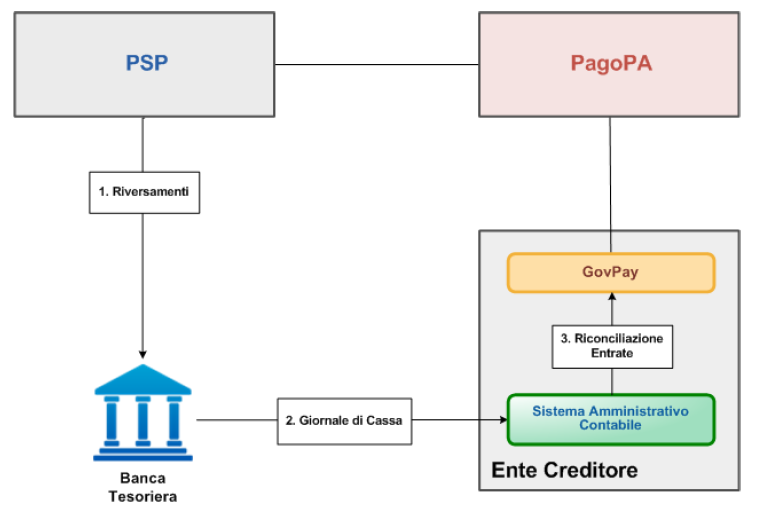

.. _integrazione_riconciliazioni:

Riconciliazione degli incassi
=============================

Il rilascio della ricevuta di pagamento, da parte dell'Ente Creditore o
del PSP a seconda del modello scelto, libera il Soggetto Debitore da
ogni ulteriore adempimento. L'Ente Creditore deve invece concludere il
ciclo di vita del pagamento verificando che gli importi riscossi dai PSP
vengano correttamente riversati nei propri conti di accredito, gestiti
dalla Banca Tesoriera.

   Riconciliazione degli incassi

Il flusso di questo scenario è il seguente:

1. Le somme riscosse dai PSP tramite il circuito pagoPA sono riversate
   sui conti di accredito degli Enti Creditori.
2. Le Banche Tesoriere forniscono ai Sistemi Amministrativi Contabili,
   nelle modalità concordate con l'Ente Creditore, il Giornale di Cassa,
   contenente il dettaglio dei movimenti avvenuti sui conti di
   accredito.
3. Ciascun riversamento pagoPA viene riconciliato individuando i singoli
   pagamenti da quietanzare.

Riversamento delle somme
------------------------

I movimenti di riversamento delle somme riscosse sono operati dai PSP
secondo i tempi ed i modi indicati dalla specifica AgID “Specifiche
Attuative dei Codici di Versamento, riversamento e rendicontazione”. In
particolare, la specifica determina che il PSP del pagatore assicuri che
l'importo dell'operazione venga accreditato sul conto dell’Ente
Creditore entro la fine della giornata operativa successiva a quella
indicata nella relativa Ricevuta Telematica, considerando che la
giornata operativa termina alle ore 13,00 (cosiddetta “giornata
operativa del Nodo dei Pagamenti-SPC”).

Comunicazione del Giornale di Cassa
-----------------------------------

Quotidianamente, o secondo quanto concordato con la Banca Tesoreria, i
Sistemi Amministrativi Contabili ricevono il Giornale di Cassa relativo
ai conti di accredito dell'Ente Creditore. Tale documento dettaglia i
movimenti contabili avvenuti sui conti di accredito ed in particolare i
movimenti di entrata determinati dai riversamenti pagoPA.

I riversamenti pagoPA sono riconoscibili poiché presentano, nel dato
AT-05 dell’SCT, il riferimento alle riscossioni riversate in uno dei
seguenti formati:

-  /PUR/LGPE-RIVERSAMENTO/URI/<identificativoFlusso>
-  /RFS/<IUV>/<importo>[/TXT/<descrizione>]
-  /RFB/<IUV>[/<importo>][/TXT/<descrizione>]

GovPay gestisce la riscossione ed il riversamento delle singole voci di
pendenza, pertanto rimane a carico dei sistemi gestionali dell’Ente
Creditore verificare la completa riconciliazione delle pendenze prima di
procedere al successivo quietanzamento.

Rinconciliazione delle entrate
------------------------------

Ciascuna entrata riconosciuta come riversamento pagoPA deve essere
registrata dal Sistema Amministrativo Contabile in GovPay tramite
l’operazione *POST /riconciliazioni/{idDominio}* utilizzando i dati acquisiti tramite il Giornale di Cassa. La risposta ottenuta con tale invocazione contiene  la lista delle riscossioni associate al riversamento. Con queste informazioni il Gestionale dell'ente creditore è in grado di
effettuare la chiusura contabile di ogni pendenza di pagamento.

Si può consultare un esempio di invocazione delle API di Riconciliazione, corrispondente a quando descritto sopra, nella sezione :ref:`Scenario "Riconciliazione dei Pagamenti con la Tesoreria" <govpay_scenari_riconciliazione_realizzazione>`.

In una fase distinta, il Gestionale può effettuare la chiamata a *GET
/riscossioni* delle API di Rendicontazione. L’operazione viene eseguita
fornendo i parametri di ricerca quali:

-  stato della riscossione impostato a “riscossa”
-  arco temporale di ricerca

Il risultato dell’operazione è l’elenco delle riscossioni, nel periodo
richiesto, che si trovano ancora in stato “riscossa” e quindi tuttora
non incassate, come nel seguente esempio:

.. code-block:: none

    GET /riscossioni?stato=RISCOSSA&tipo=ENTRATA&dataRiscossioneA=2017-12-31
    HTTP 200 OK
    {
        "numRisultati": "10",
        "numPagine": "10",
        "risultatiPerPagina": "1",
        "pagina": "1",
        "prossimiRisultati": "/riscossioni?stato=RISCOSSA&tipo=ENTRATA&dataRiscossioneA=2017-12-31&pagina=2&risultatiPerpagina=1",
        "risultati":
        [
            {
                "idDominio": "01234567890",
                "iuv": "RF23567483937849450550875",
                "iur": "1234acdc",
                "indice": 1,
                "pendenza": "/pendenze/01234567890/abcdef12345",
                "idVocePendenza": "abcdef12345_1",
                "rpt": "/pendenze/01234567890/abcd12345/n%2Fa",
                "importo": 10.01,
                "ibanAccredito": "IT02L1234512345123456789012",
                "data": "2020-12-31",
                "commissioni": 1.5,
                "allegato":
                {
                    "tipo": "Esito pagamento",
                    "testo": "string"
                }
            }
        ]
    }

Quest’ultima operazione ha valenza nell’ambito delle verifiche
periodiche atte ad individuare situazioni anomale.
