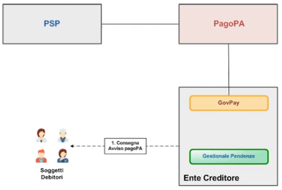

.. _govpay_scenari_dovuto3:

Pagamento di un dovuto ad iniziativa PSP
=========================================

In questo scenario al cittadino viene fornito un Avviso di Pagamento AgID relativo ad una pendenza. Egli si reca presso le strutture del PSP (sportello, ATM, Home banking, Mobile APP, etc...) per l’esecuzione del versamento.

Il flusso di questo scenario è il seguente:

L’Ente Creditore, alla predisposizione di una nuova pendenza, stampa l’Avviso di Pagamento pagoPA ad essa associata e la consegna al Soggetto Debitore, in formato digitale o cartaceo, secondo le modalità previte dell'Ente.
Munito dell'avviso, il Soggetto Debitore interagisce con il PSP che acquisisce gli estremi dell'Avviso, tramite scansione dei glifi grafici o trascrizione manuale dei codici di riferimento.
Il PSP verifica gli estremi di pagamento della pendenza, eventualmente interagendo con il Gestionale Pendenze, e li prospetta al Soggetto Debitore.
Il Soggetto Debitore perfeziona il pagamento e GovPay lo notifica al Gestionale Pendenze.

   Pagamento ad iniziativa PSP

Nell’ambito di questa tipologia di pagamento individuiamo i seguenti sottoprocessi:

Consegna dell’Avviso di Pagamento
L’ente creditore, alla predisposizione di una nuova pendenza, stampa l’Avviso di Pagamento pagoPA ad essa associata e la consegna al cittadino.

Verifica della pendenza collegata all'Avviso di Pagamento
Il cittadino si reca presso il PSP per pagare tramite l'avviso Avviso di Pagamento. Il sistema verifica gli estremi della pendenza associata prima di autorizzare le operazioni di riscossione dell'importo dovuto.

Notifica del pagamento di un Avviso di Pagamento
Al termine delle operazioni di riscossione, il gestionale viene notificato dell'esito del pagamento per aggiornare lo stato della pendenza.

Le fasi che andiamo a descrivere per questo scenario sono le seguenti:

1. La :ref:`govpay_scenari_dovuto1_realizzazione`, che prevede:

    - L'impiego delle *API Pendenze* di GovPay per realizzare l'integrazione con i sistemi gestionali e consentire il caricamento delle pendenze.

    - L'impiego delle *API "Pagamento* di GovPay per realizzare l'integrazione con il portale ente e consentire l'esecuzione dei pagamenti da parte del cittadino debitore.

2. La :ref:`govpay_scenari_dovuto1_configurazione` del canale di intermediazione delle tipologie di tributo e delle applicazioni autorizzate. Queste operazioni vengono effettuate tramite il cruscotto (per il relativo manuale consultare la sezione :ref:`govpay_configurazione`).

3. L':ref:`govpay_scenari_dovuto1_esecuzione` di un esempio tramite un ambiente definito su `Postman <https://www.getpostman.com/downloads/>`_.

.. toctree::
   :hidden:

   realizzazione
   configurazione
   esecuzione

