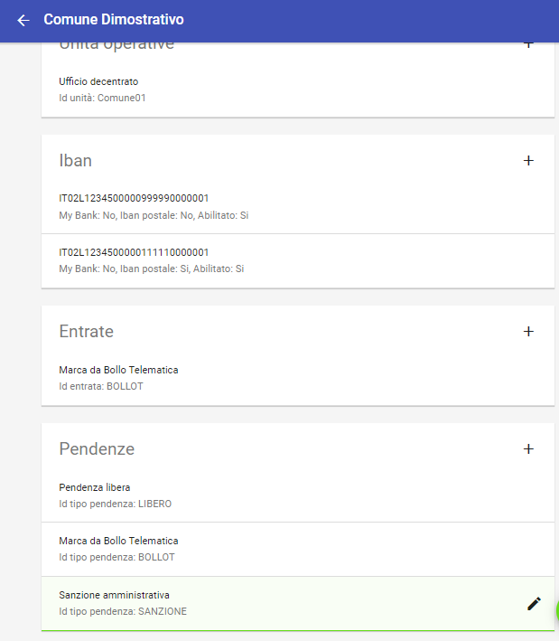

.. _integrazione_interfacce:

Gestione automatica delle interfacce
====================================

Una delle caratteristiche più interessanti di GovPay è quella di poter essere personalizzato tramite linguaggi formali atti a descrivere le interefacce verso il debitore: è possibile quindi definire le interfacce di pagamento (e anche quelle di inoltro, ad esempio, via mail della ricevuta telematica) attraverso file di testo con sintassi standard.
Nel seguito della sezione si affronterà un caso pratico di definizione di intefaccia di una pendenza caricata su un Ente Creditore.

I Linguaggi di definizione utilizzati
-----------------------------------
La definizione delle interfacce e dei processi di elaborazione e validazione si appoggia ai seguenti standard industriali assai consolidati:

* `Angular Json <https://angular.io/>`_
* `Freemarker <https://freemarker.apache.org/>`_

Personalizzazione del tipo pendenza
-----------------------------------

La pendenza può essere personalizzata, ad esempio, in relazione alla sua instanza per l'Ente Creditore. Cerchiamo di modificare la sezione della Pendenza Sanzione Amministrativa in relazione a un Ente Creditore. Andando sull'Ente creditore:

   Modifica del Tipo Pendenza all'interno di un Ente Ceditore

Selezionando questa modifica, il sistema propone

.. figure:: ../_images/INT06_CaratteristichePendenzaConInterfacceAutomatiche.png
   :align: center
   :name: Interfaccepersonalizzabilineltipopendenza

   Interfacce personalizzabili attraverso script nel Tipo Pendenza

Le interfacce personalizzabili sono

.. csv-table:: 
  :header: "Campo", "Significato", "Note"
  :widths: 40,40,20
  
  "Layout Form Dati", "Definizione dell'nterfaccia di caricamento dei dati dell'istanza della pendenza", "Angular Json"
  "Validazione", "Interfaccia di validazione dei dati dell'istanza della pendenza", "Angular Json"
  "Trasformazione", "Motore di traformazione dei dati dell'istanza della pendenza", "Freemarker"
  "Promemoria avviso di pagamento: oggetto", "Definizione dell'oggetto della mail del promemoria avviso di pagamento", "Freemarker"
  "Promemoria avviso di pagamento: messaggio", "Definizione del messaggio della mail del promemoria avviso di pagamento", "Freemarker"
  "Promemoria ricevuta telematica: oggetto", "Definizione dell'oggetto della mail del promemoria ricevuta telematica", "Freemarker"
  "Promemoria ricevuta telematica: messaggio", "Definizione del messaggio della mail del promemoria ricevuta telematica", "Freemarker"

Layout Forma Dati
~~~~~~~~~~~~~~~~~

            
              {
	"schema": {
		"type": "object",
		"required": [
			"idPendenza",
			"soggettoPagatore",
			"tipoSanzione"
		],
		"properties": {
			"idPendenza": {
				"type": "string",
				"pattern": "[A-Za-z0-9\\-_]{1,35}"
			},
			"soggettoPagatore": {
				"type": "object",
				"required": [
					"identificativo",
					"anagrafica"
				],
				"properties": {
					"identificativo": {
						"type": "string",
						"pattern": "[A-Z]{6}\\d{2}[A-Z]\\d{2}[A-Z]\\d{3}[A-Z]"
					},
					"anagrafica": {
						"type": "string"
					},
					"email": {
						"type": "string",
						"pattern": "[A-Za-z0-9_]+([\\-\\+\\.'][A-Za-z0-9_]+)*@[A-Za-z0-9_]+([\\-\\.][A-Za-z0-9_]+)*\\.[A-Za-z0-9_]+([\\-\\.][A-Za-z0-9_]+)*"
					}
				}
			},
			"tipoSanzione": {
				"type": "string",
				"enum": ["Violazione art. 123", "Violazione art. 456", "Violazione art. 789"]
			}
		}
	},
	"layout": [
		{
			"key": "idPendenza",
			"title": "Numero verbale"
		},
		{
			"key": "soggettoPagatore.anagrafica",
			"title": "Anagrafica debitore",
			"placeholder": "Nome e cognome"
		},
		{
			"key": "soggettoPagatore.identificativo",
			"title": "Codice fiscale debitore"
		},
		{
			"key": "soggettoPagatore.email",
			"title": "E-Mail debitore",
			"placeholder": "Se indicato riceverà l'avviso di pagamento"
		},
		{
			"key": "tipoSanzione",
			"title": "Tipo di violazione"
		}
	]
}

            
            

Validazione
~~~~~~~~~~~

Trasformazione
~~~~~~~~~~~~~~

Promemoria avviso di pagamento
~~~~~~~~~~~~~~~~~~~~~~~~~~~~~~
  
  
  
  
  
  
Promemoria ricevuta telematica
~~~~~~~~~~~~~~~~~~~~~~~~~~~~~~
  
