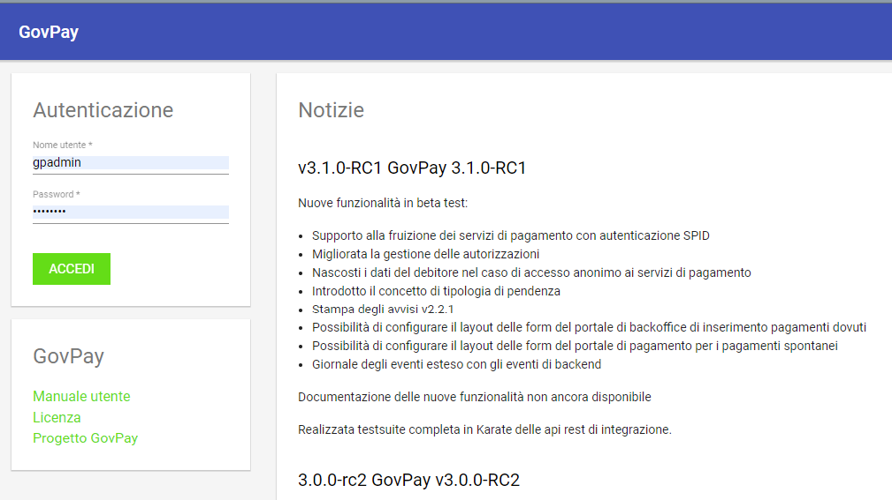

.. _utente_accesso:

Accesso al cruscotto e profilo
==============================

Una volta completata con successo la procedura di installazione
sarà possibile procedere con la configurazione accedendo al **Cruscotto
di Gestione** al seguente indirizzo:

http://<hostname>:<port>/backend/gui/backoffice

Dove al posto dei placeholder <hostname> e <port> dovranno essere inseriti i riferimenti al proprio ambiente di installazione (nome host o indirizzo IP e relativa porta).

.. figure:: ../_images/02FunzionalitaPreAutenticazione.png
   :align: center

   Figura 1: Funzionalità disponibili senza autenticazione
   
Sono disponibili le seguenti funzionalità informative, prima dellì'autenticazione:

*  **Manuale Utente**, che permette di accedere alla versione più recente di questo manuale
*  **Licenza**, che mostra gli estremi della licenza cui fa riferimento l'istanza
*  **Progetto GovPay**, che illustra le caratteristiche salienti del prodotto e le sue novità

Per l'accesso al cruscotto viene presentata la maschera per l'immissione delle credenziali. Si noti come ad ogni 
utente sia associato un *ruolo* che rappresenta l'insieme delle funzionalità che sono destinate all'utente stesso. Questo meccanismo, che verrà maggiormente dettagliato in seguito, permette di *ritagliare* in modo assolutamente generico il giusto profilo funzionale per tutte le classi di utente abilitati all'uso della piattaforma.

   Figura 2: Immissione delle credenziali [#]_
   
.. [#] Ovviamente le credenziali evidenziate in figura sono a puro scopo esemplificativo
   
Dopo aver effettuato l’accesso con le credenziali in proprio possesso, si accede a tutte le funzionalità descritte nelle corrispondenti sezioni di questo documento. La schermata dovrebbe presentarsi in questo modo [#]_
   
.. [#] Si tenga sempre presente che la propria schermata dipende dai ruoli cui si è associati

.. figure:: ../_images/03VistaIniziale.png
   :align: center   

   Figura 3: Schermata iniziale

Funzionalità di profilo
-----------------------
Il primo box in alto a sinistra mette a disposizione informazioni sul profilo e permette di effettuare il logut dalla piattaforma.

.. figure:: ../_images/05FunzionalitaArchitetturaConEvidenziazione.png
   :align: center
   
   Figura 4: Funzionalità di profilo

Menu di navigazione
-------------------

La colonna posta sinistra nell'interfaccia rappresenta il menu di navigazione, con le relative voci che variano in funzione dei ruoli associati all'utenza autenticata.

.. figure:: ../_images/03VistaIniziale.png
   :align: center   

   Figura 3: Cruscotto iniziale [#]_
   
.. [#] Si noti come le funzionalità evidenziali corrispondono a un ruolo particolare: l'utente che si autentica, a seconda dei ruoli cui è associato, potrà vedere tutte o parte delle funzionalità in figura

L'area iniziale del menu di navigazione è composta dai seguenti
elementi:

-  Identificativo dell'utente in sessione.
-  Icona per la visualizzazione del profilo utente che mostra i dati
   anagrafici di dettaglio e le autorizzazioni possedute.
-  Icona per il Logout dal cruscotto.

A seguire sono elencate le sezioni del menu di navigazione, che possono
variare in base alle autorizzazioni possedute dall'utente in sessione.
Le sezioni del menu sono:

1. *Pendenze*: sezione di consultazione delle pendenze di pagamento in
   carico ai debitori.
2. *Pagamenti*: sezione di consultazione delle operazioni di pagamento
   effettuate dai debitori.
3. *Giornale degli eventi*: sezione di consultazione del Giornale Eventi
   previsto dalla specifica pagoPA.
4. *Configurazioni:* raccoglie gli strumenti per la consultazione,
   censimento e modifica delle entità alla base della configurazione del
   prodotto (Psp, Domini, Tributi, Applicazioni, ecc.).
5. *Funzioni Avanzate*: sezione dedicata alla consultazione di entità
   avanzate (rendicontazioni, riscossioni, ecc.).
6. *Manutenzione*: Accesso a funzionalità di manutenzione straordinaria.

