.. _utente_configurazioni:

Configurazioni del Sistema
==========================

La sezione di configurazione, visibile solo agli amministratori del
sistema, consente il censimento e manutenzione delle entità logiche
coinvolte nel processo di pagamento. 

.. figure:: ../_images/08Configurazioni.png
   :align: center

   Lista delle funzionalità di configurazione

-  *Intermediari*: rappresentano le entità “Intermediario” o “Partner Tecnologico” censiti presso il Nodo dei Pagamenti scelti in
   fase di adesione dagli Enti Creditore per l'accesso al sistema pagoPA.
-  *Domini*: corrispondono agli enti creditori aderenti al sistema pagoPA.
-  *Tipi Pendenza*: rappresentano le esigenze dell'ente creditore dalle quali
   scaturiscono le tipologie di pagamenti che possono essere gestiti dal
   sistema (tassa rifiuti, licenza di caccia, bollo auto, ...).
-  *Applicazioni*: rappresentano i portali di pagamento e i gestionali
   delle posizioni debitorie degli enti Creditori integrati con GovPay
   tramite gli appositi servizi.
-  *Operatori*: sono le utenze del cruscotto di gestione GovPay.
-  *Ruoli*: definizione dei ruoli, in termini di autorizzazioni
   consentite sulle entità dati, che saranno assegnati agli utenti del
   cruscotto.

.. note:: Nell'analisi delle funzionalità di configurazione, le immagini esemplificative mostrate mancheranno della
   sezione di sinistra (*Lista funzionalità*) al fine di permettere la concentrazione sulla sola parte importante, una volta
   che si sia selezionata la funzionalità, ovvero il suo dettaglio, posto a destra.

Intermediari
------------

Gli intermediari o partner tecnologici sono entità censite da AgID sul
circuito pagoPA al momento dell'adesione di un Ente Creditore. Per il
corretto funzionamento di GovPay, gli intermediari di interesse devono
essere censiti con le informazioni di corredo necessarie.

.. figure:: ../_images/09Intermediari.png
   :align: center

   Vista di dettaglio intermediari

Accedendo alla sezione corrispondente (*Configurazioni > Intermediari*), viene visualizzato l'elenco degli intermediari censiti
sul sistema. È possibile filtrare gli intermediari in relazione al loro stato, con una funzionalità di filtro disponibile sulla sinistra del box di dettaglio, come di seguito mostrato:

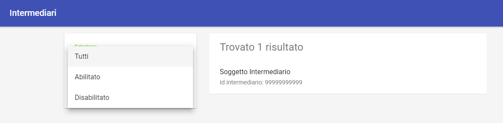

   Filtro su ricerca Intermediari

Nuovo Intermediario
~~~~~~~~~~~~~~~~~~~

Per inserire un nuovo intermediario è necessario premere l'apposito
pulsante, presente nella pagina di elenco in basso a destra, e compilare il form che viene
aperto:

.. figure:: ../_images/11CampiNuovoIntermediario.png
   :align: center

   Informazioni che definiscono un nuovo intermediario

Le informazioni contenute nel form sono le seguenti:

.. csv-table:: Dettagli di un nuovo intermediario
  :header: "Campo", "Significato", "Note"
  :widths: 40,40,20
  
  "Denominazione", "Nome associato all'Intermediario o al Partner Tecnologico", "Obbligatorio"
  "Id Intermediario", "Identificativo dell'intermediario o Partner Tecnologico, fornito da AgID, corrisponde alla Partita IVA del soggetto", "Obbligatorio"
  "Principal", "identificativo (subject certificato o principal) corrispondente alle credenziali con cui Govpay riceve le chiamate in entrata da pagoPA", ""
  "Abilitato/Non Abilitato", "Stato del nuovo intermediario: indica se l'intermediario è usabile da GovPay per gestire nuovi pagamenti o se impedire nuove richieste.", ""
  "Servizio RPT", "Riferimenti utilizzati da Govpay per comunicare con il Nodo SPC: Endpoint per le chiamate in uscita verso il Nodo SPC", ""
  "Tipo Autenticazione", "Lista a discesa per selezionare il tipo di autenticazione adottata per le comunicazioni con il Nodo SPC. Si sceglie tra: Nessuna e HTTP-Basic. Nel caso si scelga una modalità di autenticazione, dovranno essere inserite i relativi dati di configurazione", ""  

Selezionando un intermediario dalla pagina che li elenca si accede alla
pagina di dettaglio.

Dettaglio Intermediario
~~~~~~~~~~~~~~~~~~~~~~~

La pagina di dettaglio di un intermediario mostra i singoli campi che lo
compongono unitamente all'elenco delle stazioni ad esso associate.
Infatti, al censimento di un Intermediario o Partner Tecnologico, AgID
assegna anche una o più Stazioni Tecnologiche che devono essere
registrate su GovPay.

.. figure:: ../_images/12ModificaOggetto.png
   :align: center

   Pulsante di modifica

Il pulsante di modifica presente nella pagina consente di aprire il form
per modificare le proprietà dell'intermediario.

Stazioni
~~~~~~~~

Nella pagina di dettaglio dell'intermediario (quindi una volta che lo si è creato) esiste una sezione dedicata alle
stazioni in cui è possibile aggiungerne di nuove:

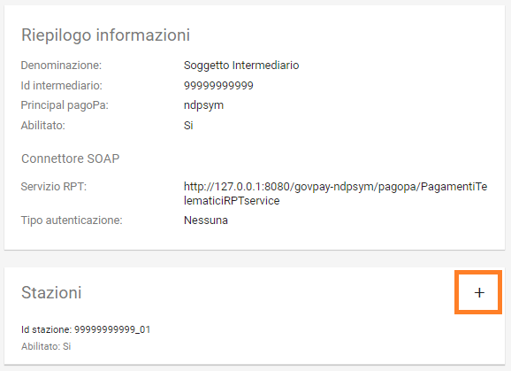
   
   Pulsante di aggiunta stazione (evidenziato in rosso)
   
Si ottiene così il seguente risultato:

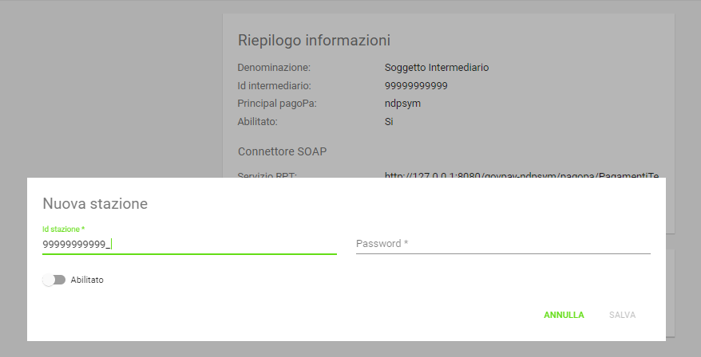
   
   Maschera di inserimento di una nuova stazione

Per definire una stazione connessa all'intermediario occorre immettere le seguenti informazioni:

.. csv-table:: Dettagli di una nuova stazione
  :header: "Campo", "Significato", "Note"
  :widths: 40,40,20
  
  "IdStazione", "Identificativo della stazione, fornito da AgID", "Obbligatorio"
  "Password", "Chiave segreta, fornita da AgID", "Obbligatorio"
  "Abilitato", "indica se la stazione è usabile da GovPay per gestire nuovi pagamenti (abilitato) o se si vogliono impedire nuove richieste (disabilitato)", ""

.. note:: Si noti come le stazioni sono connesse univocamente a ciascun intermediario, non è quindi possibile avere una stessa stazione connessa a due intermediari

È possibile visualizzare il dettaglio di una stazione selezionandola dall’elenco, avendo il dettaglio dei campi appena visti.

In corrispondenza di ciascuna stazione presente in elenco sono presenti
i pulsanti per la modifica delle informazioni:

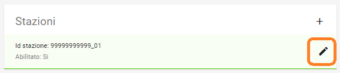
   
   Modifica di una stazione esistente

I dati modificabili della stazione saranno la sola password e lo stato; l'identificativo non sarà modificabile:

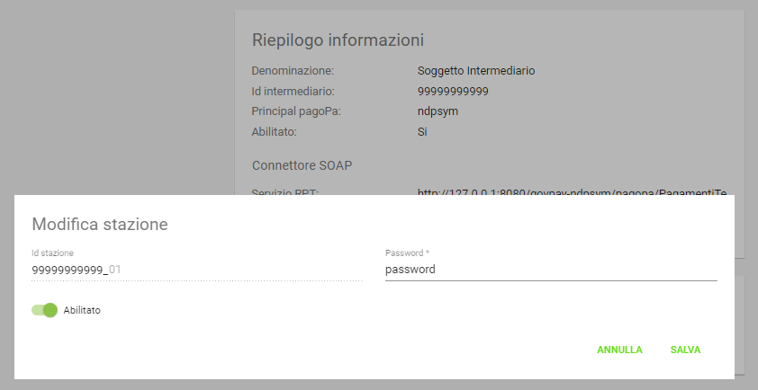
   
   Maschera di modifica di una stazione

Una volta terminata la modifica è necessaria la pressione della voce *Salva* per renderla effettiva.

Domini
------

Ogni Ente Creditore su pagoPA corrisponde ad un Dominio da registrare nell'anagrafica di GovPay.

Accedendo alla sezione *Configurazioni > Domini*, viene visualizzato l'elenco dei domini già censiti. Sul lato sinistro è presente il form per filtrare i domini visualizzati in elenco, con i possibili parametri di ricerca, ovvero:

.. figure:: ../_images/17FilttroSuDomini.png
   :align: center
   
   Parametri di filtro per la ricerca dominio

Ciascun dominio presente in elenco è identificato tramite denominazione
e codice identificativo.

Nuovo Dominio
~~~~~~~~~~~~~

Utilizzando il pulsante di creazione, presente nella pagina di elenco, è
possibile procedere con la creazione di un nuovo dominio. 

.. figure:: ../_images/17FilttroSuDomini.png
   :align: center
   
   Parametri di filtro per la ricerca dominio

È necessario compilare il seguente form di creazione:

.. figure:: ../_images/18ParametriDominio.png
   :align: center
   :name: CampiDelDominio
   
   Campi del form di inserimento Nuovo Dominio

.. csv-table:: Dettagli di un Nuovo Dominio
  :header: "Campo", "Significato", "Note"
  :widths: 40,40,20
  
  "Id Dominio", "Identificativo del dominio, fornito da AgID, corrisponde alla Partita Iva dell'ente", "Obbligatorio"
  "Ragione Sociale", "Ragione sociale del dominio", "Obbligatorio"
  "Area", "Identificativo interno dell'Area", ""
  "GLN (Global Location Number)", "Identificativo del dominio nella codifica standard GS1. Obbligatorio, fornito da AgIDD", ""
  "Intermediario", "Intermediario selezionato", "Obbligatorio"
  "Stazione", "Stazione tecnologica scelta in fase di adesione a pagoPA, deve ovviamente essere stata già censita sul sistema", "Obbligatorio"
  "Riferimenti anagrafici del Dominio", "Riferimenti anagrafici del dominio forniti dal Referente dei Pagamenti: Indirizzo (Indirizzo completo di toponimo), Numero Civico, CAP, Località, Provincia, Nazione (condice di due lettere, IT per Itaia), eMail, PEC, Sito web, Telefono, Fax", ""
  "CBILL", "Codice CBILL per i domini che supportano questa modalità di pagamento, attribuito da PagoPA", ""
  "Prefisso IUV", "Prefisso da inserire negli IUV generati da GovPay per questo dominio. Il prefisso, numerico, può contenere dei placeholder racchiusi tra graffe", ""
  "Aux", "Valore numerico che definisce la struttura del codice IUV in funzione del numero di punti di generazione dello stesso (cfr. *Specifiche Attuative dei codici identificativi di versamento, riversamento e rendicontazione*)", ""
  "Codice di segregazione", "Se configurato come dominio pluri-intermediato, imposta il codice numerico di segregazione.", "Fornito da AgID"
  "Abilitato", "Indica se il dominio è usabile da GovPay per gestire nuovi pagamenti (abilitato) o se si vogliono impedire nuove richieste (disabilitato)", ""
  "Autorizzazione stampa PT", "Numero di autorizzazione PT per la stampa in proprio del bollettino postale", ""
  "Sfoglia.. (Logo)", "Elemento per il caricamento del logo dell’ente creditore corrispondente al dominio", ""

I **placeholder contenuti nel prefisso IUV** vengono sostituiti a runtime con i valori forniti dagli applicativi richiedenti o con i valori di sistema configurati. La lunghezza del prefisso riduce lo spazio di IUV generabili, quindi è necessario che sia il più breve possibile.
I seguenti sono i placeholder di sistema, sovrascrivibili dall'applicazione chiamante:

* a: codice IUV assegnato all'applicazione che gestisce il debito
* t: codice IUV assegnato al tributo
* y: anno di emissione dello iuv, due cifre
* Y: anno di emissione dello iuv, quattro cifre

Dettaglio Dominio
~~~~~~~~~~~~~~~~~

Selezionando uno dei domini presenti nella pagina di elenco si accede
alla pagina di dettaglio. La pagina di dettaglio di un dominio è
ripartita nelle seguenti distinte aree:

.. csv-table:: Aree del dettaglio dominio
  :header: "Area", "Descrizione"
  :widths: 40,40
  
  "*Riepilogo Informazioni*", "Dati che caratterizzano il dominio, appena visti nella sezione di creazione del dominio"
  "*Unità Operative*", "Uffici di gestione dei pagamenti in cui è suddiviso il dominio dell’ente creditore."
  "*Iban*", "Codici IBAN dei conti correnti su cui l’ente creditore riceve gli accrediti in banca tesoriera. Tali Iban sono quelli già comunicati ad AgID in fase di accreditamento."
  "*Entrate*", "Sono le entrate attive nel dominio dell’ente creditore e quindi sulle quali è predisposto per ricevere dei pagamenti."
  "*Pendenze*", "Sono le entrate attive nel dominio dell’ente creditore e quindi sulle quali è predisposto per ricevere dei pagamenti."

Tramite il pulsante di modifica presente nella pagina di dettaglio è possibile procedere con l'aggiornamento dei dati di base, visualizzati nell'area "Riepilogo Informazioni". Si tenga presente che il **valore del campo “Codice Dominio” non è modificabile**.

.. figure:: ../_images/19DettaglioDominio1.png
   :align: center
   :name: CampiDelDettaglioDominio
   
   Campi del dettaglio del Dominio

Le aree seguenti contengono i relativi pulsanti di creazione e modifica dei rispettivi elementi, con le solite, naturali, uniformi convenzioni grafiche.

.. figure:: ../_images/20DettaglioDominio2.png
   :align: center
   :name: CampiDegliOggettiDelDominio
   
   Campi degli oggetti correlati al Dominio

Unità Operative
^^^^^^^^^^^^^^^

La specifica pagoPA consente di indicare l'anagrafica dell'Unità operativa titolare del credito, qualora sia diversa da quella dell'Ente
Creditore. È quindi possibile censire le Unità operative del Dominio in GovPay da utilizzare poi in fase di pagamento.

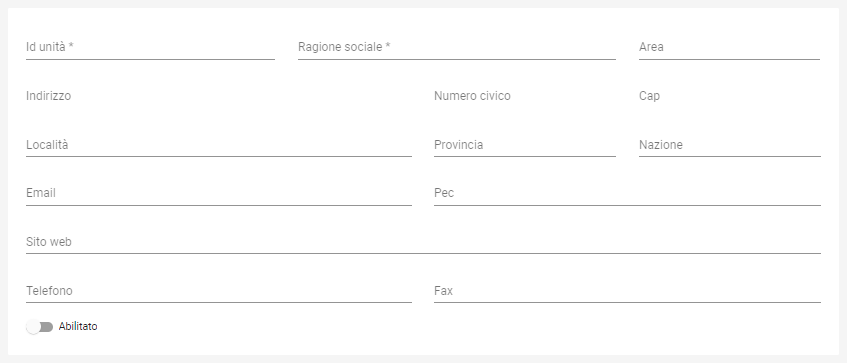
   
   Campi per creare una Nuova Unità Operativa

.. csv-table:: Dettagli di una nuova Unità Operativa
  :header: "Campo", "Significato", "Note"
  :widths: 40,40,20
  
  "Id unità", "Codice identificativo, ad uso interno, dell'unità operativa", "Obbligatorio"
  "Ragione Sociale", "Ragione sociale dell'Unità Operativa", "Obbligatorio"
  "Sezione Anagrafica", "Riferimenti anagrafici dell'unità forniti dal Referente dei Pagamenti", ""
  "Abilitato", "Indica se l'unità operativa è abilitata o meno nel contesto del dominio su cui si opera", ""

Tornando all'elenco delle unità operative, è possibile scegliere le operazioni di modifica degli elementi precedentemente associati al dominio.

Iban
^^^^

Gli iban utilizzati per l'accredito degli importi versati vanno censiti su GovPay.
Esiste quindi una maschera di definizione degli IBAN associati al dominio.

.. figure:: ../_images/22NuovoIBAN.png
   :align: center
   :name: CampiPerNuovoIBAN
   
   Maschera di creazione IBAN associato al dominio

Il form di creazione di un Iban deve essere compilato con i dati
seguenti:

.. csv-table:: Dettagli di un nuovo IBAN
  :header: "Campo", "Significato", "Note"
  :widths: 40,40,20
  
  "IBAN Accredito", "Codice iban del conto di accredito", "Obbligatorio, fornito dal referente dei Pagamenti"
  "BIC Accredito", "BIC del conto di accredito", "Obbligatorio"
  "Postale", "Indica se l'iban di accredito è riferito ad un conto corrente postale", ""
  "My Bank", "Indica se l'iban di accredito è è abilitato alle transazioni MyBank", ""
  "Abilitato", "Indica se l'IBAN  è abilitato o meno nel contesto del dominio su cui si opera", ""

Tornando all'elenco degli Iban, è possibile scegliere le operazioni di modifica degli elementi precedentemente creati. Il campo
Iban Accredito non è, ovviamente, modificabile.

Entrate
^^^^^^^

Ogni importo che costituisce un versamento deve essere associato ad una entrata censita sul sistema. L'entrata associata al versamento ne determina l'iban di accredito dell'importo e le coordinate di rendicontazione.

.. note:: **Si noti come la gestione delle Entrate è stata sostituita da quella delle Pendenze, assai più flessibile e che consente anche la generazione di interfacce automatiche per la riscossione, semplificando quindi grandemente l'implementazione effettiva di queste modalità di pagamento verso l'Utente finale. Si decide di lasciare questa tipologia di oggetti per meri scopi di ereditarietà. Le nuove configurazioni dovrebbero pertanto utilizzare la Gestione delle Pendenze.**

.. figure:: ../_images/23NuovaEntrata.png
   :align: center
   :name: CampiPerNuovaEntrata
   
   Maschera di creazione nuova entrata associata al dominio

Il form di creazione di un'entrata va compilato con i seguenti
dati:

.. csv-table:: Dettagli di una nuova entrata
  :header: "Campo", "Significato", "Note"
  :widths: 40,40,20
  
  "Tipo entrata", "Selezione tra le tipologie già censite", "Se non risulta presente la voce desiderata, selezionare *Nuova Entrata*
      -  Id Entrata: identificativo dell'entrata. 
      -  Descrizione: testo di descrizione dell'entrata per facilitarne
         il riconoscimento agli operatori. Obbligatorio, a discrezione
         dell'operatore.
      -  Tipo Contabilità: tipologia di codifica contabile assegnata
         all'entrata (SIOPE/SPECIALE/...). Obbligatorio, fornito dalla
         segreteria.
      -  Codice Contabilità: codice contabilità assegnato all'entrata
         secondo la codifica indicata precedentemente. Obbligatorio,
         fornito dalla segreteria.
      -  *Codifica IUV*: codifica dell'entrata nel contesto degli IUV
         generati da GovPay, se configurato in tal senso."
  "IBAN Accredito", "IBAN di accredito del tributo a scelta tra quelli censiti per il dominio", "Obbligatorio"
  "IBAN Appoggio", "utilizzato nelle situazioni in cui il PSP non è in condizioni di accreditare somme sul conto di accredito (si considerino le limitazioni in essere nel circuito postale)", ""
  "Tipo contabilità", "Se valorizzato sovrascive l'mpostazione prevista nel default per l'entrata cui si fa riferimento", ""
  "Codice contabilità", "Se valorizzato sovrascive l'mpostazione prevista nel default per l'entrata cui si fa riferimento", ""
  "Abilitato", "Indica se l'Entrata è abilitata o meno nel contesto del dominio su cui si opera", ""

.. note:: I campi *Tipo Contabilità e Codice Contabilità* rappresentano i valori di default per il tipo entrata e saranno attualizzabili nel contesto di ciascun dominio.

Dalla lista delle Entrate rimane sempre possibile modificare la singola Entrata, con il campo *Codice Entrata* non modificabile. Fa eccezione l'entrata preconfigurata “Marca da Bollo Telematica” per la quale si ha la sola possibilità di modificare i parametri di contabilizzazione.

Pendenze
^^^^^^^^

Questa sezione permette la scelta e la personalizzazione delle pendenze (ovvero oggetti che vanno riconciliati con i pagamenti) ammissibili per il dominio in essere. Si noti come le pendenze possano essere associate al dominio selezionandole da quelle censite (l'aggiunta si gestisce a livello delle funzionalità della voce *Tipi Pendenze* del menu di configurazione sulla sinistra). Il sistema, ovviamente, permette di aggiungere solo le pendenze che, per il dominio, non siano state già scelte.
Ad esempio, in un dominio abbiamo le seguenti tipologie di pendenza già selezionate:

.. figure:: ../_images/25PendenzeSceltePerIlDominio.png
   :align: center
   :name: PendenzeRelativeAUnDominio
   
   Pendenze associate a un dominio
   
A questo punto, sul dominio selezionato, si potrà aggiungere una sola pendenza (quella non ancora selezionata), come mostrato:

.. figure:: ../_images/26PendenzaSelezionabile.png
   :align: center
   :name: PendenzaSelezionabilePerAggiunta
   
   Pendenza selezionabile per aggiunta al dominio

Risulta possibile, una volta aggiunta una nuova pendenza, personalizzarla per il dominio, consentendo anche la generazione di maschere automatiche per l'immissione dei dati.
Si tenga presente che si affronterà il dettaglio dei campi delle pendenze nella sezione apposita, cui si fa riferimento. Al momento si noti come una pendenza possa essere completamente personalizzata per un dominio a partire da una *standard* definita nella sezione *Tipi Pendenze* 
I meccanismi di selezione sono del tutto analoghi a quanto già visto in altre sezioni: selezioniamo la Pendenza *Sanzione Amministrativa*

.. figure:: ../_images/27SelezioneDellaPendenzaPerModifica.png
   :align: center
   :name: SelezionePendenza
   
   Selezione della Pendenza *Sanzione Amministrativa*

Il sistema mostra la seguente maschera

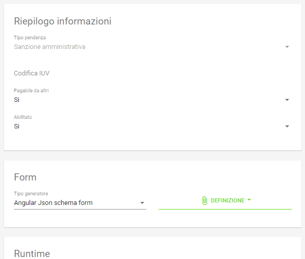
   
   Modifica *Sanzione Amministrativa*

Da qui possiamo personalizzare **senza modificare le informazioni standard del tipo Sanzione Amministrativa**.

Tipi Pendenze
-------------

Ogni importo che costituisce un versamento deve essere associato ad una pendenza censita sul sistema. La configurazione di questo oggetto ne determina quindi le coordinate di pagamento e quelle di rendicontazione. Si noti come le pendenze siano associate a un dominio, determinando quindi il tipo di pagamenti che ad esso fanno riferimento.
La gestione dei tipi di pendenza permette la generazione di maschere automatiche per l'immissione dei dati, semplificando in modo notevole lo sviluppo di interfacce e ottimizzando i tempi generali di progetto.
Le modalità per la creazione di una nuova pendenza sono sempre le medesime (tasto più in basso a destra) e la maschera presentata è la seguente:

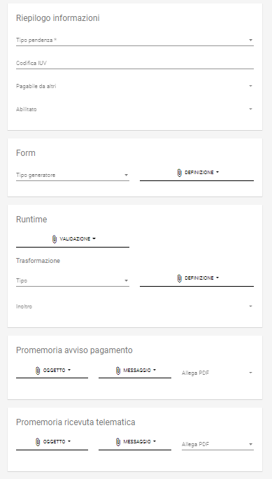
   
   Maschera di creazione di una Nuova Pendenza
   
Vediamo come modificare una pendenza esistente; ciò ci permetterà di illustrare il dettaglio dei campi presenti. Sslezioniamo quindi la Pendenza *Sanzione Amministrativa*.

.. figure:: ../_images/27SelezioneDellaPendenzaPerModifica.png
   :align: center
   :name: SelezionePendenza
   
   Selezione della Pendenza *Sanzione Amministrativa*

Il sistema mostra la seguente maschera

   
   Modifica del tipo pendenza *Sanzione Amministrativa*

Possiamo identificare i seguenti raggruppamenti di informazioni:

* Riepilogo Informazioni
* Layout form dati
* Elaborazione
* Promemoria avviso pagamento
* Promemoria ricevuta telematica

A ciascuno di essi è dedicata una sezione di dettaglio, come segue.

Riepilogo Informazioni
~~~~~~~~~~~~~~~~~~~~~~
La sottosezione si presenta nel seguente modo:

.. figure:: ../_images/34EntrataRiepilogoInformazioni.png
   :align: center
   :name: RiepilogoInformazioni
   
   Sezione Riepilogo Informazioni

.. csv-table:: Campi modificabili della prima sezione
  :header: "Campo", "Significato", "Note"
  :widths: 40,40,20
  
  "Descrizione", "Descrizione sintetica del tipo di pendenza", ""
  "Id Tipo Pendenza", "Codice tecnico che indica in modo univoco la pendenza", "Non modificabile"
  "Tipologia", "Tipo di pendenza: dovuta o spontanea", ""
  "Codifica IUV", "Identificatore della struttura del codice IUV", ""
  "Abilitato", "Indica se la Sanzione Amministrativa sia abilitata o meno, quindi sia o meno associabile a domini esistenti", ""
  "Pagabile da terzi", "Indica se la sanzione possa o meno essere pagata non dal debitore", ""

Layout form dati
~~~~~~~~~~~~~~~~

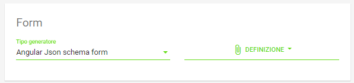
   
   Sezione form della *Sanzione Amministrativa*

.. csv-table:: Campi modificabili della sezione *Layout Form dati*
  :header: "Campo", "Significato", "Note"
  :widths: 40,40,20
  
  "Tipo layout", "Indica il motore di interpretazione della descrizione formale della maschera di immissione del pagamento da parte del debitore", " Al momento solo Angular Json schema form"
  "Definizione", "Mostra il menu di caricamento e visualizzazione della descrizione formale dell'interfaccia di pagamento", ""

.. figure:: ../_images/32MenuDefinizioneForm.png
   :align: center
   :name: MenuDefinizioneForm
   
   Funzionalità selezionabili per la definizione form

Sono presenti le voci:

* *Carica*: carica un nuovo file di definizione del form
* *Visualizza*: visualizza la definizione del form
* *Ripristina*: ripristina la definizione originaria del form  

Vediamo un esempio di un file di definizione dell'interfaccia:

.. figure:: ../_images/28SchemaFormEntrata1.jpg
   :align: center
   :name: MenuDefinizioneForm
      
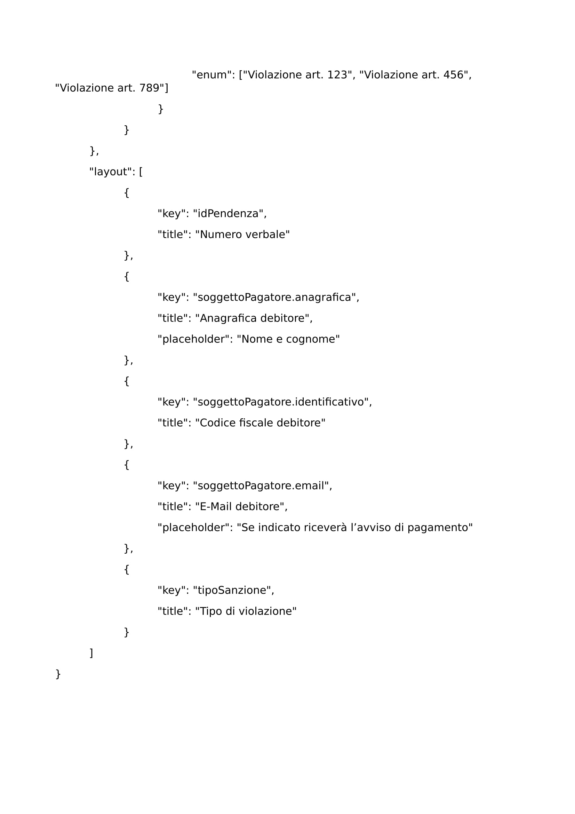
   
   Funzionalità selezionabili per la definizione form

Elaborazione
~~~~~~~~~~~~

Vediamo adesso la sezione *Elaborazione*, che consente a GovPay di descrivere in modo formale come elaborare quanto immesso nella sezione *Layout Form Dati* al fine di trasformare e inoltrare le informazioni del pagamento alle applicazioni che lo processano ulteriormente.

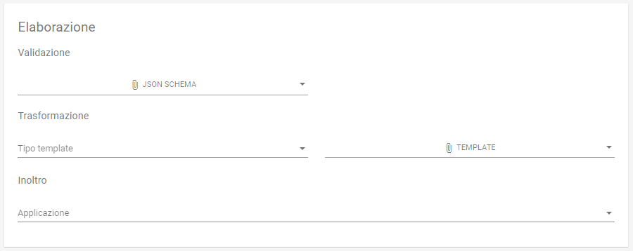
   
   Funzionalità della sezione *Elaborazione*
   

.. csv-table:: Dettagli della sezione *Elaborazione*
  :header: "Campo", "Significato", "Note"
  :widths: 40,40,20
  
  "Validazione", "Selezione delle funzionalità sulla definizione della validazione in formato Json Schema", "* Carica
  * Visualizza
  * Ripristina"
  "Trasformazione: tipo template", "Motore di trasformazione delle informazioni immesse nel Form Dati", "Freemarker"
  "Trasformazione: Template", "Template di defizione della trasformazione dati", "* Carica
  * Visualizza
  * Ripristina"
  "Applicazione", "Consente di selezionare l'applicazione cui verranno inoltrati i dati", "L'applicazione deve essere censita nella sezione *Applicazioni*"
  

Promemoria Avviso Pagamento
~~~~~~~~~~~~~~~~~~~~~~~~~~~

La sezione *Avviso di pagamento* permette l'inoltro automatico verso la mail del debitore dell'avviso di pagamento. La tipologia di definizione del *subject* e del corpo della mail è, al momento, basata su `Freemarker <https://freemarker.apache.org/>`_

.. figure:: ../_images/35EntrataPromemoriaAvvisoDiPagamento.png
   :align: center
   :name: PromemoriaAvvisoDiPagamento
   
   Informazioni della sezione *Promemoria Avviso Pagamento*
   

.. csv-table:: Dettagli della sezione *Promemoria Avviso Pagamento*
  :header: "Campo", "Significato", "Note"
  :widths: 40,40,20
  
  "Tipo template", "Motore di trasformazione delle informazioni immesse nel template *oggetto* e *messaggio* della mail di Avviso Pagamento", "Freemarker"
  "Template Oggetto", "Template di defizione dell'oggetto della mail di Avviso Pagamento", "* Carica
  * Visualizza
  * Ripristina"
   "Template Messaggio", "Template di defizione del messaggio della mail di Avviso Pagamento", "* Carica
  * Visualizza
  * Ripristina"
  "Allega pdf avviso", "Permette di allegare o meno il pdf dell'avviso di pagamento alla mail di promemoria", ""

Promemoria Ricevuta Telematica
~~~~~~~~~~~~~~~~~~~~~~~~~~~~~~

La sezione *Promemoria Ricevuta Telematica* è del tutto analoga a quella relativa all' *Avviso di pagamento*: essa permette l'inoltro automatico verso la mail del debitore della ricevuta telematica dell'avvenuto pagamento. Anche in questo caso la tipologia di definizione formale del *oggetto* e del corpo della mail è, al momento, basata su `Freemarker <https://freemarker.apache.org/>`_

.. figure:: ../_images/35EntrataPromemoriaRicevutaTelematica.png
   :align: center
   :name: PromemoriaRicevutaTelematica
   
   Informazioni della sezione *Promemoria Ricevuta Telematica*
   

.. csv-table:: Dettagli della sezione *Promemoria Ricevuta Telematica*
  :header: "Campo", "Significato", "Note"
  :widths: 40,40,20
  
  "Tipo template", "Motore di trasformazione delle informazioni immesse nel template *oggetto* e *messaggio* della mail di Ricevuta Telematica", "Freemarker"
  "Template Oggetto", "Template di defizione dell'oggetto della mail di Ricevuta Telematica", "* Carica
  * Visualizza
  * Ripristina"
   "Template Messaggio", "Template di defizione del messaggio della mail di Ricevuta Telematica", "* Carica
  * Visualizza
  * Ripristina"
  "Allega pdf avviso", "Permette di allegare o meno il pdf della Ricevuta Telematica", ""

Applicazioni
------------

Le Applicazioni in GovPay rappresentano i portali di pagamento e i sistemi applicativi gestionali dei debiti che si interfacciano tramite le Web API di integrazione.
Accedendo alla sezione *Configurazioni > Applicazioni*, viene visualizzato l'elenco delle applicazioni già censite. Sul lato sinistro
della pagina è presente un form che consente di filtrare i dati visualizzati nella pagina, come di seguito mostrato:

.. figure:: ../_images/36Applicazioni.png
   :align: center
   :name: Applicazioni
   
   Vista generale delle applicazioni censite e criterio di filtro

Nuova Applicazione
~~~~~~~~~~~~~~~~~~

Utilizzando l'apposito pulsante presente nella pagina di elenco, posizionato come sempre in basso a destra è
possibile censire nuove applicazioni:

.. figure:: ../_images/37NuovaApplicazioneVistaInsieme.png
   :align: center
   :name: NuovaApplicazione
   
   Vista generale dei campi di una nuova applicazione

Analizziamo le sottosezioni in cui è strutturata l'applicazione, ovvero:
* Informazioni di riepilogo
* Codifica avvisi
* API integrazione
* Autorizzazioni API

Informazioni di riepilogo
^^^^^^^^^^^^^^^^^^^^^^^^^
In questa sottosezione sono contenute le informazioni che identificano l'applicazione 
.. csv-table:: Dettagli delle informazioni di Testata di una nuova Applicazione
  :header: "Campo", "Significato", "Note"
  :widths: 40,40,20
  
  "Id A2A", "identificativo dell'applicazione", "Obbligatorio"
  "Principal", "Identificativo del principal autenticato nelle chiamate alle Web API di integrazione", ""
  "Abilitato", "se disabilitato, tutte le nuove richieste all'applicazione saranno negate", ""
  
  L'area visualizza l'elenco dei domini su cui l'applicazione può agire.
Ciascun dominio in elenco può essere rimosso tramite il pulsante
visibile alla destra dell'elemento. Il pulsante di creazione consente di
aggiungere nuovi domini tra quelli censiti nel sistema.

  
  
  
  
  
  
  

-  : .
-  Codifica Avvisi

   -  Codifica IUV: numero identificativo dell'applicazione nel prefisso
      IUV, se configurato. Opzionale
   -  RegExp IUV: espressione regolare che consente di effettuare la
      validazione dei codici IUV inviati dall'applicazione.
   -  Generazione IUV interna: attivare questo flag nel caso in cui
      l'applicazione generi autonomamente i codici IUV relativi alle
      proprie pendenze. In alternativa i codici saranno generati da
      GovPay.

-  Servizio Verifica

   -  *URL*: Endpoint del servizio di verifica erogato dall'applicazione
      e descritto nel manuale di integrazione (GP-API).
   -  Versione API: versione delle interfacce di integrazione utilizzate
      dall'applicazione. Obbligatorio ed avanzato.
   -  Tipo Autenticazione: selezione a scelta tra: Nessuna, Http-Basic e
      SSL. In base al valore selezionato sarà necessario inserire i
      conseguenti dati di configurazione della specifica modalità di
      autenticazione.

-  Servizio Notifica

   -  *URL*: Endpoint del servizio di notifica erogato dall'applicazione
      e descritto nel manuale di integrazione (GP-API).
   -  Versione API: versione delle interfacce di integrazione utilizzate
      dall'applicazione. Obbligatorio ed avanzato.
   -  Tipo Autenticazione: selezione a scelta tra: Nessuna, Http-Basic e
      SSL. In base al valore selezionato sarà necessario inserire i
      conseguenti dati di configurazione della specifica modalità di
      autenticazione.

Dettaglio Applicazione
~~~~~~~~~~~~~~~~~~~~~~

Selezionando una delle applicazioni presenti nella pagina di elenco si
accede alla pagina di dettaglio. La pagina di dettaglio di
un'applicazione è ripartita in tre distinte aree:

-  Riepilogo Informazioni
-  Domini
-  Entrate
-  Autorizzazioni

Tramite il pulsante di modifica presente nella pagina di dettaglio è
possibile procedere con l'aggiornamento dei dati di base, visualizzati
nell'area "Riepilogo Informazioni".

Le tre aree seguenti contengono i propri pulsanti di creazione, modifica
e cancellazione degli elementi visualizzati.

.. _domini-1:

Domini
^^^^^^

L'area visualizza l'elenco dei domini su cui l'applicazione può agire.
Ciascun dominio in elenco può essere rimosso tramite il pulsante
visibile alla destra dell'elemento. Il pulsante di creazione consente di
aggiungere nuovi domini tra quelli censiti nel sistema.

.. _entrate-1:

Entrate
^^^^^^^

L'area visualizza l'elenco delle entrate su cui l'applicazione può
agire. Ciascuna entrata in elenco può essere rimossa tramite il pulsante
visibile alla destra dell'elemento. Il pulsante di creazione consente di
aggiungere nuove entrate tra quelle censite nel sistema.

Autorizzazioni
^^^^^^^^^^^^^^

L'area visualizza le autorizzazioni possedute dall'applicazione. Le
autorizzazioni visualizzate in elenco possono essere modificate o
eliminate tramite i pulsanti presenti alla destra di ciascun elemento.
Il pulsante di creazione consente di aggiungere nuove autorizzazioni. Il
form di creazione di una autorizzazione deve essere compilato con i
seguenti dati:

-  *Servizio*: indica la specifica funzionalità o entità dati sulla
   quale l'autorizzazione ha effetto (Giornale Eventi, Rendicontazioni,
   ...). Si seleziona un valore da un elenco predefinito. Obbligatorio.
-  *Operazioni*: indica l'operazione consentita sul servizio sopra
   selezionato. Si seleziona una o più scelte tra:

   -  Lettura
   -  Scrittura
   -  Esecuzione

Operatori
---------

Gli operatori rappresentano gli utenti autorizzati all'accesso al
cruscotto di gestione di GovPay.

Accedendo alla sezione “Configurazioni > Operatori”, viene visualizzato
l'elenco degli operatori già censiti. Sul lato sinistro della pagina è
presente un form che consente di filtrare i dati visualizzati nella
pagina.

Gli elementi nell'elenco identificano gli operatori presenti
visualizzando i campi principal e nome.

Nuovo Operatore
~~~~~~~~~~~~~~~

Tramite il pulsante presente nella pagina di elenco è possibile aprire
il form di creazione di un operatore, che deve essere compilato con i
seguenti dati:

-  *Principal*: identificativo del principal autenticato. Obbligatorio,
   a discrezione del gestore.
-  Nome: Nome e cognome dell'utente operatore. Obbligatorio.
-  *Abilitato*: se disabilitato, sarà negato l'accesso al cruscotto di
   gestione.

Dettaglio Operatore
~~~~~~~~~~~~~~~~~~~

Dalla pagina elenco degli operatori, selezionando uno degli elementi, si
giunge alla relativa pagina di dettaglio.

La pagina di dettaglio dell'operatore è composta dalle seguenti aree:

-  Riepilogo Informazioni: area che visualizza i dati identificativi
   dell'operatore.
-  Domini: area che elenca gli enti creditori su cui l'operatore ha
   visibilità.
-  Entrate: area che elenca le entrate sulle quali l'operatore ha
   visibilità.
-  Autorizzazioni: area che elenca le autorizzazioni possedute
   dall'operatore. Le autorizzazioni rappresentano le specifiche
   operazioni che può effettuare.

Tramite il pulsante di modifica presente nella pagina di dettaglio è
possibile aprire il form per l'aggiornamento dei dati identificativi
dell'operatore.

.. _domini-2:

Domini
^^^^^^

L'area visualizza l'elenco dei domini su cui l'operatore può agire.
Ciascun dominio in elenco può essere rimosso tramite il pulsante
visibile alla destra dell'elemento. Il pulsante di creazione consente di
aggiungere nuovi domini tra quelli censiti nel sistema.

.. _entrate-2:

Entrate
^^^^^^^

L'area visualizza l'elenco delle entrate su cui l'operatore può agire.
Ciascuna entrata in elenco può essere rimossa tramite il pulsante
visibile alla destra dell'elemento. Il pulsante di creazione consente di
aggiungere nuove entrate tra quelle censite nel sistema.

.. _autorizzazioni-1:

Autorizzazioni
^^^^^^^^^^^^^^

L'area visualizza le autorizzazioni possedute dall'operatore. Le
autorizzazioni visualizzate in elenco possono essere modificate o
eliminate tramite i pulsanti presenti alla destra di ciascun elemento.
Il pulsante di creazione consente di aggiungere nuove autorizzazioni. Il
form di creazione di una autorizzazione deve essere compilato con i
seguenti dati:

-  *Servizio*: indica la specifica funzionalità, entità o gruppo di
   entità sui quali l'autorizzazione ha effetto (Giornale Eventi,
   Rendicontazioni, ...). Si seleziona un valore da un elenco
   predefinito. Obbligatorio.
-  *Operazioni*: indica l'operazione consentita sul servizio sopra
   selezionato. Si seleziona una o più scelte tra:

   -  Lettura
   -  Scrittura
   -  Esecuzione

Ruoli
-----

I ruoli rappresentano una delle modalità con cui assegnare le
autorizzazioni a operatori e applicazioni. I ruoli vengono acquisiti da
GovPay tramite il profilo utente ottenuto dal sistema che gestisce il
processo di autenticazione. Dopo aver effettuato l'accesso a GovPay,
l'operatore o applicazione ottiene le autorizzazioni che gli sono state
concesse puntualmente (vedi sezioni `7.3.2.3 <#anchor-30>`__ e
`7.4.2.3 <#anchor-36>`__) in aggiunta a quelle associate ai ruoli
posseduti.

La sezione “Configurazioni > Ruoli” mostra l’elenco dei ruoli già
presenti nel sistema.

Nuovo Ruolo
~~~~~~~~~~~

Utilizzando l'apposito pulsante presente nella pagina di elenco, è
possibile creare un nuovo ruolo, inserendo nel form di creazione i
seguenti dati:

-  *Identificativo*: identificativo assegnato al ruolo
-  *Descrizione*: testo che descrive il ruolo
-  *Risorsa*: elenco tra cui selezionare la risorsa protetta sulla quale
   concedere accesso, ad un determinato ruolo, mediante le operazioni
   indicate al punto successivo
-  *Operazioni*: (selezione multipla) consente di specificare quali
   operazioni sono consentite sulla risorsa selezionata per un
   determinato ruolo. Possono essere scelte le seguenti operazioni:

   -  Lettura
   -  Scrittura
   -  Esecuzione

Dettaglio Ruolo
~~~~~~~~~~~~~~~

Selezionando un elemento dall'elenco dei ruoli si accede al suo
dettaglio. La pagina di dettaglio del ruolo è suddivisa in due aree:

-  Riepilogo Informazioni: visualizza i dati identificativi del ruolo:
   Codice Ruolo e Descrizione.
-  Autorizzazioni: visualizza l'elenco delle autorizzazioni che sono
   associate al ruolo

Tramite il pulsante di modifica si accede al form che consente di
aggiornare la descrizione del ruolo.

.. _autorizzazioni-2:

Autorizzazioni
^^^^^^^^^^^^^^

L'area visualizza le autorizzazioni associate al ruolo. Le
autorizzazioni visualizzate in elenco possono essere modificate o
eliminate tramite i pulsanti presenti alla destra di ciascun elemento.
Il pulsante di creazione consente di aggiungere nuove autorizzazioni. Il
form di creazione di una autorizzazione deve essere compilato con i
seguenti dati:

-  *Servizio*: indica la specifica funzionalità, entità o gruppo di
   entità sui quali l'autorizzazione ha effetto (Giornale Eventi,
   Rendicontazioni, ...). Si seleziona un valore da un elenco
   predefinito. Obbligatorio.
-  *Operazioni*: indica l'operazione consentita sul servizio sopra
   selezionato. Si seleziona una o più scelte tra:

   -  Lettura
   -  Scrittura
   -  Esecuzione
