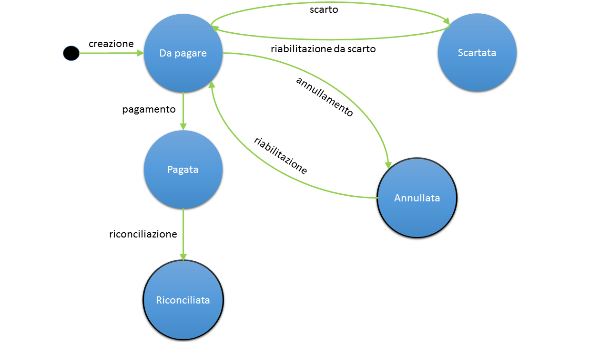

.. _utente_pendenze:

Pendenze
========

Questa sezione è dedicata alla consultazione delle pendenze di pagamento presenti nel repository dei pagamenti in attesa. Le pendenze sono abilitate al modello di pagamento 3 tramite Avviso di pagamento AgID.

Gli stati del Pagamento
-----------------------
Si noti come, all'interno del sistema, il diagramma di stato delle pendenze sia il seguente:

   Diagramma degli stati della Pendenza
   
   
In particolare:

* Si arriva a e si parte da lo stato *annullata* solo a seguito di azioni dell'operatore

Area iniziale
-------------

Inizialmente è necessario selezionare la pendenza di proprio interesse
effettuandone la ricerca. L'area di ricerca è composta dai seguenti
elementi:

-  Sulla sinistra è presente il form per impostare i criteri di filtro
   sui dati da mostrare.
-  Sulla destra è presente l'elenco delle pendenze che corrispondono ai
   criteri di filtro impostati.

Dopo aver effettuato una ricerca è possibile ottenere un CSV di
esportazione relativo all'elenco delle pendenze che soddisfano i criteri
di ricerca forniti. L'esportazione dell'elenco si effettua selezionando
il collegamento "Esporta" che compare sul menu a discesa azionato con
l'icona in alto a destra nella pagina. Il file prodotto con
l'esportazione è un tracciato CSV in cui ciascun record contiene i
principali dati identificativi di ciascuna pendenza.

.. figure:: ../_figure_utente/100002010000031700000212828B7F50531FFD28.png
   :alt: Figura 3: Sezione per la consultazione delle pendenze di pagamento
   :width: 17cm
   :height: 11.389cm

   Figura 3: Sezione per la consultazione delle pendenze di pagamento

Selezionando uno degli elementi presenti in elenco si procede alla
visualizzazione del dettaglio della pendenza.

Dettaglio Pendenza
------------------

La pagina di dettaglio della pendenza fornisce una vista delle singole
informazioni che la riguardano.

In testa, sulla destra, è presente un menu a discesa che consente, nel
caso si possiedano le necessarie autorizzazioni, di effettuare le
seguenti operazioni:

-  Annulla/Ripristina Pendenza

   Se la pendenza si trova in uno stato diverso da "Eseguito" è
   possibile effettuare l'annullamento facendola transitare nello stato
   "Annullato". All’atto dell’annullamento viene richiesto di fornire un
   testo di motivazione dell’operazione che verrà visualizzato nella
   pagina di elenco e veicolato ai PSP nel caso ne venisse tentato il
   pagamento. Successivamente è possibile tornare indietro tramite
   l'operazione "Ripristina" che consente di far transitare la pendenza
   nello stato "Non Eseguito". Anche nel caso del ripristino è possibile
   opzionalmente inserire un testo di descrizione della motivazione.

-  Esporta Pendenza

   Consente di scaricare un archivio in formato ZIP che contiene i
   documenti che compongono la pendenza, quali:

   -  Documento PDF con i dati della pendenza (IUV, scadenza, importo,
      ...), il dettaglio delle voci di pagamento presenti e le eventuali
      segnalazioni.
   -  RPT e relative RT generate per la pendenza in formato XML.
   -  Le versioni PDF delle RT.
   -  Documento CSV contenente gli eventi scaturiti dagli scambi con
      pagoPA.
   -  Avviso di Pagamento in PDF se previsto dalla pendenza.

La presentazione dei dati di dettaglio della pendenza è articolata in
tre differenti sezioni raggiungibili selezionando altrettanti tab:

-  Dati Pendenza
-  Tentativi di Pagamento
-  Eventi

Le sezioni successive dettagliano il contenuto di questi tab.

Dati Pendenza
~~~~~~~~~~~~~

La pagina riporta nella sezione **Riepilogo** i dati principali che
compongono la pendenza (ente creditore, debitore, IUV, scadenza,
importo, stato, ...). Gli stati che una pendenza può assumere sono:

-  *Da pagare* - Stato iniziale di una pendenza
-  *Parzialmente pagato* - Stato anomalo che indica il pagamento
   regolare di un insieme parziale delle voci di pagamento associate
   alla pendenza. Questo accade quando alcune ma non tutte le voci di
   pagamento sono nello stato "pagato".
-  *Pagato* - Stato che indica il regolare pagamento della pendenza.
   Questo accade se tutte le voci di pagamento della pendenza sono nello
   stato "pagato".
-  *Riconciliato* - Stato che indica il completamento del processo di
   riconciliazione della pendenza con la somma incassata (riscossione).
   Questo accade quando tutte le voci di pagamento della pendenza sono
   nello stato "Riconciliato".
-  *Scaduto* - Stato che indica l'avvenuta decorrenza della data di
   scadenza.
-  *Annullato* - Stato assegnato alla pendenza dopo che ne è stato
   richiesto l'annullamento.

Il valore assunto dallo stato è un elemento importante che consente ad
esempio, in fase di ricerca, di selezionare le sole pendenze con non
risultano pagate.

La sezione **Dettaglio Importi** fornisce l'elenco delle singole voci di
pagamento contenute nella pendenza (titolo, importo, stato, ...).

La sezione **Note** riporta le eventuali segnalazioni associate alla pendenza che sono state
rilevate dal sistema durante il suo ciclo di vita.

Tentativi di Pagamento
~~~~~~~~~~~~~~~~~~~~~~

Questa sezione mostra i dati relativi alle transazioni di pagamento che
sono state effettuate per pagare la pendenza (la banca, la data,
l'importo, l'esito,...).

Il clic su ciascun elemento in elenco comporta un'espansione con la
visualizzazione di ulteriori dati di dettaglio.

.. figure:: ../_figure_utente/10000201000002E900000158220886F6B336F7BE.png
   :alt: Figura 5: Tentativi di pagamento relativi ad una pendenza
   :width: 17cm
   :height: 7.849cm

   Figura 5: Tentativi di pagamento relativi ad una pendenza

Eventi
~~~~~~

Questa sezione mostra l'elenco degli eventi, presenti nel Giornale degli
Eventi, previsto dalla specifica pagoPA, che sono scaturiti nel corso
del ciclo di vita della pendenza che si sta consultando. Maggiori
dettagli su questi elementi sono riportati nella sezione
`6 <#anchor-11>`__, dove è descritta la funzionalità di consultazione
generale del Giornale degli Eventi.
